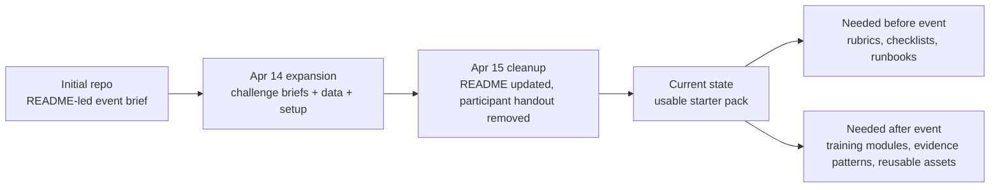
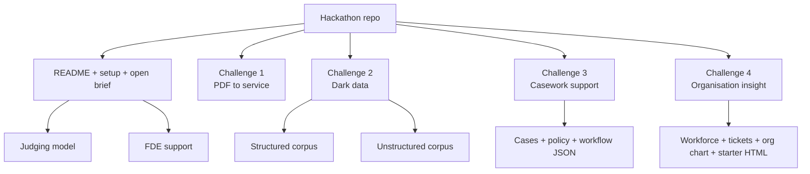
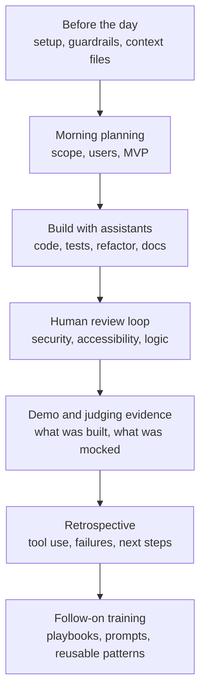

# Deep Research Review of the AI Engineering Lab Hackathon London 2026 Repository

## Executive summary

**Verified fact:** The published hackathon repository is no longer a thin event brief. The current upstream repository under entity["company","Version 1","IT consultancy"] contains a top-level README, a setup guide, an open-brief guide, four challenge briefs, a sample PDF for challenge 1, a mixed structured/unstructured corpus for challenge 2, synthetic JSON for challenge 3, and synthetic workforce, ticket and organisation data plus a starter `index.html` for challenge 4. The user’s fork under entity["company","GitHub","software platform"] is explicitly shown as forked from the upstream repository. citeturn11view0turn5view0turn4view0turn5view1turn3view0

**Verified fact:** Commit history matters here. The repository began on 8–9 April 2026 as essentially README-led hackathon material. A major commit on 14 April 2026 added the challenge briefs, setup guide, open-brief guidance and datasets. A later commit on 15 April 2026 deleted `participant-handout.md` and trimmed the README accordingly. That means the prompt’s “published repository baseline” is substantially correct, but the repository has also changed since the challenge pack was first enlarged. citeturn2view0turn9view0turn3view0turn36view0

**Reasoned inference:** In its current state, the repository is best described as a **strong event starter pack and a moderate training asset**. It is good enough to support a one-day prototype event, especially for teams with an assigned Forward Deployed Engineer, but it is not yet a fully reusable departmental training pack because the repo still lacks several operational and assurance artefacts that would reduce ambiguity on the day: a published judging rubric, a milestone schema, evidence-capture templates, challenge-specific build checklists, a facilitator runbook, and explicit safety templates for teams using mocked AI endpoints. citeturn5view0turn4view0turn5view1turn12view0turn14view0turn15view1

**Verified fact:** The event framing is unusually clear and strategically useful. The README says the hackathon is about how AI coding tools change software delivery, not merely whether a team embeds AI inside the prototype. The event does not provide central model API access; teams may use departmental access, personal access, local models, or mocked AI capabilities. That distinction is one of the repository’s strongest design choices because it lets judges assess delivery practice separately from model availability. citeturn5view0turn7view2

**Recommendation:** Organisers should treat this pack as a **beta operating model**. It is already publishable as event guidance, but it should be upgraded before the event into a v1.1 facilitator-and-judging pack, and upgraded after the event into a v2.0 repeatable training pack informed by observed team behaviour, common failure modes and judged evidence. That trajectory aligns with the wider entity["organization","Department for Science, Innovation and Technology","UK government department"] and entity["organization","Government Digital Service","UK digital service"] direction of travel: safe, practical AI adoption with explicit guardrails, context engineering, quality measures and lifecycle thinking. citeturn12view0turn14view0turn15view0turn15view10

## Evidence base and method

**Verified fact:** This review prioritised the repository and its commit history first, then current official UK government guidance, then the linked AI Engineering Lab repository, then the supplied attendee-domain mapping file, and finally public evidence of relevant AI or algorithmic activity in participating bodies. That approach is consistent with the prompt’s requested source hierarchy and with current government guidance emphasising user needs, technical assurance, transparency, security and data governance. citeturn2view0turn5view0turn12view0turn18search0turn17search1turn17search2turn22search6

**Verified fact:** The main standards lens is highly material, not decorative. The GOV.UK Service Standard requires teams to understand users, solve whole problems, provide a joined-up experience and make services simple to use. The GOV.UK Design System and Prototype Kit support rapid, researchable, accessible service prototyping. Public sector web services are expected to meet WCAG 2.2 AA. The AI Playbook, the Data and AI Ethics Framework and the Algorithmic Transparency Recording Standard shape how public bodies should approach human oversight, fairness, documentation, explainability and public trust. NCSC guidance pushes secure-by-design and secure development practices, while the Technology Code of Practice and the new Digital Assurance Playbook shape technology assurance expectations. citeturn18search0turn18search5turn18search2turn18search3turn17search1turn22search6turn19search1turn19search2turn23search16turn17search2

**Reasoned inference:** Because the hackathon is one day long and many teams will be using AI assistants under time pressure, the key evaluation question is not “is this production-ready?” but “does this prototype move in the right direction under the real constraints public-sector teams face?” The standards therefore act less like pass/fail gates and more like design pressure: they change what a credible prototype looks like. A prototype that ignores accessibility, provenance, auditability, human decision accountability or safe-data boundaries may still demo well, but it should not score as a strong public-sector prototype. citeturn18search0turn18search3turn17search1turn19search0turn19search2

## Repository review

**Verified fact:** The repository baseline mostly checks out. The README frames a one-day hackathon for engineers in the AI Engineering Lab community, with pre-assigned teams, FDE support, milestone scoring during the day, and table-based judge review. The setup guide is tool-agnostic and explicitly names GitHub Copilot, Amazon Kiro and Gemini Code Assist as valid options. It also says that attendees without a licence do not need to arrange one in advance because one will be allocated on the day. The open-brief note requires open or synthetic data and a facilitator conversation before 10:00. citeturn5view0turn4view0turn5view1

**Verified fact:** There are two important repository ambiguities. First, the README says “There are no stage presentations” while the published day structure also contains “Top 3 Finalist Presentations” at 16:15; the intent is clear, but the wording should be corrected to “no stage presentations for every team”. Second, `participant-handout.md` existed in the enlarged 14 April state and was then deleted on 15 April, so any older expectation that the handout remains part of the pack is now stale. citeturn5view0turn36view0

**Verified fact:** The pack’s internal maturity is uneven in a useful way. Challenge briefs are conceptually strong and well-scoped. Setup guidance is practical. The open-brief document gives teams helpful prompts rather than vague encouragement. Challenge 2’s starter data is especially rich and intentionally messy: 20 structured files across housing/benefits and business/employment, plus 23 binary-format files simulating a departmental shared drive. Challenge 3 and challenge 4 also provide bounded synthetic data with enough structure to support rapid prototyping. citeturn35view0turn34view0turn30view0turn32view0turn7view2turn7view8

**Reasoned inference:** The repository’s central strength is **problem framing** rather than starter-code depth. That is a good choice for an AI-assisted build event, because the most valuable learning is likely to come from scoping, decomposition, interface design, data shaping and review discipline. The trade-off is that novice teams may still lose time on boilerplate and evidence capture unless organisers add lighter-weight scaffolds. The linked AI Engineering Lab repository already contains the missing conceptual ingredients: AI-SDLC guidance, context engineering, guardrails and quality metrics. The hackathon pack should borrow from that repository much more overtly. citeturn12view0turn14view0turn15view0turn15view6turn15view10turn15view12

**Recommendation:** The most important pre-event additions are straightforward:

| Priority | Add | Why it matters |
|---|---|---|
| Must-have before event | Published judging rubric and judge question script | Removes score drift across tables |
| Must-have before event | Milestone schema with definitions | Makes “live dashboard” judging auditable |
| Must-have before event | One-page evidence pack template | Helps teams demonstrate user need, tool use, next steps |
| Must-have before event | Safe-data and privacy quick reference | Reduces open-brief missteps |
| Useful before event | Challenge-specific build checklists | Helps novice teams scope down faster |
| Useful before event | Mock-AI endpoint examples and disclosure wording | Supports honest demos without penalising teams lacking model access |
| Useful after event | Post-event retrospective template | Turns the day into a learning asset |
| Future training asset | Challenge starter templates and SVG/PNG diagram fallbacks | Improves repeatability in future cohorts |

The need for these additions follows directly from the repository’s current scope and from current government guidance on assurance, transparency and secure delivery. citeturn5view0turn4view0turn5view1turn23search16turn17search2turn19search0

## Challenge portfolio

**Verified fact:** The four official challenges are coherent and complementary rather than repetitive. Challenge 1 centres on transforming a PDF-based interaction into an accessible digital service. Challenge 2 centres on extracting, structuring and making findable policy-document content. Challenge 3 centres on surfacing the right information to caseworkers without automating away accountability. Challenge 4 centres on joining workforce and operational data so leaders can act on capacity and workload. citeturn5view0turn6view0turn6view6turn7view0turn7view6

| Brief | Best one-day prototype | Starter-data quality | Standards burden | Novice fit | Training value |
|---|---|---|---|---|---|
| Challenge 1 | End-to-end accessible form journey with validation and confirmation | Moderate | High | High | High |
| Challenge 2 | Extraction + schema + searchable view | Very high | High | Medium | Very high |
| Challenge 3 | Case summary, policy match and workflow/audit view | High | Very high | Medium | Very high |
| Challenge 4 | Capacity and workload dashboard with drill-down | High | Medium | High | High |
| Open brief | Narrow, user-specific prototype | Variable | Variable | Low to medium | Variable |

The table reflects the repository briefs and current public-sector standards expectations. citeturn6view5turn6view8turn7view2turn7view4turn7view8turn18search0turn18search3turn17search1turn19search1

**Verified fact:** Challenge 1 is the strongest introductory brief. The repository explicitly positions it as a good starting point for teams newer to AI coding tools and provides a sample licence-application PDF. The brief pushes teams towards identifying fields and validations, mapping friction for applicants and processors, following GOV.UK patterns, and treating accessibility as a first-order design constraint. That aligns closely with the GOV.UK Design System question-page and check-answers patterns, the Prototype Kit, the Service Standard and WCAG 2.2 AA expectations. citeturn5view0turn6view2turn6view3turn6view4turn6view5turn18search13turn18search21turn18search2turn18search3turn18search0

**Reasoned inference:** A credible one-day MVP for challenge 1 is not “OCR the PDF”. It is a short service journey: start page, one-question-per-page flow, explicit validation, evidence upload placeholder if needed, check-your-answers, and confirmation/reference page. AI assistants are most useful here for decomposing the paper form into fields, generating validation logic, scaffolding accessible form pages and generating tests. Human work remains essential for deciding the service flow, the plain-English content, the error strategy and the minimum evidence model. The current starter data is enough to start, but the repo would be stronger if it also shipped a field inventory or JSON schema derived from the sample PDF. citeturn6view2turn6view4turn6view5turn18search5turn18search2turn14view0

**Verified fact:** Challenge 2 is the richest engineering brief. The structured corpus includes deliberate metadata inconsistencies, stale/current conflicts and cross-domain links. One clear example is that `DOC-HB-003` is marked “Status: Current” while `DOC-HB-009` explicitly says it replaces the earlier version. The unstructured corpus adds exactly the kinds of filenames and formats teams see on departmental shared drives: PDF, Word and spreadsheet files covering policies, briefing packs, staff directories, performance frameworks and compliance material. The brief also explicitly links the problem to GOV.UK Chat and the need for structured content. citeturn6view8turn30view0turn30view2turn32view0turn34view0turn17search0turn17search3turn17search9

**Reasoned inference:** Challenge 2 has the highest follow-on training value because it forces teams to confront extraction, schema design, versioning, provenance and retrieval together. A good one-day pattern is either an extraction pipeline for the structured files, or a provenance-first index over both corpora, or a search/Q&A prototype that always exposes source, date, status and supersession. The wrong pattern is a confident chat front end with weak provenance. The January 2026 government guidance on AI-ready datasets makes this sharper: machine-readable structure, metadata quality, governance and reproducibility are foundational, not optional. citeturn6view9turn6view10turn22search1turn22search5turn19search19

**Verified fact:** Challenge 3 is the strongest brief for responsible AI and algorithmic transparency. The brief repeatedly says the event does not provide model access and that a mocked AI layer is acceptable, then supplies 10 cases, 10 policy extracts and a workflow-state definition covering benefit review, licence application and compliance check scenarios. The implied architecture is clear: case timeline, policy matching, workflow status, and deadline/escalation awareness. citeturn7view1turn7view2turn7view4turn7view5

**Reasoned inference:** Challenge 3 is where the line between “AI used to build the prototype” and “AI embedded in the prototype” becomes most important. A strong judge should reward a prototype that improves caseworker cognition without pretending to automate judgement. In public-sector terms, this is the brief most obviously touched by ATRS-style transparency, human accountability, auditability, data-protection lawfulness and bias concerns. If any team moves towards prioritisation, recommendation or decision support beyond simple rules, they should be expected to explain where the human decision sits, what is logged, and how a caseworker would challenge or override the system. citeturn19search1turn19search13turn19search0turn22search6turn22search12

**Verified fact:** Challenge 4 combines a synthetic workforce sample, a 50-ticket operational sample, an organisation chart and a starter HTML front end branded “Staff & Services Finder” for a fictional Directorate of Corporate Services. The brief positions the task around capacity, over-commitment, ticket pressure and decision support for leaders and operations managers. citeturn7view8turn7view11turn37view1

**Reasoned inference:** Challenge 4 is the most immediately demoable and the least dependent on live AI. The best one-day builds are dashboards or question-led views, not generic analytics portals: Which teams are over-committed? Where are resolution times longest? Who holds fragile skills? Where does project allocation clash with operational demand? AI assistants help by generating joins, summary logic, chart code, SQL and test data. Humans must define which questions matter to leaders and what access controls or aggregation rules are needed. The main assurance risks are privacy leakage, false precision, weak role-based access and overclaiming from synthetic samples. citeturn7view8turn7view10turn7view11turn19search0turn22search6

## Open brief assessment

**Verified fact:** The open-brief route is substantially better than an appendix. The guidance insists on three things: a real user, a clear gap, and a prototype that can be demoed by 15:00. It requires a facilitator conversation before 10:00 and prohibits live production data, personal data and unclear handling of sensitive material. It also includes practical prompt patterns for framing the problem, identifying users, scoping, generating synthetic data and stress-testing the idea. citeturn5view1

**Reasoned inference:** The open-brief route is **conceptually sound but operationally under-instrumented**. The “before 10:00” check is necessary, but not sufficient, unless facilitators also have a triage checklist. The likely failure modes are familiar: teams bring a system problem instead of a user problem, rely on inaccessible or unsafe data, aim for a production integration, or propose a problem too broad to prototype honestly in one day. Those risks can be lowered with a published accept / narrow / redirect framework. citeturn5view1turn18search0turn19search0

**Recommendation:** Facilitators should triage open briefs against five plain tests: user clarity, one-day scope, data safety, demoability, and assurance burden. Safe patterns include service triage forms, document-finding tools over public guidance, caseworker information views over synthetic data, accessibility remediations of existing internal journeys, and standards/compliance copilots that operate over official public guidance. Unsafe patterns include anything requiring production access, personal data, live ministerial or casework records, or a model-dependent prototype without fallback or disclosure. Judges should score open briefs against the same core dimensions as official challenges: user need, prototype quality, responsible assistant use, evidence of thinking, and believable next steps. citeturn5view1turn17search1turn19search1turn23search1

## Attendee landscape and future brief priorities

**Verified fact:** The supplied attendee-domain mapping file indicates a broad public-sector mix with especially strong concentration from the entity["organization","Home Office","UK government department"], entity["organization","HM Revenue & Customs","UK tax authority"], entity["organization","Ministry of Justice","UK government department"], entity["organization","Ministry of Housing, Communities & Local Government","UK government department"], entity["organization","Driver and Vehicle Licensing Agency","UK executive agency"], entity["organization","Department for Business & Trade","UK government department"], entity["organization","UK Health Security Agency","UK executive agency"], entity["organization","Department for Environment, Food & Rural Affairs","UK government department"], entity["organization","Met Office","UK national weather service"] and local-government bodies. The file appears sufficient for organisation-level concentration analysis, but not for role-specific analysis because no participant names or job titles were supplied. 

**Verified fact:** Public evidence shows that several of the most represented bodies are already working on algorithmic, automated or AI-assisted services. The Home Office has an ATRS record for a visa application routing tool. HMRC has ATRS records for “Ask HMRC online” and for a VAT Return Analysis Tool used to support compliance work. The Ministry of Justice has ATRS coverage via the Probation Service’s Effective Proposal Framework. DVLA has ATRS records for a contact-centre chatbot, a natural-language IVR service and a medical casework decision-tree system. The ATRS hub also lists bodies including MHCLG, the Greater London Authority, the UK Statistics Authority and Warwickshire County Council. citeturn38search0turn38search1turn38search5turn38search2turn38search3turn38search6turn38search9turn38search10

**Reasoned inference:** That attendee mix points to three shared opportunity areas across the room. First, **casework and decision support** will resonate strongly with central-government departments and several agencies. Second, **findability, document structure and content operations** will land across almost every body represented, especially those with large guidance estates. Third, **organisational visibility and resource planning** will land particularly well in corporate, combined-authority and local-government contexts. Challenge 1 remains broadly relevant, but it is comparatively narrower unless teams can connect it to a concrete service area. 

**Recommendation:** The next wave of optional future briefs should be split by format rather than forced into one-day hackathon form. Good future one-day briefs are data processing and visualisation, standards/compliance copilots, and AI-assisted SDLC assurance/document-pack generation. Better workshop-module briefs are legacy modernisation, adaptive testing and quality engineering, and multi-service architecture design. Better gameday briefs are security vulnerability remediation, performance and resilience, and production deployment / incident response. That split better matches the skills the hackathon is already set up to surface. citeturn14view0turn15view6turn15view10turn19search2turn23search16

## AI coding assistants and training

**Verified fact:** The hackathon pack and the linked AI Engineering Lab repository together already imply a practical training model. The event pack asks teams to use AI coding tools across planning, code, testing and presentation; the setup guide asks attendees to verify not just autocomplete but chat, test generation, refactoring and multi-file editing; the AI Engineering Lab repository provides explicit SDLC guidance, context-engineering advice, base guardrails and a quality strategy. citeturn4view0turn5view0turn12view0turn14view0turn15view0turn15view6turn15view10

**Verified fact:** The named tool landscape is real, not ornamental. Official documentation shows entity["company","GitHub","software platform"] Copilot now spans in-editor support and cloud-agent workflows; Kiro is positioned as an agentic coding environment built around specs, steering and hooks; Gemini Code Assist explicitly supports development across the SDLC and can return cited contextual responses; and Amazon Q Developer remains particularly strong in AWS-centred build, troubleshoot and operate flows. citeturn16search0turn16search4turn16search7turn16search1turn16search14turn16search18turn16search2turn16search19turn16search3turn16search12

**Reasoned inference:** For this event, the comparison that matters most is not model quality in the abstract but **workflow fit**. Copilot is strongest where teams want low-friction IDE flow and repository-linked agent work. Kiro is strongest where teams benefit from a more explicit spec-first discipline. Gemini Code Assist is especially useful where teams want cited explanations and cloud/deploy support. Amazon Q is strongest for teams already working in AWS-shaped environments. For novice hackathon teams, the biggest productivity difference will probably come less from tool choice than from prompt hygiene, context files, decomposition discipline and review behaviour. citeturn14view0turn15view6turn16search0turn16search1turn16search2turn16search3

**Recommendation:** The repeatable training journey should have three stages. **Before the event:** short modules on safe prompting, context engineering, test generation, accessibility checks, and honest use of mocked AI. **During the event:** table-side coaching on problem narrowing, repo context files, prompt review, test-first repair, and evidence capture. **After the event:** structured retrospectives using the AI Engineering Lab quality metrics, followed by challenge-specific advanced modules. Teams should capture just enough evidence to be useful: what the assistant helped with, what humans overruled, what was mocked, what tests were added, what standards were checked, and what would need real assurance next. That keeps the event lightweight while still turning it into an organisational learning asset. citeturn14view0turn15view0turn15view10turn23search13

## Standards, assurance and recommendations

**Verified fact:** Current official guidance changes what “good enough” looks like for this event. The Service Standard and GOV.UK patterns push challenge 1 teams away from PDF mimicry and towards solving the whole service problem. Accessibility guidance makes WCAG 2.2 AA the baseline expectation for public-facing web journeys. The AI Playbook and Data and AI Ethics Framework make human oversight, transparency, fairness and safe deployment non-negotiable. ATRS guidance matters as soon as challenge 3 or open-brief teams move towards algorithm-assisted public decisions. ICO guidance keeps DPIA-style thinking and lawful-basis reasoning in scope. NCSC guidance keeps secure-by-design, secure development environments and review of generated code in scope. The Technology Code of Practice and Digital Assurance Playbook mean even prototypes should show credible thinking about interoperability, sustainability, architecture and assurance. citeturn18search0turn18search3turn17search1turn22search6turn19search1turn19search0turn19search2turn19search18turn17search2turn23search16

**Recommendation:** Organisers, facilitators and judges should use a very simple public-sector prototype test. A strong demo should show: a named user and pain point; a constrained and honest MVP; evidence of safe data handling; evidence of human review of AI-assisted work; at least one accessibility or security check; clear disclosure of any mocked AI; and a believable 30/90/180-day path. A weak demo is one that looks polished while hiding unsafe assumptions, unverifiable AI behaviour, inaccessible design, or no coherent user problem. citeturn5view0turn5view1turn14view0turn15view0turn18search0turn18search3

**Recommendation:** The single best repository improvement before the event is to **publish the judging and facilitation operating layer**. The single best improvement after the event is to **convert the strongest team patterns into reusable training notes, starter templates and evidence exemplars**. If those two things happen, this repository stops being just an event pack and becomes a practical cross-government asset for AI-assisted software delivery. citeturn12view0turn14view0turn15view10

**Methods and limitations:** This review verified the upstream repository, the fork relationship, the commit history, the current markdown guides, the published file trees, representative structured-doc examples, and the challenge 3 and 4 starter-data descriptions. Binary documents in challenge 2 were assessed primarily by file inventory and positioning rather than exhaustive content review in this pass. The attendee analysis used the supplied organisation-domain mapping file but did not have participant names or roles, so it cannot support person-level or profession-level conclusions. Public evidence of algorithmic or AI activity was found for several high-representation bodies, but absence of a discoverable public record for another body should not be read as absence of activity. citeturn11view0turn2view0turn3view0turn36view0turn34view0turn35view0turn38search10