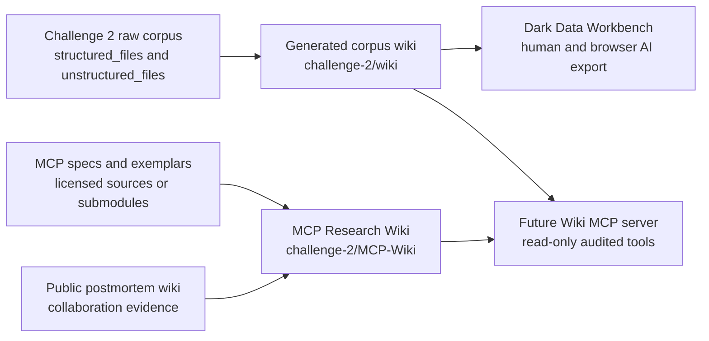
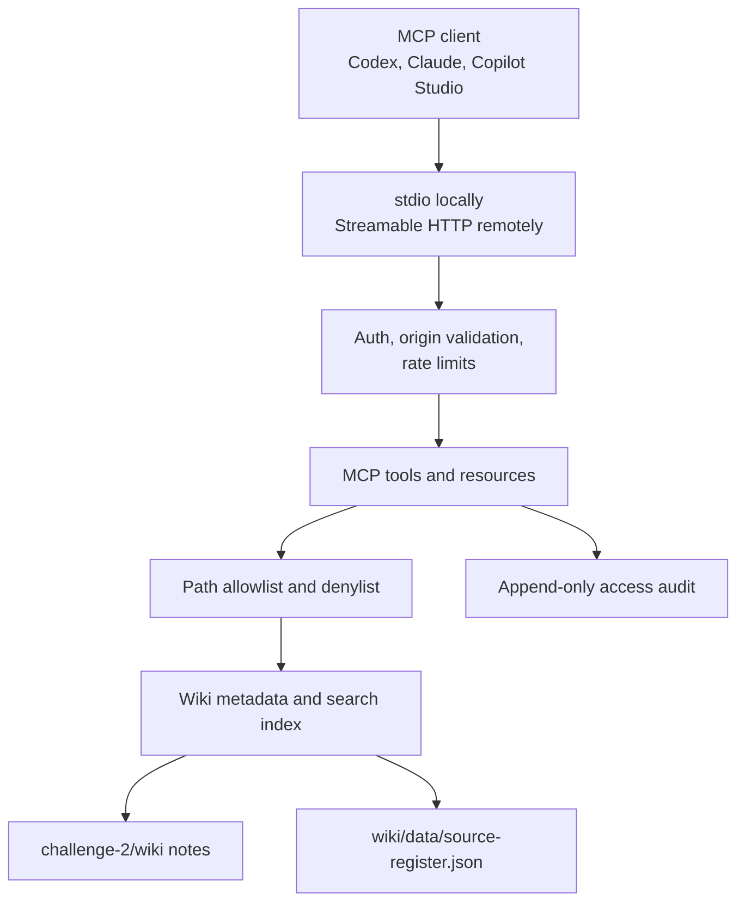

# MCP Research Wiki Architecture

This wiki separates MCP research and implementation planning from the Challenge 2 evaluation corpus. It gives humans and agents one place to understand candidate projects, specifications, licensing, security controls, and the future server implementation.

## Knowledge Boundaries



## Server Target



## Research Source Model

The research wiki stores four classes of source material:

| Class | Local treatment | License posture |
| --- | --- | --- |
| Project-generated reports | Full Markdown, DOCX, and PDF variants | Project artifact; record hashes and provenance |
| External specifications | Citation notes first; optional snapshots later | Preserve upstream license and update method |
| Reference implementations | Citation notes first; optional git submodules after review | Preserve upstream license files and dependency notices |
| Academic or web literature | Citation notes and summaries | Use canonical URLs, DOIs, arXiv IDs, or publisher links |

## Future Submodule Layout

Reference implementations and specifications should not be copied casually. If we decide to vendor or submodule them, use this layout:

```text
challenge-2/MCP-Wiki/references/external/<source-id>/
  upstream-submodule-or-snapshot
  SOURCE.md
  LICENSE
  NOTICE.md
```

Each `SOURCE.md` should record canonical URL, commit or version, license, retrieval command, purpose of inclusion, and whether code is used directly or only studied.
