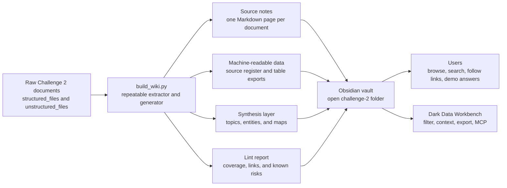
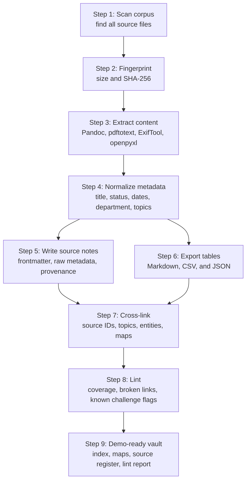
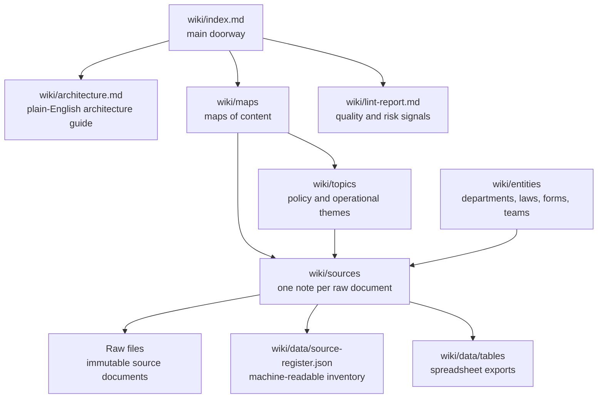

# Challenge 2 Architecture

This page explains the knowledge-base architecture for someone seeing it for the first time. The short version: the original documents stay untouched, a repeatable builder reads them, and the generated wiki turns them into linked notes that are easy to browse, search, review, and demo.

## What This Is

Challenge 2 starts with a messy document collection: HTML, Markdown, text files, PDFs, Word documents, and spreadsheets. The architecture translates those documents into an Obsidian-friendly knowledge base without changing the source files. The result is a wiki with source notes, topic pages, entity pages, maps of content, a source register, and a lint report.

The design follows the LLM Wiki pattern: raw sources are the source of truth, generated Markdown is the navigable knowledge layer, and explicit operating rules tell future agents how to maintain it.

The browser interface for this layer is [Dark Data Workbench](workbench.md). It lets users filter the generated source register, build an explicit context set, inspect evidence without AI, or export the same context to browser AI and local MCP clients.

## System At A Glance

## Ingest And Validation Flow

## Knowledge Model

## What The Builder Produces

- `43` source notes: one generated Markdown note for every Challenge 2 document.
- `14` topic pages: reusable summaries for policy and operational themes.
- `14` entity pages: departments, forms, laws, and named teams/programmes.
- `5` maps of content: guided entry points for browsing related material.
- `3` workbook exports: each spreadsheet is preserved as Markdown tables, JSON, and CSV.
- `5` flagged sources: stale, draft, superseded, synthetic fixture identifiers, or past-review records.

## Corpus Coverage

| Format | Sources |
| --- | ---: |
| `docx` | 11 |
| `html` | 8 |
| `md` | 7 |
| `pdf` | 9 |
| `txt` | 5 |
| `xlsx` | 3 |

## Demo Walkthrough

1. Open the `challenge-2/` folder as the Obsidian vault.
2. Start at [the knowledge base index](index.md) or [Dark Data Workbench](workbench.md).
3. Use [Housing And Benefits Map](maps/housing-and-benefits.md) to show how policy documents connect.
4. Use [Procurement And Spending Controls](topics/procurement-and-spending-controls.md) to answer the IT hardware approval question.
5. Use [the lint report](lint-report.md) to show why metadata, provenance, and versioning matter.
6. Use [the source register](data/source-register.json) or Dark Data Workbench exports to show the same knowledge base can also feed machine consumers.

## Why The Architecture Matters

- **Traceability:** every generated note links back to its raw source file.
- **Repeatability:** the builder can regenerate the wiki from the source corpus.
- **Findability:** maps, topics, entities, tags, and backlinks give multiple routes through the same material.
- **Safety:** stale, superseded, draft, synthetic fixture identifiers, and sensitive classifications are highlighted instead of hidden.
- **Synthetic fixtures:** all Challenge 2 raw and generated data is synthetic. Synthetic names and contact-like values are retained for demo fidelity; real secrets and local environment leaks remain review issues.
- **Portability:** the output is plain Markdown and JSON, so it works in Obsidian, GitHub, VS Code, and simple scripts.

## Glossary

| Term | Meaning |
| --- | --- |
| Architecture | The way the raw files, extraction script, generated notes, data files, and Obsidian vault fit together. |
| Corpus | The complete set of Challenge 2 source documents being processed. |
| Dark Data Workbench | The browser UI for filtering the wiki corpus, building context sets, browsing evidence, and exporting that context to browser AI or MCP. |
| Entity page | A generated note about a department, law, form, team, or programme that appears across sources. |
| Extraction | The process of reading content and metadata from source formats such as PDF, DOCX, HTML, Markdown, text, and XLSX. |
| Frontmatter | YAML metadata at the top of a Markdown note, used by Obsidian and scripts for filtering and navigation. |
| Ingest | One run of the builder that reads the corpus and regenerates the wiki layer. |
| Lint report | A generated quality report covering source coverage, broken links, missing metadata, and known Challenge 2 risk signals. |
| LLM Wiki | A maintained Markdown knowledge base that sits between raw sources and users, so knowledge compounds instead of being rediscovered from scratch. |
| Map of content | A curated navigation page that groups related notes around a domain or workflow. |
| Obsidian vault | A folder of Markdown files opened in Obsidian as a browsable knowledge base. |
| Provenance | Evidence showing where a claim or extracted fact came from. |
| Raw source | The original source document. In this architecture, raw sources are not edited. |
| Source note | A generated Markdown note that represents one raw source file, including extracted text, metadata, links, and provenance. |
| Source register | The machine-readable JSON inventory of every source file, extraction method, metadata fields, flags, and generated note path. |
| Synthetic fixture data | Artificial data created for the Challenge 2 demo. It may look like staff or contact data, but it is not real personal data. |
| Topic page | A generated synthesis note that groups sources around a recurring policy or operational theme. |

## Related Notes

- [Knowledge base index](index.md)
- [Lint report](lint-report.md)
- [Operating rules](../AGENTS.md)
