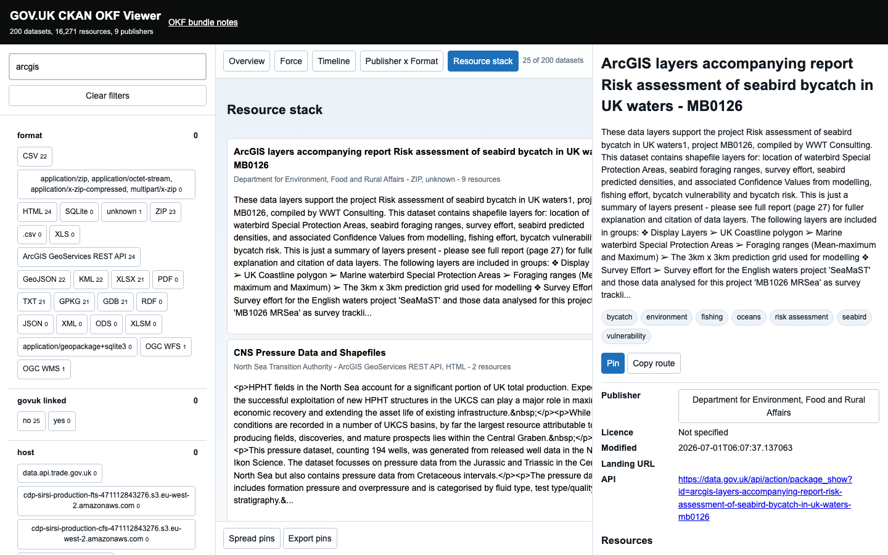
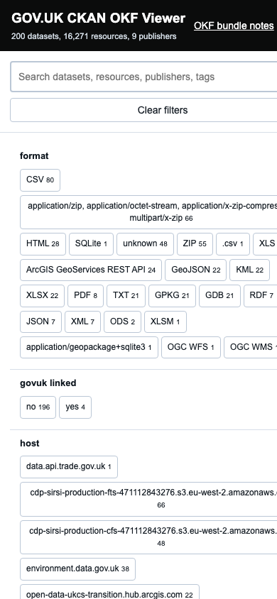

# GOV.UK CKAN Viewer UI Design

## Three-panel Standard

The left panel reduces the corpus through search and folded facets. Facets are derived from source structure: publisher, publisher family, format, licence, tag, update year, URL host, GOV.UK-linked status, and resource type. Facets start folded; opening one facet folds the previous inactive facet while selected values remain visible as compact chips.

The centre canvas never defaults to a hairball. `#overview` opens with a screen-sized bundle info-card. Dataset, publisher, resource-stack, timeline, matrix, and Graph views are available after selection or filtering. Graph view includes a colour key, visible relationship list, edge labels for selected-item graphs, drag-to-pan, zoom controls, and clickable concept nodes for facets such as format, tag, host, and licence.

The right panel is a scannable data card for the selected dataset, resource, or publisher. It exposes metadata, source links, related records, provenance, a copyable route, and pin controls.

## Hover, Touch, And Accessibility

All hover behaviour is backed by one `spotlight` state. Pointer hover, keyboard focus, Enter, Space, and touch tap all activate the same state. Escape clears it. The viewer announces spotlight changes through an aria-live region, and every visual hover action has a button equivalent.

## Comparison

Pinned cards are stored locally and can be spread from a compact stack into a comparison strip. The comparison strip is intentionally below the canvas controls so it does not cover graph relationships.

## Screenshot Examples

The sample bundle has deterministic screenshot examples for the viewer states that matter most:

The overview route opens at `viewer.html#overview` and presents counts, top publishers, dominant formats, and caveats before any graph is shown.

The selected dataset route uses `mode=force` to show a reduced publisher/dataset relationship graph with the selected data card visible on the right.

The resource stack route uses the same active reduction model as the graph views, but renders scannable dataset rows as a step before deeper exploration.

Pinned items can be kept as a compact stack or spread into a comparison strip. The screenshot restores pins from URL state for deterministic documentation; normal use persists pins in localStorage.

The mobile route stacks the panels and preserves touch access to the same spotlight state used by pointer hover and keyboard focus.
