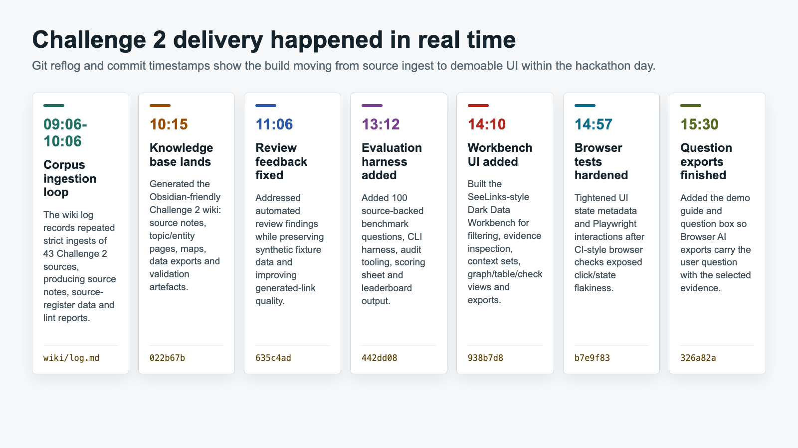
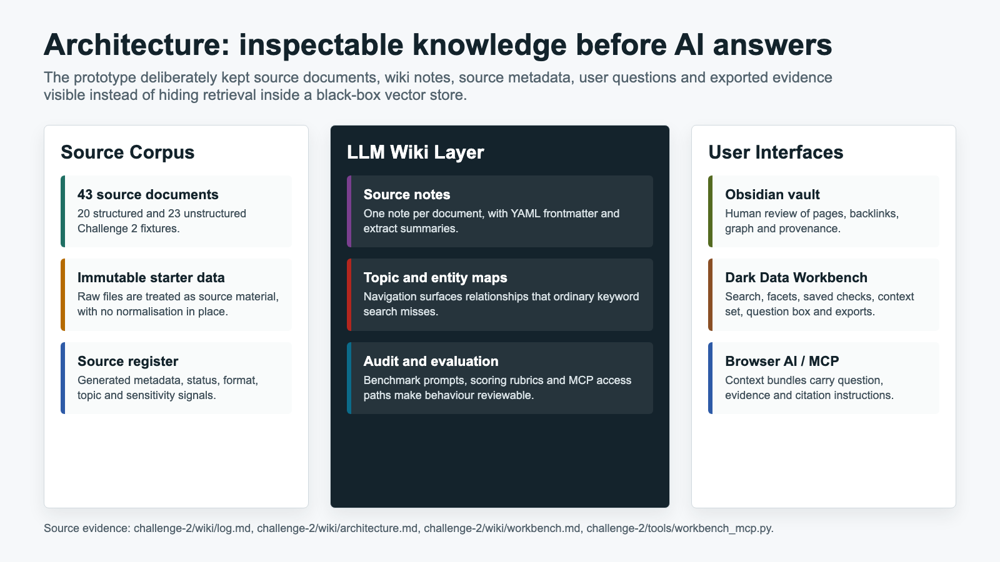
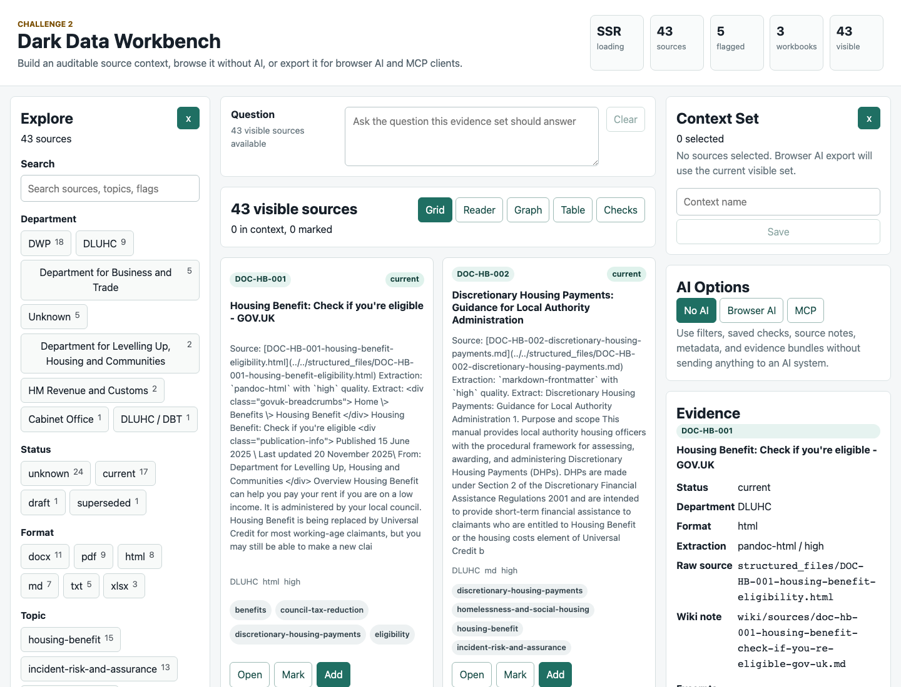

# Challenge 2 Realtime Delivery Report

## Executive Summary

On 2026-04-16 Team DSIT A worked on [Challenge 2: Unlocking the dark data](../../challenge-02-unlocking-the-dark-data.md), the hackathon brief about making fragmented government policy, guidance and procedural documents findable, structured and answerable. The project started from a fork of the upstream hackathon repository and moved through source ingestion, Obsidian-style knowledge-base generation, review hardening, evaluation design, a SeeLinks-style browser workbench, and a final question-box export improvement.

The central design decision was to avoid treating the problem as "just put documents into a vector store". Instead, we built an inspectable Markdown/Obsidian knowledge layer over the Challenge 2 corpus. That layer preserves source IDs, document status, version/provenance signals, topic relationships, source paths, caveats and quality warnings. The UI and export layer then allows a user to state a question, select evidence deliberately, inspect source text, and export a context bundle for Browser AI or MCP clients.

The realtime evidence is strong. The local git reflog, commit history, [Challenge 2 wiki log](../../challenge-2/wiki/log.md), and Codex thread metadata summarized in the public postmortem show a continuous build on 2026-04-16:

- 03:32 - fork cloned locally.
- 09:06 to 10:06 - repeated wiki ingestion runs against 43 Challenge 2 sources.
- 10:15 - generated Challenge 2 Obsidian knowledge base committed.
- 11:06 - automated-review feedback addressed.
- 13:12 - evaluation harness committed.
- 14:10 - Dark Data Workbench committed.
- 14:57 - Playwright UI interactions hardened.
- 15:30 - demonstration guide and question-box exports committed.



Figure 1. Realtime delivery sequence reconstructed from `wiki/log.md`, `git reflog`, and commit timestamps.

## Sources Used

This report uses four evidence classes.

| Evidence source | What it contributes | Link |
| --- | --- | --- |
| Supplied Word write-up | Human narrative, judging context, chosen problem, design rationale and "4th overall" note. | Private local source; summarized here rather than published. |
| Repository history | Timestamped implementation sequence and exact commits. | [origin repository](https://github.com/chris-page-gov/ai-engineering-lab-hackathon-london-2026) |
| Repository logs and tracking docs | Build logs, project status, validation, architecture assumptions and change history. | [wiki log](../../challenge-2/wiki/log.md), [Changelog](../../Changelog.md), [Context](../../Context.md), [Progress](../../Progress.md) |
| Codex session records | Conversation and command-level evidence for the final Seelinks question-box work and clean-working-tree check. | Public summary: [Codex postmortem](../../postmortem-public/wiki/index.md). Raw local transcripts are not published. |

The supplied Word file is treated as a secondary narrative source for the live event discussion. The repo history and local logs are treated as primary evidence for implementation order, timestamps and validation.

## Starting Point

The supplied write-up records that the repo was forked to [chris-page-gov/ai-engineering-lab-hackathon-london-2026](https://github.com/chris-page-gov/ai-engineering-lab-hackathon-london-2026). The local reflog confirms the clone happened on 2026-04-16 at 03:32 local time:

```text
2026-04-16 03:32:22 +0100 clone: from https://github.com/chris-page-gov/ai-engineering-lab-hackathon-london-2026.git
2026-04-16 03:32:58 +0100 checkout: moving from main to codex/hackathon-work
```

The team selected Challenge 2, described in the supplied write-up as the "dark data" or unstructured-document challenge. The challenge brief frames the core user problem as the inability of citizens, officials and downstream channels to get direct answers from material that exists but is buried in PDFs, Word documents, spreadsheets and semi-structured guidance. See [challenge-02-unlocking-the-dark-data.md](../../challenge-02-unlocking-the-dark-data.md).

The important early constraint was that answers must depend on more than matching words. They often depend on source provenance, currency, supersession, document status, extraction quality and whether a source is draft, stale, synthetic or contradictory. That pushed the architecture towards a navigable knowledge base rather than a retrieval-only prototype.

## Design Decision: Knowledge Base Before Answers

The supplied write-up captures the main decision: we deliberately did not start with a conventional RAG-first approach. The team built a Markdown/Obsidian-style knowledge base from the source documents because source chunks alone can lose:

- document status;
- source relationships;
- version history;
- supersession links;
- extraction warnings;
- topic context;
- provenance back to raw starter files.

The implementation in the repo reflects that decision. Challenge 2 now contains:

- immutable raw source folders under [challenge-2/structured_files](../../challenge-2/structured_files/) and [challenge-2/unstructured_files](../../challenge-2/unstructured_files/);
- generated source notes under [challenge-2/wiki/sources](../../challenge-2/wiki/sources/);
- topic pages under [challenge-2/wiki/topics](../../challenge-2/wiki/topics/);
- entity pages under [challenge-2/wiki/entities](../../challenge-2/wiki/entities/);
- maps under [challenge-2/wiki/maps](../../challenge-2/wiki/maps/);
- machine-readable output under [challenge-2/wiki/data](../../challenge-2/wiki/data/);
- a plain-English architecture page at [challenge-2/wiki/architecture.md](../../challenge-2/wiki/architecture.md);
- an Obsidian/workbench entry point at [challenge-2/wiki/workbench.md](../../challenge-2/wiki/workbench.md).



Figure 2. Architecture as implemented: source corpus, LLM Wiki layer, Obsidian/Workbench interfaces and AI/MCP export paths.

## What We Built, In Order

### 1. Generated the Challenge 2 Wiki

The wiki log records repeated ingestion runs on 2026-04-16:

| Time UTC | Log entry | Result |
| --- | --- | --- |
| 09:06 | `ingest | Challenge 2 source corpus` | 43 sources processed, 43 source notes generated, 5 flagged sources. |
| 09:14 | `ingest | Challenge 2 source corpus` | Same source count and register output. |
| 09:30 | `ingest | Challenge 2 source corpus` | Same source count and register output. |
| 10:04 | `ingest | Challenge 2 source corpus` | Same source count and register output. |
| 10:06 | `ingest | Challenge 2 source corpus` | Same source count and register output. |

The first major implementation commit was [022b67b](https://github.com/chris-page-gov/ai-engineering-lab-hackathon-london-2026/commit/022b67b410520ce8efde134ada4f600b9e830c41), `Add Challenge 2 Obsidian knowledge base`, at 10:15 local time. It added the generated wiki, source notes, topic pages, entity pages, maps, table exports, source-register JSON and lint output.

The key implementation file is [challenge-2/tools/build_wiki.py](../../challenge-2/tools/build_wiki.py). The local Challenge 2 operating rules are in [challenge-2/AGENTS.md](../../challenge-2/AGENTS.md). Those rules define the raw-source immutability contract, source-note metadata shape, synthetic fixture-data assumptions and maintenance workflow.

### 2. Preserved Synthetic Data Correctly

The supplied write-up records a governance issue: automated review flagged names and contact-like details for redaction. The team clarified that the challenge data was synthetic, then added repository guidance so future automated review would preserve synthetic identifiers while still flagging real secrets, local paths, broken links and provenance gaps.

That decision is visible in:

- [AGENTS.md](../../AGENTS.md), repo-wide operating rules;
- [challenge-2/AGENTS.md](../../challenge-2/AGENTS.md), Challenge 2 synthetic fixture-data rules;
- [Context.md](../../Context.md), data assumptions;
- commit [635c4ad](https://github.com/chris-page-gov/ai-engineering-lab-hackathon-london-2026/commit/635c4adefdcd9c97ec97d7b195e469161aef216a), `Address Challenge 2 review feedback`, at 11:06 local time.

This mattered because the goal was not to remove useful demo data. The goal was to distinguish synthetic fixture identifiers from genuine data-leak risks.

### 3. Added Documentation Lockstep

At 12:34 local time, commit [b2b9da6](https://github.com/chris-page-gov/ai-engineering-lab-hackathon-london-2026/commit/b2b9da62b7b0ef774ee9776e8f59d6f2cd5b053f) added repo-wide documentation tracking and lockstep checks:

- [Changelog.md](../../Changelog.md);
- [Context.md](../../Context.md);
- [Progress.md](../../Progress.md);
- [tools/check_documentation_lockstep.py](../../tools/check_documentation_lockstep.py);
- pull-request template and CI support.

At 12:54, commit [35a9011](https://github.com/chris-page-gov/ai-engineering-lab-hackathon-london-2026/commit/35a90111c3a0cb372916d7de449d3af98584ff11) hardened that check so deletion of required tracking files could not pass as an update.

This was a process improvement as much as a code change. It forced implementation, validation and documentation to move together.

### 4. Added an Evaluation Harness

The supplied write-up says the next step was to generate around 100 questions, run multiple AI systems, score answer quality and use those results to improve the wiki structure and prompting. The repo implements that plan.

At 13:12 local time, commit [442dd08](https://github.com/chris-page-gov/ai-engineering-lab-hackathon-london-2026/commit/442dd0841adb546da270656b187c27667a5006db), `Add Challenge 2 evaluation harness`, added:

- [challenge-2/wiki/evaluation-benchmark.md](../../challenge-2/wiki/evaluation-benchmark.md), the 100-question benchmark with gold answers and rubrics;
- [challenge-2/evaluation/README.md](../../challenge-2/evaluation/README.md), the runbook;
- [challenge-2/tools/run_wiki_eval.py](../../challenge-2/tools/run_wiki_eval.py), the CLI harness;
- [challenge-2/tools/wiki_eval_mcp.py](../../challenge-2/tools/wiki_eval_mcp.py), the audited wiki MCP layer;
- [challenge-2/tools/summarise_wiki_eval.py](../../challenge-2/tools/summarise_wiki_eval.py), leaderboard generation.

This was the point where the prototype became measurable. Instead of only demonstrating a generated knowledge base, it had a plan for comparing answer quality across Codex, Gemini CLI and Claude Code using the same source-backed questions.

### 5. Built the SeeLinks-Style Dark Data Workbench

The supplied write-up notes feedback that the team needed a clear user interface and something demoable, not just a strong backend/evaluation story. That is exactly what commit [938b7d8](https://github.com/chris-page-gov/ai-engineering-lab-hackathon-london-2026/commit/938b7d84e1f5d8a8d242704414fcbc7b9860aca6), `Add Challenge 2 dark data workbench`, delivered at 14:10 local time.

The workbench lives under [challenge-2/workbench](../../challenge-2/workbench/). It is a SvelteKit app that loads [challenge-2/wiki/data/source-register.json](../../challenge-2/wiki/data/source-register.json) and generated source notes, then provides:

- search and facets;
- source cards;
- source reader;
- context-set building;
- saved deterministic checks;
- graph and table views;
- evidence panel;
- Browser AI JSON and Markdown exports;
- MCP setup guidance;
- unit, component and Playwright tests.



Figure 3. The current Dark Data Workbench. The question box sits above the visible-source results and is carried into exports.

### 6. Hardened Browser Automation and UI State

At 14:57 local time, commit [b7e9f83](https://github.com/chris-page-gov/ai-engineering-lab-hackathon-london-2026/commit/b7e9f83cfb7256fc70bfad78b3e7963e4a866504) hardened the workbench Playwright interactions. The issue was practical: browser automation needed reliable active/pressed state for controls that drive the visible corpus, evidence and export context.

That commit updated:

- [challenge-2/workbench/src/routes/+page.svelte](../../challenge-2/workbench/src/routes/+page.svelte);
- [challenge-2/workbench/tests/ui/workbench.spec.ts](../../challenge-2/workbench/tests/ui/workbench.spec.ts);
- the tracking docs that explain why UI state matters.

This was a small but important quality loop: a UI that cannot be tested reliably is hard to demonstrate reliably.

### 7. Added the Demonstration Guide and Question Box

The supplied write-up says the UI was not completed in time for the original judging moment. The repo timeline shows why that feedback was fair and how the gap was closed:

- the core workbench UI landed at 14:10;
- browser automation was hardened at 14:57;
- the final question-box export improvement landed at 15:30, after the final-review period had already started at 15:15.

At 15:30 local time, commit [326a82a](https://github.com/chris-page-gov/ai-engineering-lab-hackathon-london-2026/commit/326a82a8f17440d49471dab6a11d2b725b879359), `Add Challenge 2 demo guide and question exports`, added:

- [challenge-2/wiki/demonstration-guide.md](../../challenge-2/wiki/demonstration-guide.md), an end-to-end demo route;
- [challenge-2/AI Benchmark Mastery Scoring Guide.png](../../challenge-2/AI%20Benchmark%20Mastery%20Scoring%20Guide.png), the scoring-guide visual referenced by the supplied write-up;
- a workbench question box in [challenge-2/workbench/src/routes/+page.svelte](../../challenge-2/workbench/src/routes/+page.svelte);
- question persistence in [challenge-2/workbench/src/lib/workbench/model.ts](../../challenge-2/workbench/src/lib/workbench/model.ts);
- export typing in [challenge-2/workbench/src/lib/workbench/types.ts](../../challenge-2/workbench/src/lib/workbench/types.ts);
- test coverage in [model.test.ts](../../challenge-2/workbench/src/lib/workbench/model.test.ts) and [workbench.spec.ts](../../challenge-2/workbench/tests/ui/workbench.spec.ts);
- workbench documentation updates in [challenge-2/wiki/workbench.md](../../challenge-2/wiki/workbench.md) and [challenge-2/workbench/README.md](../../challenge-2/workbench/README.md).

The Codex question-box thread shows the detailed sequence from request to validation:

| Time UTC | Thread event | Evidence |
| --- | --- | --- |
| 14:25:36 | User asked: "Update the Seelinks UI to include a question box." | [public postmortem exchange](../../postmortem-public/wiki/exchanges/0049-20260416142455-add-workbench-question-box.md) |
| 14:25:37 | Assistant began by locating the Seelinks UI. | same thread |
| 14:26:07 | Design stated: typed question should pass through saved checks, JSON export, browser prompt and evidence bundle. | same thread |
| 14:26:31 | Files to edit identified: Svelte page, export model/types, tests and docs. | same thread |
| 14:28:55 | First `pnpm check` found the missing `view.question` type path. | same thread |
| 14:29:08 | `pnpm check` passed after correcting the type. | same thread |
| 14:29:16 | `pnpm test` passed: 2 test files, 14 tests. | same thread |
| 14:29:22 | `pnpm build` passed. | same thread |
| 14:29:31 | `pnpm test:ui` passed: 8 Playwright tests. | same thread |
| 14:29:39 | Documentation lockstep check passed. | same thread |
| 14:30:20 | Final response reported implementation complete and local dev URL available. | same thread |

The implementation deliberately does not pretend to answer the question inside the workbench. It records the question and keeps it attached to the evidence pack. That is the right boundary: evidence selection remains inspectable, and any AI answer must cite the exported source IDs.

## Realtime Timeline

The following timeline reconciles event-day context from the supplied Word file with primary implementation evidence from the repo.

| Local time | What happened | Evidence |
| --- | --- | --- |
| 03:32 | Fork cloned locally and work began on `codex/hackathon-work`. | [git reflog](../../.git/logs/HEAD) |
| 08:30 | Event arrival window in supplied agenda. | Private source write-up, summarized here. |
| 09:00 | Welcome/keynote framed AI as engineering leverage requiring discipline, feedback loops and operational quality. | supplied write-up |
| 09:06-10:06 | Challenge 2 corpus ingested repeatedly: 43 sources, 20 structured, 23 unstructured, 43 source notes, 5 flagged sources. | [challenge-2/wiki/log.md](../../challenge-2/wiki/log.md) |
| 10:15 | Challenge 2 Obsidian knowledge base committed. | [022b67b](https://github.com/chris-page-gov/ai-engineering-lab-hackathon-london-2026/commit/022b67b410520ce8efde134ada4f600b9e830c41) |
| 10:19 | Review docs and Obsidian vault config committed. | [ea4b14b](https://github.com/chris-page-gov/ai-engineering-lab-hackathon-london-2026/commit/ea4b14b0171696bc7159d5cd3479b79032a9d90a) |
| 10:32 | Architecture overview committed. | [5a24eb9](https://github.com/chris-page-gov/ai-engineering-lab-hackathon-london-2026/commit/5a24eb9157b223714ad4efa8ec9cb89866bb7cd2) |
| 11:06 | Challenge 2 review feedback addressed. | [635c4ad](https://github.com/chris-page-gov/ai-engineering-lab-hackathon-london-2026/commit/635c4adefdcd9c97ec97d7b195e469161aef216a) |
| 11:56 | First Challenge 2 PR merged into fork `main`. | [816ff0e](https://github.com/chris-page-gov/ai-engineering-lab-hackathon-london-2026/commit/816ff0e) |
| 12:34 | Documentation tracking and lockstep checks added. | [b2b9da6](https://github.com/chris-page-gov/ai-engineering-lab-hackathon-london-2026/commit/b2b9da62b7b0ef774ee9776e8f59d6f2cd5b053f) |
| 12:54 | Lockstep deletion check fixed. | [35a9011](https://github.com/chris-page-gov/ai-engineering-lab-hackathon-london-2026/commit/35a90111c3a0cb372916d7de449d3af98584ff11) |
| 13:12 | Challenge 2 evaluation harness committed. | [442dd08](https://github.com/chris-page-gov/ai-engineering-lab-hackathon-london-2026/commit/442dd0841adb546da270656b187c27667a5006db) |
| 13:15 | Evaluation harness PR merged. | [dec9cf2](https://github.com/chris-page-gov/ai-engineering-lab-hackathon-london-2026/commit/dec9cf2) |
| 13:40 | Upstream `main` merged into fork work. | [44dbc25](https://github.com/chris-page-gov/ai-engineering-lab-hackathon-london-2026/commit/44dbc25) |
| 14:10 | Dark Data Workbench committed. | [938b7d8](https://github.com/chris-page-gov/ai-engineering-lab-hackathon-london-2026/commit/938b7d84e1f5d8a8d242704414fcbc7b9860aca6) |
| 14:25 | Separate Codex thread started for "Update Seelinks UI question box". | [public postmortem source](../../postmortem-public/wiki/sources/conv-004-seelinks-question-box-pr-hygiene-and-baseline-cleanup.md) |
| 14:57 | Workbench Playwright controls hardened. | [b7e9f83](https://github.com/chris-page-gov/ai-engineering-lab-hackathon-london-2026/commit/b7e9f83cfb7256fc70bfad78b3e7963e4a866504) |
| 15:04 | Obsidian workspace state ignored to keep local browsing out of git. | [a719306](https://github.com/chris-page-gov/ai-engineering-lab-hackathon-london-2026/commit/a7193063bffdc5263268749ce75d06cc9972fed4) |
| 15:15 | Final review period began, according to supplied agenda. | supplied write-up |
| 15:30 | Demonstration guide and question-box exports committed. | [326a82a](https://github.com/chris-page-gov/ai-engineering-lab-hackathon-london-2026/commit/326a82a8f17440d49471dab6a11d2b725b879359) |
| 16:15 | Top-three presentations began, according to supplied agenda. | supplied write-up |
| 16:30 | Winners announced, according to supplied agenda. | supplied write-up |
| 2026-04-17 11:38 | Working tree, branches and worktrees confirmed clean. | [public postmortem exchange](../../postmortem-public/wiki/exchanges/0050-20260416142455-are-we-clean-here-and-other-branches-worktrees.md) |

## Demonstration Storyline

The strongest colleague-facing storyline is:

1. We chose a real public-sector knowledge-management problem: documents exist, but direct answers are hard because the material is fragmented, unstructured and operationally messy.
2. We did not start with a chat box. We started by turning the corpus into an inspectable knowledge asset.
3. We preserved raw sources and generated traceable Markdown source notes, topic pages, entity pages and machine-readable registers.
4. We treated metadata as product value, not decoration. Status, version, extraction quality, source path and synthetic-data caveats affect whether an AI answer can be trusted.
5. We added evaluation early enough to make answer quality measurable rather than anecdotal.
6. We then built a SeeLinks-style UI so judges and users could see the evidence set, not just hear about it.
7. We added the question box so the exported AI context carries both the user need and the evidence selected to answer it.
8. We validated the work with typecheck, unit/component tests, production build, Playwright tests, wiki compile checks and documentation lockstep checks.

## Validation Evidence

The current repo records these validation paths in [Progress.md](../../Progress.md), and the question-box thread records the final focused validation run:

| Validation | Purpose | Result |
| --- | --- | --- |
| `pnpm check` | Svelte typecheck and SvelteKit sync. | Passed after adding the `view.question` export type. |
| `pnpm test` | Vitest unit/component tests. | Passed: 2 files, 14 tests. |
| `pnpm build` | Production SvelteKit build. | Passed. |
| `pnpm test:ui` | Playwright desktop/mobile browser tests. | Passed: 8 tests, including mobile no-horizontal-overflow. |
| `uv run --with openpyxl python -m py_compile challenge-2/tools/build_wiki.py` | Narrow Challenge 2 wiki compile check. | Passed. |
| `python3 tools/check_documentation_lockstep.py` | Required tracking docs updated. | Passed. |
| `git diff --check` | Whitespace and patch hygiene. | Passed. |

The clean-state check on 2026-04-17 found:

- branch `main`;
- HEAD `326a82a`;
- no uncommitted or untracked files at that time;
- only one local branch;
- only one worktree;
- `main` tracking `origin/main` with no ahead/behind shown from the local remote ref.

## Judging Context and Scoring

The supplied write-up states that the project was 4th overall and that the UI was not completed in time for the original judging moment. The repo history makes that understandable rather than contradictory. The knowledge base, evaluation harness and first workbench were all delivered on the hackathon day, but the final UI polish and question-export story were still converging as final review began.

The scoring-guide image committed with the final report guide reinforces the same lesson: the work was strongest where it connected AI engineering with governable evidence, evaluation and model comparison, and weakest at the original judging point where the UI was not yet complete enough to make that value obvious immediately.


Figure 4. Scoring guide image referenced by the supplied write-up and committed in the final demonstration-guide commit.

## What This Means for Colleagues

The project is useful as a pattern, not just as a hackathon artifact.

For product and policy colleagues, it shows that AI-assisted discovery should expose provenance and caveats rather than hide them. The user should be able to ask "which source did this come from?", "is this current?", "what conflicts with it?", and "what evidence did the model see?".

For engineering colleagues, it shows a practical AI-coding workflow:

- use AI to accelerate corpus analysis and code generation;
- keep source data immutable;
- record architecture and data assumptions in repo docs;
- add deterministic tests and CI checks;
- use browser automation for UI confidence;
- evaluate answer quality with a benchmark rather than demo impressions;
- treat documentation as part of the product.

For governance colleagues, it shows how to separate synthetic fixture data from real data-risk controls. Automated review should not reflexively redact synthetic names in a challenge corpus, but it should continue to flag real secrets, local paths, broken links, malformed content and provenance gaps.

## Remaining Work

The repo already lists the next steps in [Progress.md](../../Progress.md):

1. Run the full benchmark against Codex, Gemini CLI and Claude Code using [challenge-2/tools/run_wiki_eval.py](../../challenge-2/tools/run_wiki_eval.py).
2. Score `generated/scoring-sheet.csv` and generate `generated/leaderboard.md`.
3. Add source-backed demo answers for the five Challenge 2 demo questions.
4. Use Dark Data Workbench during the demo to show search, context export and source-backed checks over the generated knowledge base.

The most important product next step is to make the UI answer-flow explicit: question, evidence selection, caveat review, export, answer, citation check, audit record. The question box is the first piece of that path.

## Appendix A: Key Commits

| Commit | Time local | Summary | Link |
| --- | --- | --- | --- |
| `022b67b` | 2026-04-16 10:15 | Add Challenge 2 Obsidian knowledge base. | [commit](https://github.com/chris-page-gov/ai-engineering-lab-hackathon-london-2026/commit/022b67b410520ce8efde134ada4f600b9e830c41) |
| `ea4b14b` | 2026-04-16 10:19 | Include review docs and Obsidian vault config. | [commit](https://github.com/chris-page-gov/ai-engineering-lab-hackathon-london-2026/commit/ea4b14b0171696bc7159d5cd3479b79032a9d90a) |
| `5a24eb9` | 2026-04-16 10:32 | Add Challenge 2 architecture overview. | [commit](https://github.com/chris-page-gov/ai-engineering-lab-hackathon-london-2026/commit/5a24eb9157b223714ad4efa8ec9cb89866bb7cd2) |
| `635c4ad` | 2026-04-16 11:06 | Address Challenge 2 review feedback. | [commit](https://github.com/chris-page-gov/ai-engineering-lab-hackathon-london-2026/commit/635c4adefdcd9c97ec97d7b195e469161aef216a) |
| `b2b9da6` | 2026-04-16 12:34 | Add documentation tracking and lockstep checks. | [commit](https://github.com/chris-page-gov/ai-engineering-lab-hackathon-london-2026/commit/b2b9da62b7b0ef774ee9776e8f59d6f2cd5b053f) |
| `35a9011` | 2026-04-16 12:54 | Fix documentation lockstep deletion check. | [commit](https://github.com/chris-page-gov/ai-engineering-lab-hackathon-london-2026/commit/35a90111c3a0cb372916d7de449d3af98584ff11) |
| `442dd08` | 2026-04-16 13:12 | Add Challenge 2 evaluation harness. | [commit](https://github.com/chris-page-gov/ai-engineering-lab-hackathon-london-2026/commit/442dd0841adb546da270656b187c27667a5006db) |
| `938b7d8` | 2026-04-16 14:10 | Add Challenge 2 dark data workbench. | [commit](https://github.com/chris-page-gov/ai-engineering-lab-hackathon-london-2026/commit/938b7d84e1f5d8a8d242704414fcbc7b9860aca6) |
| `b7e9f83` | 2026-04-16 14:57 | Harden workbench Playwright controls. | [commit](https://github.com/chris-page-gov/ai-engineering-lab-hackathon-london-2026/commit/b7e9f83cfb7256fc70bfad78b3e7963e4a866504) |
| `a719306` | 2026-04-16 15:04 | Ignore Obsidian workspace state. | [commit](https://github.com/chris-page-gov/ai-engineering-lab-hackathon-london-2026/commit/a7193063bffdc5263268749ce75d06cc9972fed4) |
| `326a82a` | 2026-04-16 15:30 | Add Challenge 2 demo guide and question exports. | [commit](https://github.com/chris-page-gov/ai-engineering-lab-hackathon-london-2026/commit/326a82a8f17440d49471dab6a11d2b725b879359) |

## Appendix B: Important Repository Links

- [Challenge 2 brief](../../challenge-02-unlocking-the-dark-data.md)
- [Challenge 2 wiki index](../../challenge-2/wiki/index.md)
- [Challenge 2 architecture](../../challenge-2/wiki/architecture.md)
- [Challenge 2 workbench note](../../challenge-2/wiki/workbench.md)
- [Challenge 2 demonstration guide](../../challenge-2/wiki/demonstration-guide.md)
- [Dark Data Workbench README](../../challenge-2/workbench/README.md)
- [Workbench Svelte page](../../challenge-2/workbench/src/routes/+page.svelte)
- [Workbench model/export logic](../../challenge-2/workbench/src/lib/workbench/model.ts)
- [Workbench export types](../../challenge-2/workbench/src/lib/workbench/types.ts)
- [Workbench Playwright tests](../../challenge-2/workbench/tests/ui/workbench.spec.ts)
- [Evaluation benchmark](../../challenge-2/wiki/evaluation-benchmark.md)
- [Evaluation harness README](../../challenge-2/evaluation/README.md)
- [Wiki evaluation MCP](../../challenge-2/tools/wiki_eval_mcp.py)
- [Workbench MCP](../../challenge-2/tools/workbench_mcp.py)
- [Documentation lockstep check](../../tools/check_documentation_lockstep.py)

## Appendix C: Example Codex Conversations

missing text, formatted in Word doc in Downloads

### Challenge 2 Obsidian Knowledge Base Plan

#### Summary

Build Challenge 2 as a Karpathy-style LLM Wiki: raw source documents stay immutable, an LLM-maintained Markdown wiki becomes the navigable knowledge layer, and schema/index/log files keep the system disciplined. This follows the pattern in Karpathy’s [LLM Wiki gist](https://gist.github.com/karpathy/442a6bf555914893e9891c11519de94f): raw sources, generated wiki, and explicit operating rules.

Use all Challenge 2 documents: 20 structured files and 23 unstructured files from [challenge-2](../../challenge-2). “Translate” means format translation into Obsidian-friendly Markdown, not natural-language translation.

#### Key Changes

- Treat `challenge-2/` as the Obsidian vault root so source files, generated notes, and links live together.
- Add a generated wiki layer under `challenge-2/wiki/`:
  - `index.md`: content catalogue and primary navigation.
  - `log.md`: append-only ingest/query/lint history.
  - `sources/`: one note per original document.
  - `topics/`: synthesized policy/topic pages such as Housing Benefit, DHPs, Flexible Working, Procurement, Data Protection, FOI, HR Policies.
  - `entities/`: departments, teams, roles, legislation, forms, and named programmes.
  - `maps/`: maps of content for Housing and Benefits, Small Business and Employment, Corporate Operations, People Policies, and Risk/Assurance.
- Add `challenge-2/AGENTS.md` as the wiki operating schema: raw sources are read-only, every generated note needs YAML frontmatter, every claim needs source provenance, and every ingest updates `index.md` and `log.md`.
- Add lightweight extraction tooling under `challenge-2/tools/`:
  - Inventory every source file with path, format, size, SHA-256, technical metadata, and extraction status.
  - Extract Markdown/HTML/TXT directly.
  - Extract PDFs with `pdftotext`, `pdfinfo`, and `exiftool`.
  - Extract DOCX with `pandoc` plus DOCX core-property metadata.
  - Extract XLSX with `openpyxl` via `uv`, converting each worksheet to Markdown tables plus structured JSON.

#### Metadata And Interfaces

- Preserve metadata in three places:
  - YAML frontmatter for Obsidian navigation and Dataview-style filtering.
  - A visible “Metadata” section inside each source note.
  - A machine-readable source register, `challenge-2/wiki/data/source-register.json`.
- Use this canonical frontmatter shape for source notes:

```yaml
source_id: DOC-HB-002
title: "Discretionary Housing Payments: Guidance for Local Authority Administration"
source_path: "../structured_files/DOC-HB-002-discretionary-housing-payments.md"
source_format: "md"
document_type: "procedural-manual"
department: "DLUHC"
owner: null
status: "current"
version: "2.1"
publication_date: "2025-03-01"
last_updated: "2025-09-15"
audience: ["Local authority housing officers"]
topics: ["housing-benefit", "discretionary-housing-payments"]
supersedes: ["DOC-HB-002 v1.4"]
related_sources: ["DOC-HB-001", "DOC-HB-008"]
tags: ["source", "challenge-2", "housing-benefit"]
extraction:
  method: "markdown-frontmatter"
  quality: "high"
  warnings: []
sensitivity:
  contains_personal_data: false
  classification: null
```

- Keep raw metadata exactly as found, even when inconsistent. Normalised fields support navigation; raw fields support audit.
- Use relative Markdown links throughout so the wiki works in Obsidian, VS Code, and GitHub.
- Use Obsidian aliases and tags, but avoid Obsidian-only syntax where a normal Markdown fallback is needed.

#### Build Flow

1. Inventory: scan all 43 files, fingerprint them, capture technical metadata, and create the source register.
2. Extract: convert each document into Markdown-like content while retaining headings, pages, sections, tables, and worksheets.
3. Generate source notes: one note per document with summary, extracted structure, metadata, tables, provenance, and related links.
4. Generate synthesis notes: create topic/entity pages that compile repeated concepts once, instead of rediscovering them on every query.
5. Link: auto-link document IDs, titles, departments, legislation, “see also” references, supersession relationships, stale-review dates, and draft/current conflicts.
6. Lint: report broken links, missing metadata, orphan notes, unrepresented sources, stale policies, contradictions, and low-quality extraction.
7. Demo: open the vault at `challenge-2/`, show `wiki/index.md`, graph navigation, maps of content, source provenance, and a few policy questions answered from linked notes.

#### Test Plan

- Source coverage: all 43 Challenge 2 files have one source note and one source-register entry.
- Metadata coverage: every note has valid YAML frontmatter, source path, source format, extraction method, and provenance.
- Link integrity: all internal Markdown links resolve; no source note is orphaned.
- Known challenge checks:
  - Flag `DOC-HB-003` as stale/conflicted because `DOC-HB-009` says it replaces the March 2024 version.
  - Flag `DOC-HB-006` as superseded.
  - Flag `Information Security Policy - DRAFT v0.8.docx` as draft.
  - Flag `travel-and-subsistence-policy-v2.0.docx` as past review because it says next review was April 2022.
  - Capture the spending-controls PDF table into a navigable Markdown table.
  - Capture all three XLSX workbooks by sheet, including Procurement Thresholds and Staff Directory.
- Demo questions:
  - “Which Council Tax Reduction guidance is current?”
  - “Can a self-employed person claim Housing Benefit?”
  - “Which staff policies are draft, stale, or past review?”
  - “What approvals are needed for IT hardware over £5,000?”
  - “Which documents mention Discretionary Housing Payments?”

#### Assumptions

- The prototype does not require a runtime LLM API. The coding agent can build and maintain the wiki, while deterministic scripts provide repeatable extraction and linting.
- Raw files under `structured_files/` and `unstructured_files/` are never modified.
- Synthetic personal data in the staff directory can be included for the demo, but it must be tagged as personal-data-like content and handled as sensitive in the metadata.
- The first demo prioritises provenance, versioning, findability, and contradiction detection over a polished chat UI.
