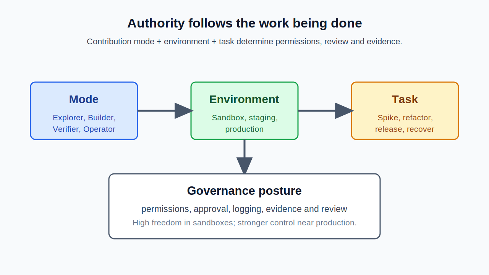
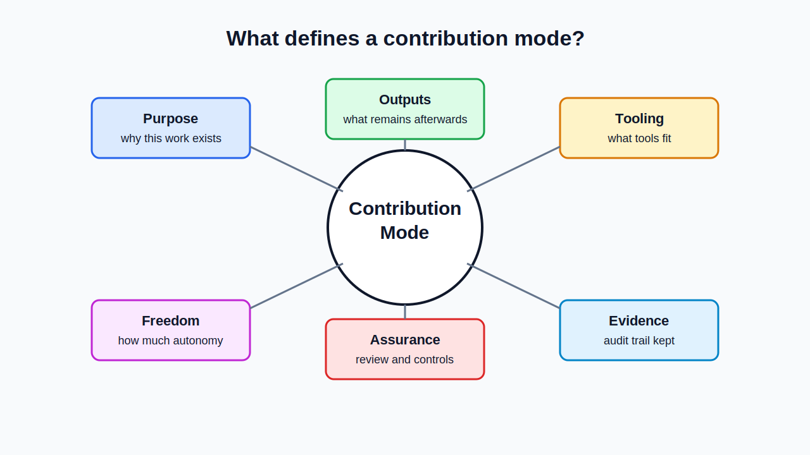
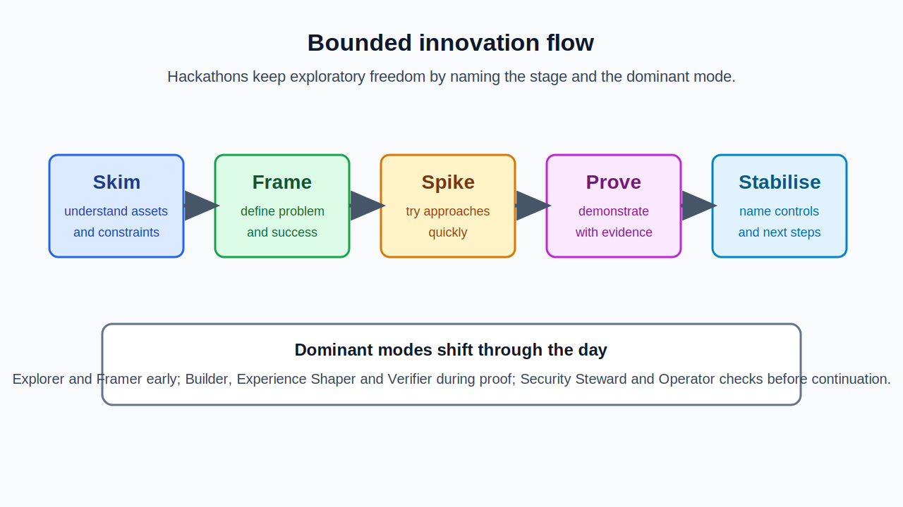

**Proposal for Introducing\
Contribution Modes in Software Work**

Application to hackathons, skunkworks, discovery, delivery, and live
operations

| Prepared for    | BDUK                                                 |
|-----------------|------------------------------------------------------|
| Document type   | Proposal report                                      |
| Date            | 3 April 2026                                         |
| Reference style | Institutional bibliography with URLs and access date |

Core proposition: software work should be organised by contribution mode
— the purpose of the work being done — rather than assuming one
undifferentiated “developer” role with the same tooling, permissions,
and review obligations in every context.

# Executive summary

> **•** This proposal recommends adopting “Contribution Modes in
> Software Work” as an organising model for hackathons and,
> subsequently, for wider delivery and live operations.
>
> **•** A contribution mode is defined by purpose, typical outputs,
> suitable tooling, authority level, assurance expectations, and
> required evidence.
>
> **•** The proposed modes are: Explorer, Framer, Architect, Builder,
> Refiner, Experience Shaper, Verifier, Security Steward, and Operator.
>
> **•** The model is grounded in existing guidance rather than personal
> preference alone: NIST SSDF emphasises explicit roles and least
> privilege; W3C ARRM distributes accessibility responsibilities across
> roles; GOV.UK service guidance distinguishes exploration and
> prototyping from later phases; OWASP guidance supports least privilege
> and governance for CI/CD and third-party services.
>
> **•** The key operating rule is that authority should be granted by
> mode + environment + task, not by generic job title.
>
> **•** Hackathons should use the model to preserve exploratory freedom
> while preventing exploratory artefacts, temporary credentials, or
> broad agent permissions from quietly becoming production practice.
>
> **•** The model is intentionally about modes of contribution, not
> rigid people categories; one person may work in several modes during
> the same project.
>
> **•** A staged adoption path is recommended: pilot in hackathons,
> extend to discovery/alpha, then integrate into engineering governance,
> access control, architecture review, and operational policy.

# 1. Purpose and rationale

The term “developer” is too coarse to govern modern software work well.
In practice, teams already separate exploratory coding, product framing,
architecture, implementation, refactoring, experience design, testing,
security control, and operations. What is often missing is a single
shared language that links these different kinds of contribution to
appropriate tooling, permissions, review standards, and evidence
requirements.

This proposal introduces contribution modes as that shared language. The
aim is not to multiply job titles. It is to make the purpose of the work
visible so that teams can choose the right controls without suppressing
legitimate exploration. The need is especially strong in hackathons,
skunkworks, and AI-assisted development, where rapid experimentation can
easily blur into durable architecture or live operational behaviour if
boundaries are weak.

The proposal is consistent with NIST’s Secure Software Development
Framework, which calls for defined roles and responsibilities and for
least-privilege access to code, tools, and artefacts \[1\]\[2\]. It is
also consistent with W3C’s Accessibility Roles and Responsibilities
Mapping, which treats accessibility as a responsibility distributed
across multiple roles rather than a specialist afterthought \[3\]\[4\].

# 2. What a contribution mode is

A contribution mode is a way of contributing to software work defined by
six things: primary purpose, typical outputs, best-fit tooling, default
freedom level, review and assurance requirements, and the evidence that
should remain afterwards.

Contribution modes are not permanent identities. A single individual may
move between modes across a week, a project phase, or even a single
piece of work. The value of the model lies in giving teams a disciplined
way to say: “what sort of work are we doing right now, and what tools
and permissions are appropriate for that mode?”

# 3. Proposed contribution modes

The initial operating set is shown below. This is the detailed version;
for lightweight communication, it can later be collapsed into five
headline modes: Explorer, Architect, Builder, Experience Shaper, and
Guardian.

| **Mode** | **Primary purpose** | **Typical outputs** | **Default governance posture** |
|----|----|----|----|
| Explorer | Reduce ambiguity quickly by trying things out. | Spikes, proof-of-concept builds, alternative implementations, throwaway scripts. | High freedom in sandboxes; no routine production write access. |
| Framer | Define the problem, users, constraints, and success measures. | Problem statements, hypotheses, success criteria, evaluation plans. | Broad read access to context; limited technical write authority. |
| Architect | Shape maintainable structure, boundaries, and contracts. | ADRs, interfaces, schemas, module boundaries, trust boundaries. | Broad read access; controlled design changes; formal review expected. |
| Builder | Implement robust components within agreed boundaries. | Code, tests, integrations, migrations, deployment artefacts. | Moderate authority in dev/test; production change normally mediated through pipeline and approval. |
| Refiner | Improve readability, cohesion, and maintainability. | Refactors, simplifications, documentation improvements. | Source-code write access with standard review; limited live-system authority. |
| Experience Shaper | Make the product understandable, consistent, and accessible. | Interaction patterns, layouts, component behaviour, microcopy, design-system decisions. | High freedom in design/staging; low operational privilege. |
| Verifier | Discover faults, regressions, and mismatches. | Test plans, acceptance evidence, adversarial cases, evaluation results. | High freedom in test environments; controlled access outside them. |
| Security Steward | Define and enforce trust boundaries, permissions, secrets handling, and auditability. | IAM design, policy, approval flows, audit requirements, threat models. | High authority over controls, but tightly governed and extensively logged. |
| Operator | Run and recover systems safely in reality. | Runbooks, observability, release controls, rollback plans, incident procedures. | High operational authority in live environments, with strong approval and evidence obligations. |

# 4. Why hackathons are the right starting point

Hackathons are a strong proving ground because they naturally compress
time, encourage alternative implementations, and reward practical
learning. Recent research on hackathon-based learning reports gains in
collaboration, creativity, and real-world problem solving \[13\]. The
same features, however, can also lead to muddled expectations if teams
do not distinguish between exploratory artefacts and supported delivery
artefacts.

GOV.UK guidance for the alpha phase is especially relevant here. It
states that alpha is where teams try out different solutions, build
prototypes, and explore new approaches \[5\]. That aligns closely with
Explorer and Framer modes. GOV.UK’s guidance on service teams also
emphasises multidisciplinary capability rather than a single generic
technical role \[6\].

The proposal therefore recommends piloting contribution modes in
hackathons first, where the distinction between exploration and durable
delivery is most valuable and most visible.

# 5. Recommended operating model for hackathons

Hackathons should be run as bounded innovation environments. The useful
analogy is not an ungoverned free-for-all but a sandbox: rapid
experimentation with clear boundaries, limited blast radius, and an
explicit exit path. The FCA’s Regulatory Sandbox similarly treats
experimentation as controlled testing rather than exemption from
responsibility \[10\].

Five practical stages are recommended. Skim: understand the problem
space and available assets. Frame: convert the broad challenge into one
or two precise problem statements. Spike: test alternative approaches
rapidly. Prove: demonstrate one feasible route with evidence. Stabilise:
identify what would need to change for safe continuation. Different
contribution modes dominate at each stage, and teams should name them
explicitly.

A simple rule set follows from this model: exploratory code must be
marked as exploratory; any live-data use must be minimised and approved;
temporary credentials should expire automatically; third-party and
agentic tools should run inside approved sandbox profiles; and no
hackathon artefact should move into production without a separate
design, security, and operational review path \[7\]\[8\]\[9\].

# 6. Security, freedom, and least privilege

The most important control principle is this: authority should be
granted by contribution mode + environment + task, not by generic job
title. This follows directly from NIST SSDF’s emphasis on explicit
responsibilities and protecting code, tools, and related artefacts with
appropriate access control \[1\]\[2\].

In practical terms, Explorer mode should enjoy broad freedom inside a
sandbox but almost none in production. Builder mode can have moderate
freedom in development and test, but live changes should normally flow
through release controls. Experience Shaper mode may need broad staging
access but little or no privileged operational access. Security Steward
and Operator modes may require stronger authority, but that authority
should carry stronger logging, approval, and evidence obligations.

OWASP guidance reinforces this approach. The CI/CD Security Cheat Sheet
and related materials recommend least privilege, careful governance of
third-party services, strong identity and access management, and
protection of software supply chains \[7\]\[8\]\[9\]. These controls
matter even more when agentic or AI-assisted tooling can act with the
permissions of the signed-in user.

# 7. Accessibility and experience are not optional extras

The proposal deliberately includes Experience Shaper as a first-class
mode because understandability, consistency, and accessibility are not
decorative concerns. W3C ARRM explains accessibility responsibilities by
role and workflow, making clear that inclusive outcomes depend on
distributed ownership across design, development, content, and testing
\[3\]\[4\].

WCAG 2.2 remains the relevant benchmark family for web accessibility
\[11\]. In practice this means accessibility should be visible in at
least three modes: Experience Shaper, Builder, and Verifier. The
immediate implication for hackathons is that user-facing prototypes
should not treat accessibility as something to be retrofitted later if
the idea succeeds. Even exploratory artefacts benefit from clear content
structure, keyboard usability, and understandable interaction flows.

# 8. Tooling implications

Contribution modes help determine where high-freedom tools are genuinely
appropriate. Agentic coding tools, notebook-based experimentation,
scaffolders, and disposable environments are a strong fit for Explorer
mode. They can also be valuable in early Builder and Refiner work,
provided that write scope and downstream permissions are bounded.

The same tools are weaker fits for Security Steward and Operator work
unless they are very tightly constrained. In those modes, the main need
is not raw generation speed but predictable control, approval,
traceability, and careful evidence capture. This distinction becomes
especially important where a tool may infer that solving a problem
requires a live write action that the human user did not intend, but
technically could authorise.

# 9. Roll-out plan

Phase 1: pilot the model in one or two hackathons. Publish a short
glossary, a one-page matrix, standard hackathon rules, and an exit-note
template. Success at this stage should be judged by clarity: can teams
name their current mode, explain their tool choices, and distinguish
throwaway artefacts from candidates for further development?

Phase 2: extend the model into discovery and alpha delivery. Add ADR
templates for Architect mode, accessibility checkpoints for Experience
Shaper and Verifier modes, and standard access profiles for Explorers,
Builders, and testers. This step fits GOV.UK’s established distinction
between discovery, alpha, beta, and live \[5\]\[6\].

Phase 3: integrate the model into wider engineering governance. Use
contribution modes in access requests, architecture review, third-party
tool approval, sandbox policy, operational policy, and onboarding. At
this stage the model becomes part of normal working language rather than
a hackathon-only device.

# 10. Risks and mitigations

Risk: the model becomes bureaucratic. Mitigation: keep the detailed
taxonomy for policy and the five-mode simplified version for everyday
use.

Risk: teams mistake modes for rigid personal identities. Mitigation:
state repeatedly that one person may work in several modes and that
modes describe work, not status.

Risk: exploratory artefacts are promoted directly into production.
Mitigation: require explicit classification of artefacts as exploratory,
transitional, or supported, with a separate promotion review path.

Risk: accessibility is collapsed back into “design” alone. Mitigation:
assign explicit responsibilities to Experience Shaper, Builder, and
Verifier modes, consistent with ARRM and WCAG 2.2 \[3\]\[4\]\[11\].

Risk: agentic tools inherit broad authority. Mitigation: default to
sandboxed profiles, ephemeral credentials, read-only external
integrations unless separately approved, and audit logging where
feasible \[7\]\[8\]\[9\].

# 11. Recommendations

Adopt Contribution Modes in Software Work as a shared language for
hackathons, discovery, alpha delivery, and engineering governance.

Publish a lightweight internal standard containing the glossary, mode
definitions, tooling-and-permissions matrix, hackathon rules, and the
promotion path from exploratory artefacts to supported artefacts.

Pilot the model in the next hackathon, including mandatory mode
declaration and an exit note covering what was learned, what is
reusable, what requires redesign, and what must not proceed.

Define default access profiles for each mode, with particular care for
agentic coding tools, third-party services, secrets, and
production-adjacent integrations.

Embed accessibility responsibilities across Experience Shaper, Builder,
and Verifier modes, rather than treating them as specialist-only
concerns \[3\]\[4\]\[11\].

# Appendix A. Glossary

**Contribution mode:** A distinct way of contributing to software work,
defined by purpose, outputs, tooling, authority, and assurance
expectations.

**Spike:** A short, focused piece of work done primarily to learn
quickly or remove uncertainty; the main output is evidence or
understanding rather than polished code.

**Proof of concept (PoC):** A small build intended to show that
something can work at all. It does not prove maintainability, scale, or
production readiness.

**Prototype:** A more developed artefact than a PoC, often used to test
workflow, usability, or architecture.

**Throwaway code:** Code written for learning, comparison, or
demonstration and expected to be discarded or substantially reworked.

**Skunkworks:** A deliberately lightweight, fast-moving effort used to
explore uncertain ideas quickly, with fewer process constraints but
still clear governance boundaries.

**Sandbox:** An isolated environment intended for safe experimentation
with limited blast radius.

**Harness:** The surrounding machinery that makes a tool or agent
useful: permissions, tool calls, context handling, logging,
orchestration, and evaluation support.

**Interface:** A defined boundary specifying how one component interacts
with another.

**Contract:** An interface plus stronger guarantees about structure,
behaviour, compatibility, and error handling.

**Least privilege:** Giving people, tools, and services only the minimum
access needed for the specific task.

**Guardrail:** A technical or procedural control that limits unsafe or
unintended action, such as read-only mode, schema validation, an
approval gate, or environment isolation.

**Trust boundary:** The point at which an action, identity, or output
should no longer be implicitly trusted and therefore requires
validation, control, or logging.

**Audit trail:** A record of actions, actors, timestamps, tools, and
outcomes sufficient to reconstruct what happened later.

# Appendix B. Tooling, permissions, and evidence matrix

| **Mode** | **Best-fit tooling** | **Default freedom** | **Default data access** | **Write scope** | **Minimum evidence** |
|----|----|----|----|----|----|
| Explorer | Notebooks, scaffolding tools, agentic coding tools, mock servers, disposable repositories. | High in sandbox | Synthetic, scrubbed, or sample data | Sandbox only | Short learning note |
| Framer | Docs, user-research notes, lightweight planning tools. | Moderate | Broad read of problem context | Usually none | Framing document |
| Architect | Schema tools, ADRs, modelling, dependency analysis, threat modelling. | Moderate | Broad read of systems and docs | Limited design edits | Decision records |
| Builder | IDEs, CI, tests, package tooling, debuggers. | Moderate in dev/test | Task-scoped dev/test access | Direct in dev/test; mediated in production | Code review and CI results |
| Refiner | Refactoring tools, linters, metrics, documentation tooling. | Moderate | Broad source-code read | Source changes only | Standard change history |
| Experience Shaper | Design systems, prototyping tools, accessibility tools, usability testing. | High in design/staging | Representative non-sensitive data | Staging/demo only | Prototype plus review notes |
| Verifier | Automated tests, replay tools, fuzzers, evaluation harnesses. | High in test | Broad read in test/staging | Controlled writes in test | Test evidence |
| Security Steward | IAM, secrets managers, policy engines, audit logging. | High over controls | Broad read across systems | Controlled policy/config changes | Policy and audit records |
| Operator | CI/CD, observability, IaC, release and incident tooling. | High in ops domain | Operational read access | Tightly governed live changes | Operational logs and approvals |

# Bibliography

Bibliography format: institutional / web source entry with title,
publisher or site, publication or last-updated date where available,
URL, and access date. Access date for all entries: 3 April 2026.

\[1\] Souppaya, M., Scarfone, K., and Dodson, D. Secure Software
Development Framework (SSDF) Version 1.1: Recommendations for Mitigating
the Risk of Software Vulnerabilities. NIST Special Publication 800-218,
February 2022. <https://csrc.nist.gov/pubs/sp/800/218/final> and
<https://nvlpubs.nist.gov/nistpubs/specialpublications/nist.sp.800-218.pdf>

\[2\] NIST. Secure Software Development Framework (SSDF) supporting
materials and role examples. NIST.
<https://www.nist.gov/document/eo-14028-presentation-nist-secure-software-development-framework-ssdf>
and
<https://nvlpubs.nist.gov/nistpubs/SpecialPublications/NIST.SP.800-218-draft.pdf>

\[3\] W3C Web Accessibility Initiative. Accessibility Roles and
Responsibilities Mapping (ARRM). W3C, 24 July 2025.
<https://www.w3.org/WAI/planning/arrm/>

\[4\] W3C ARRM Community Group. Accessibility Roles and Responsibilities
Mapping Community Group. W3C. <https://www.w3.org/groups/cg/arrm/> ; see
also roles overview at <https://www.w3.org/WAI/planning/arrm/roles/>

\[5\] GOV.UK Service Manual. How the alpha phase works. GOV.UK, updated
4 August 2016.
<https://www.gov.uk/service-manual/agile-delivery/how-the-alpha-phase-works>

\[6\] GOV.UK Service Manual. Set up a service team at each phase.
GOV.UK, updated 3 March 2016.
<https://www.gov.uk/service-manual/the-team/set-up-a-service-team>

\[7\] OWASP Cheat Sheet Series. CI/CD Security Cheat Sheet. OWASP.
<https://cheatsheetseries.owasp.org/cheatsheets/CI_CD_Security_Cheat_Sheet.html>

\[8\] OWASP. CICD-SEC-02: Inadequate Identity and Access Management.
OWASP Top 10 CI/CD Security Risks.
<https://owasp.org/www-project-top-10-ci-cd-security-risks/CICD-SEC-02-Inadequate-Identity-And-Access-Management>

\[9\] OWASP Cheat Sheet Series. Software Supply Chain Security Cheat
Sheet. OWASP.
<https://cheatsheetseries.owasp.org/cheatsheets/Software_Supply_Chain_Security_Cheat_Sheet.html>

\[10\] Financial Conduct Authority. Regulatory Sandbox. FCA, last
updated 6 March 2026.
<https://www.fca.org.uk/firms/innovation/regulatory-sandbox> ; see also
Regulatory Sandbox Guide PDF at
<https://www.fca.org.uk/publication/fca/fca-regulatory-sandbox-guide.pdf>

\[11\] W3C Web Accessibility Initiative. Web Content Accessibility
Guidelines (WCAG) 2.2. W3C Recommendation, 12 December 2024 page date;
recommendation first published 5 October 2023.
<https://www.w3.org/TR/WCAG22/> ; overview at
<https://www.w3.org/WAI/standards-guidelines/wcag/new-in-22/>

\[12\] GOV.UK Service Manual. Understanding WCAG. GOV.UK, updated 10
October 2018.
<https://www.gov.uk/service-manual/helping-people-to-use-your-service/understanding-wcag>

\[13\] AlMahri, H. et al. Impact of educational hackathons on student
skills and problem solving: a recent review article summary page in
ScienceDirect index. ScienceDirect result accessed 3 April 2026.
<https://www.sciencedirect.com/science/article/pii/S2444569X24000404>

Note on evidence base: The proposal draws most heavily on official
guidance (NIST, W3C, GOV.UK, FCA, OWASP). The hackathon study is
included as supportive rather than foundational evidence because the
operational recommendations are governed primarily by secure-delivery
and service-design guidance.
