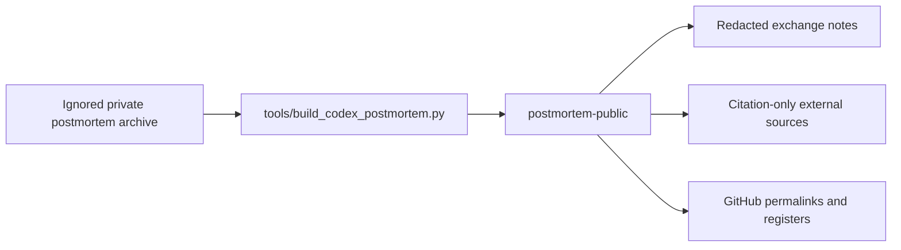

# Public Postmortem Architecture

The public folder is intentionally a derivative. It keeps the useful timeline, contribution analysis, and repository evidence while excluding raw local transcripts and full third-party copied source bodies.
