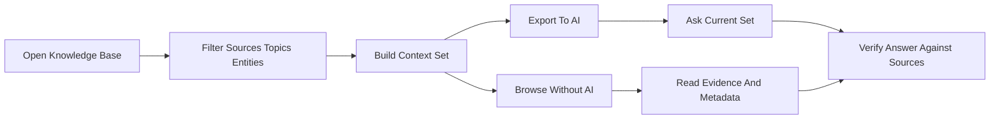
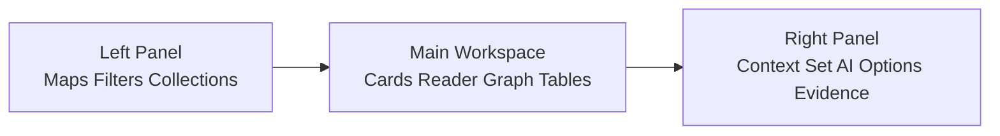
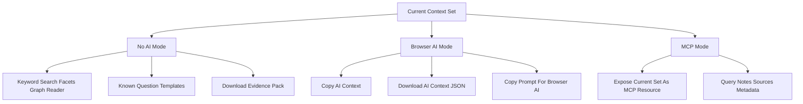

# 0021. I need to design a UI for this with options to use AI or not. I like the way that SeeLinks pulls

## Publication Boundary

This is a redacted public derivative. It preserves sequence and contribution evidence, but it is not the raw Codex transcript.

## Source

- Conversation: CONV-002 (Karpathy Wiki Planning and Challenge 2 Vault Build)
- Raw transcript: retained only in the private local evidence archive.

## User Prompt

````text
I need to design a UI for this with options to use AI or not. I like the way that SeeLinks pulls things into context and then you can use the browser AI to quiz what is present in the current set.

This is locally here [PRIVATE_REFERENCE_REPO] and online [PRIVATE_REFERENCE_REPO_URL], The repo is private but only because it has copyright data
````

## Codex Response

### Response 1 (commentary)

- Timestamp: `2026-04-16T12:00:44.654Z`

````text
I’ll inspect both the Challenge 2 repo and the local SeeLinks repo so the UI design matches the existing patterns instead of inventing a disconnected interface. After that I’ll give you a concrete UI proposal and, if the repo has an obvious place for it, I can add it as a design note.
````

### Response 2 (commentary)

- Timestamp: `2026-04-16T12:00:50.250Z`

````text
The Challenge repo already has unrelated edits in the worktree, so I’m treating this as design/discovery for now. I’m going to read the SeeLinks web app structure and the current wiki architecture docs to extract the interaction model.
````

### Response 3 (commentary)

- Timestamp: `2026-04-16T12:00:56.330Z`

````text
SeeLinks is a SvelteKit PWA with a category pane, item grid/readers, collections, and optional MCP/browser export flows. I’m going one level deeper into those components now so the proposed UI can reuse its strongest interaction ideas.
````

### Response 4 (commentary)

- Timestamp: `2026-04-16T12:01:11.379Z`

````text
I have enough to frame the UI: the useful SeeLinks pattern is “filter/select a visible set, make that set explicit, then either browse it deterministically or export it as AI context.” I’m checking the exact export shape so the Challenge 2 design can map cleanly onto it.
````

### Response 5 (final_answer)

- Timestamp: `2026-04-16T12:01:52.109Z`

````text
I’d design this as a **SeeLinks-style “context workbench”** for the Challenge 2 Obsidian/wiki corpus, with AI as an optional layer rather than the main product.

The core idea: users first build a visible, auditable set of documents using deterministic UI controls. Then they can either browse that set without AI, or hand the exact same set to browser AI/MCP for questioning.

**Product Shape**

Name it something like **Dark Data Workbench** or **Challenge 2 Knowledge Explorer**.

Primary user journey:



The important design decision is that **AI never owns retrieval silently**. The user can see what is in scope before asking anything.

**Screen Layout**

Use a three-column workbench, similar in spirit to SeeLinks:



Left panel:
- Maps of content: Housing and Benefits, People Policies, Corporate Operations, Risk/Assurance.
- Facets: department, topic, source type, status, extraction quality, sensitivity, stale/draft/superseded flags.
- Saved context sets: “Current CTR guidance”, “Staff policies at risk”, “Procurement evidence”.

Centre workspace:
- Default **source grid**: one tile per generated source note.
- Toggle views:
  - `Grid`
  - `Outline`
  - `Graph`
  - `Timeline`
  - `Reader`
  - `Table`
- Reader view shows extracted Markdown, metadata, flags, provenance, and links back to raw source.
- Graph view shows source/topic/entity relationships.
- Table view is especially useful for procurement thresholds and staff directory workbook sheets.

Right panel:
- **Context Set**: the currently visible/selected notes.
- **Mode switch**:
  - `No AI`
  - `Browser AI`
  - `MCP`
  - optionally `API`, if a department model is available later
- **Ask Current Set** area.
- Evidence trail: which notes, excerpts, source IDs, flags, and metadata were included.

**AI / No-AI Modes**

The UI should treat AI as a pluggable action on the current context set.



No AI mode should be fully useful:
- Search and filter.
- Follow topic/entity/source links.
- Compare versions.
- Show stale/draft/superseded warnings.
- Produce deterministic evidence bundles.
- Answer known demo questions via prebuilt query templates, not generated text.

Browser AI mode:
- Same as SeeLinks: copy or download the current view as AI-ready JSON/Markdown.
- Include selected/highlighted flags.
- Include provenance, source paths, status flags, sensitivity flags, and extracted excerpts.
- Provide a prompt such as: “Answer only from the supplied context. Cite source IDs. Say when evidence is missing.”
- Do not require an LLM API inside the app.

MCP mode:
- Serve the source register, source notes, topic pages, table exports, and current context sets as MCP resources.
- Let ChatGPT Desktop, Claude Desktop, Atlas, or similar clients pull the exact data on demand.
- Keep the server localhost-only.

**Key UI Controls**

Top bar:
- Dataset title: `Challenge 2 Knowledge Base`
- Search box.
- View switcher.
- Mode switch: `No AI | Browser AI | MCP`
- Status chips: `43 sources`, `5 flagged`, `3 workbooks`, `0 broken links` if available.

Source cards:
- Title and source ID.
- Department.
- Format.
- Status.
- Topic chips.
- Warning chips: `draft`, `stale`, `superseded`, `past review`, `synthetic fixture`.
- Buttons/icons:
  - Open
  - Add to context
  - View raw source
  - Copy citation

Context set panel:
- Count of included notes.
- Included source IDs.
- Add/remove selected.
- Save as collection.
- Clear.
- Export as Markdown.
- Export as JSON.
- Open as MCP resource.

Question panel:
- In No AI mode:
  - Run saved checks:
    - “Which Council Tax Reduction guidance is current?”
    - “Can a self-employed person claim Housing Benefit?”
    - “Which staff policies are draft, stale, or past review?”
    - “What approvals are needed for IT hardware over GBP 5,000?”
    - “Which documents mention Discretionary Housing Payments?”
  - Show matching notes and evidence, not generated prose.
- In Browser AI mode:
  - Copy context.
  - Copy prompt.
  - Download context.
- In MCP mode:
  - Show local endpoint/resource name.
  - Show available resources/tools.

**Context Export Shape**

Reuse the SeeLinks idea almost directly, but adapt it to wiki documents:

```json
{
  "exported_at": "2026-04-16T00:00:00Z",
  "mode": "browser-ai",
  "corpus": {
    "title": "Challenge 2 Knowledge Base",
    "source_count": 43,
    "synthetic_data": true
  },
  "view": {
    "query": "discretionary housing payments",
    "filters": {
      "topics": ["housing-benefit"],
      "status": ["current"]
    },
    "selected_source_ids": ["DOC-HB-002", "DOC-HB-008"]
  },
  "instructions": {
    "answer_policy": "Use only included context. Cite source_id for every claim.",
    "synthetic_data_notice": "Names and contact-like values are synthetic fixture data and should not be redacted."
  },
  "sources": [
    {
      "source_id": "DOC-HB-002",
      "title": "Discretionary Housing Payments",
      "status": "current",
      "format": "md",
      "topics": ["housing-benefit", "discretionary-housing-payments"],
      "flags": [],
      "note_path": "wiki/sources/doc-hb-002-discretionary-housing-payments-guidance-for-local-autho.md",
      "raw_path": "structured_files/DOC-HB-002-discretionary-housing-payments.md",
      "summary": "...",
      "excerpts": ["..."]
    }
  ]
}
```

**How It Maps To SeeLinks**

SeeLinks concept to reuse:
- Pack = Challenge 2 wiki corpus.
- ItemRecord = source note, topic page, entity page, map page.
- Category tree = maps/topics/departments/status.
- Facets = source metadata.
- Collections = saved context sets.
- Reading view = source note reader.
- Graph view = topic/entity/source relationship graph.
- AI export = current context export.
- MCP packs = Challenge 2 knowledge resources.

This avoids building a chat app first. The real product is the **context selector and evidence browser**. AI is then just one consumer of the selected context.

**Recommended First Prototype**

Build one SvelteKit page, borrowing the SeeLinks interaction model:

1. Load `challenge-2/wiki/data/source-register.json`.
2. Render source cards with filters.
3. Add a context basket.
4. Add `No AI / Browser AI / MCP` mode switch.
5. Implement `Copy AI context` and `Download AI context`.
6. Add deterministic saved queries for the five demo questions.
7. Add prominent links back into Obsidian:
   - `wiki/index.md`
   - source note path
   - raw source path
   - lint report

That gives you a demoable UI without depending on any runtime model access, while still supporting browser AI exactly like the SeeLinks pattern you like.

**Glossary**

| Term | Meaning |
| --- | --- |
| Context set | The current selected or filtered group of notes that a user wants to inspect or ask about. |
| No AI mode | Deterministic browsing, search, filtering, evidence viewing, and saved checks. |
| Browser AI mode | Copy/download the current context so a browser AI can answer questions about exactly that set. |
| MCP mode | Expose the corpus or current set to an AI client through local MCP resources/tools. |
| Source card | A UI tile representing one source document or generated wiki note. |
| Evidence bundle | A portable export containing selected sources, metadata, excerpts, and provenance. |
| Saved query | A deterministic question/check implemented with filters and source metadata rather than an LLM. |
| Provenance | The source ID, note path, raw path, and extracted text behind a claim. |
| Synthetic fixture data | Artificial demo data that may look personal but is not real and should not be redacted. |
````

## Contribution Reading

- User contribution: Supplied task direction, constraints, or review feedback.
- Codex contribution: Mapped the request into repeatable generation, linting, and source-backed wiki artifacts.
