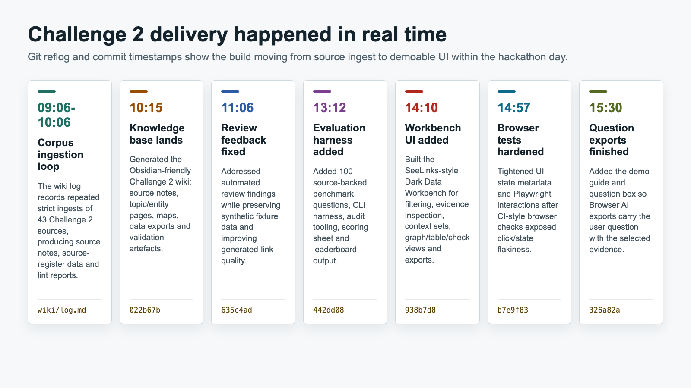
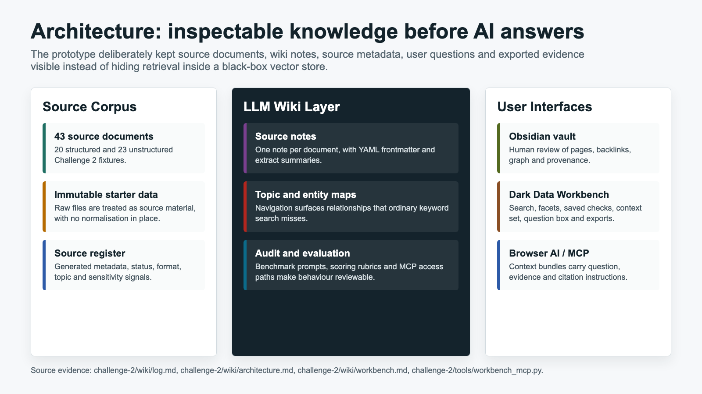
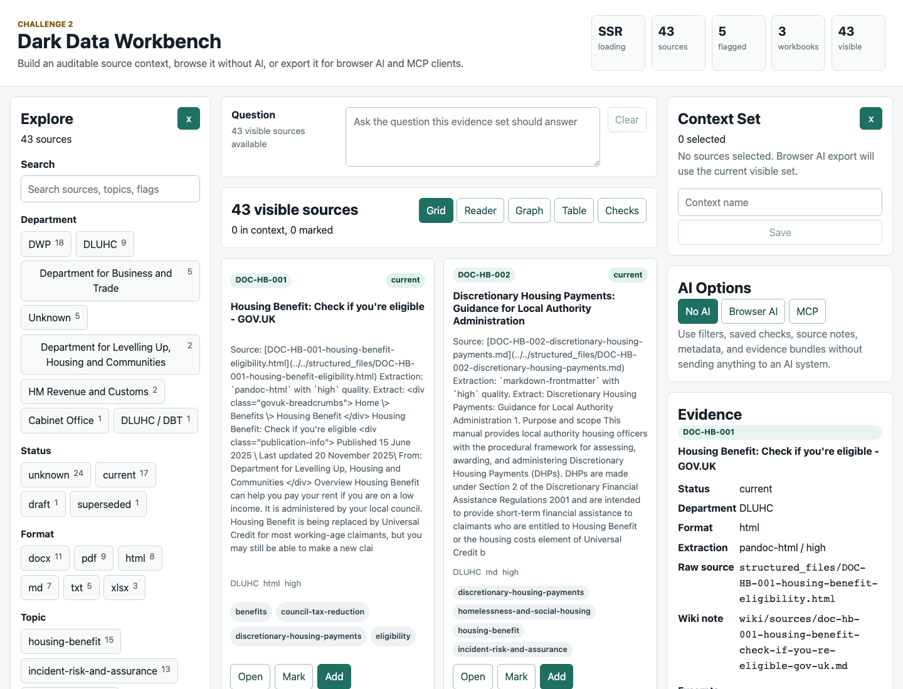

# Reader Walkthrough

This walkthrough is the first route through the public wiki. It starts with the postmortem because the most useful story is how the human and AI coding assistant collaborated, then drops into the Challenge 2 implementation and local SeeLinks-style workbench.

## 1. Start With The Conversation Trail

Open the [Conversation Summary](conversation-summary.md), then use the [start-to-finish readers](index.md#start-to-finish-conversation-readers) to follow each curated Codex conversation without opening every exchange note.

The readers are the main narrative path. The individual exchange notes are still present for auditability, but they are more useful when you need to inspect a particular prompt-response step.

## 2. Read The Public Postmortem

Read [Public Postmortem](postmortem.md) after the conversation summary. It explains what Codex did well, where human steering mattered, what publication controls were added, and why the raw private archive is not published directly.



## 3. Inspect The Architecture

The [Public Postmortem Architecture](architecture.md) explains the publication boundary: ignored private archive, generated public derivative, redacted exchanges, conversation readers, citation-only external sources, and repository evidence.

The wider Challenge 2 knowledge architecture is illustrated here:



## 4. Move Into The Challenge 2 Wiki

Once the postmortem story is clear, open the [Challenge 2 Wiki](../../challenge-2/wiki/index.md). That wiki is the generated knowledge base over the synthetic dark-data corpus. Useful next pages are:

- [Challenge 2 Demonstration Guide](../../challenge-2/wiki/demonstration-guide.md)
- [Dark Data Workbench](../../challenge-2/wiki/workbench.md)
- [Evaluation Benchmark](../../challenge-2/wiki/evaluation-benchmark.md)

## 5. Use The Local SeeLinks-Style Workbench

The static GitHub Pages wiki cannot start a process on your computer. On this machine, start the local workbench from the repository root with:

```bash
cd challenge-2/workbench
pnpm dev -- --host 127.0.0.1
```

Then open:

- Challenge 2 corpus: <http://localhost:5173/>
- HMRC narrative pack: <http://localhost:5173/?pack=hmrc-narrative>

The current workbench screenshot set is partial. The repo already includes these reusable images, but a full walkthrough needs a fresh browser-capture pass over search, facets, reader, graph, table, checks, context export, and local pack switching.



## 6. Review Evaluation Evidence

The scoring route starts with the [Evaluation Benchmark](../../challenge-2/wiki/evaluation-benchmark.md) and the public-safe leaderboard artifacts linked from the Challenge 2 wiki.


## Current Screenshot Coverage

Available now:

- knowledge architecture image;
- realtime delivery timeline image;
- Dark Data Workbench question-box screenshot;
- AI benchmark scoring guide image.

Still to build:

- viewer screenshots after this postmortem-first viewer pass;
- SeeLinks-style workbench screenshots for search, facets, graph, reading, table, checks, and export;
- a compact GitHub Pages publication screenshot showing the postmortem graph and Challenge 2 corpus switch.
