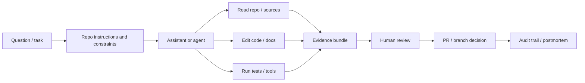

# AI coding assistants on 9 May 2026 for the HMRC Data Science Academy talk

**Scope and assumptions.** This briefing is a point-in-time snapshot for **9 May 2026**, using **public internet sources only** and written for a mixed audience at the urlHMRC Data Science Academyhttps://www.gov.uk/government/organisations/hm-revenue-customs. It assumes the output will be copied into slides, a DOCX, or a PDF, and that no departmental slide template or internal-only HMRC material has been specified.

## Executive summary

- AI coding assistants have moved materially beyond autocomplete. The leading tools now combine codebase exploration, multi-file editing, terminal and test execution, planning, and iterative task completion. In practice, some engineering effort is shifting from manually typing code to **steering, reviewing, testing, and governing** outputs. See tool sources T1-T12 in the source register.
- The most useful lens for HMRC is **category rather than vendor**: IDE autocomplete/chat, repo-level or terminal agents, PR/review/CI assistants, autonomous software-engineering agents, and enterprise/government control layers. Those categories map directly to different risk and assurance patterns.
- The biggest changes since 2024–2025 are longer-context repo understanding, agentic edits across multiple files, command and test loops, MCP-style tool integration, and tighter issue/branch/PR workflows. Several of these capabilities are **fast-changing**, especially where vendors label them preview, beta, or rapidly updated.
- For public-sector teams, the decisive question is no longer only “which model is best?” It is “which workflow can we govern?”: approvals, network boundaries, sandboxing, secrets handling, audit trails, branch protection, and test gates matter as much as raw model quality.
- Your case-study repo is strong because it demonstrates a **source-backed, evidence-producing, human-governed** pattern rather than vendor theatre: generated wiki over synthetic documents, browser workbench, evidence export, evaluation harness, MCP support, documentation in lockstep, and a public postmortem/security framing.
- The safest HMRC starting point is not “autonomous developer”. It is a **supervised assistant inside a controlled delivery workflow**, initially on lower-sensitivity engineering tasks and synthetic or sanitised repositories.
- The productivity evidence is mixed rather than uniformly positive. The best-known controlled 2023 Copilot study found meaningful speed gains on a constrained task, while METR’s 2025 field study found experienced open-source maintainers were slower on average using early-2025 AI tools in mature repos they already knew well.
- Benchmarks have improved quickly, but they still overstate readiness for brownfield government codebases. SWE-bench is useful for tracking capability ceilings; CodeScaleBench is more relevant to enterprise reality because it stresses larger codebases, multi-repo settings, and tool traces.
- Review burden has become more important, not less. The market is converging on bundles of assistant + agent + review workflows, which is itself evidence that the bottleneck is moving towards validation, provenance, and approval.
- The most defensible Civil Service message is: **AI coding assistants are already useful for bounded engineering work, but they are not a substitute for accountable human ownership, secure SDLC controls, or departmental assurance.**

## State of the market

### Slide-ready state of the market

- The centre of gravity has shifted from **“suggest code”** to **“complete a bounded task”**.
- Most leading tools now offer some combination of **chat, multi-file edit, tool use, and terminal execution**.
- Repo rules and instruction files are becoming standard, because agentic systems need explicit local policy and operating constraints.
- PR review is becoming agentic too, but it still belongs inside a human review chain.
- The market is converging on **assistant + agent + review** bundles, not one isolated feature.
- The enterprise gap is increasingly about **control, audit, policy, and integration**, not just model quality.
- Claims about autonomy, benchmark rank, pricing, and preview features are **fast-changing** and should always be time-stamped.

### Comparison table by assistant category

The category table below synthesises official documentation from the named tool families and translates it into a public-sector control posture. Source keys are mapped in the source notes immediately below the table.

```text
Category                            | Primary unit of work                 | Strengths now                                             | Typical failure modes                                      | Public-sector control stance                                      | Examples                         | Source key
------------------------------------|--------------------------------------|-----------------------------------------------------------|------------------------------------------------------------|-------------------------------------------------------------------|----------------------------------|----------
IDE autocomplete/chat               | Current file, selection, or question | Fast drafting, explanation, tests, refactors, navigation | Plausible-but-wrong suggestions; shallow repo understanding | Best entry point if prompts and outputs stay within approved data | Copilot, Gemini, Q, AI Assistant | C1
Agentic terminal/repo-level         | Repo-scoped task                     | Multi-file edits, shell/test loops, codebase search       | Unsafe commands; context drift; over-editing               | Use only with approvals, sandboxing, diff review, and secret care | Claude Code, Cursor, Windsurf    | C2
PR/review/CI assistant              | Diff, PR, or CI event                | First-pass review, scalable routine feedback              | Noise; false positives; false reassurance                  | Treat as advisory; never as sole approver                         | Copilot review, Q review, Devin  | C3
Autonomous SWE agent                | Issue-to-branch or issue-to-PR       | Background work, plans, docs/tests/code in one loop       | Benchmarks outrun reality; brittle on brownfield systems   | Strongest controls: isolated branches, approvals, logs, no auto-merge | Copilot cloud agent, Devin, Air | C4
Enterprise/government control layer | Policy, telemetry, permissions       | Makes adoption governable                                 | Mistaken for a substitute for SDLC discipline              | Essential for government use, but only valuable with assurance    | Codex safety controls, AI Enterprise | C5
```

**Category source notes**

- **C1**: IDE assistant category is evidenced by official docs for GitHub Copilot, Gemini Code Assist, Amazon Q Developer, and JetBrains AI Assistant.
- **C2**: Repo-level/terminal agent category is evidenced by official docs for Claude Code, Cursor Agent, Windsurf Cascade, and Junie.
- **C3**: PR/review category is evidenced by official docs for GitHub Copilot code review, Amazon Q GitHub code reviews, Windsurf PR Reviews, and Devin Review.
- **C4**: Autonomous software-engineering agent category is evidenced by official docs for GitHub Copilot cloud agent, Amazon Q feature development in GitHub, Devin, and JetBrains Air.
- **C5**: Enterprise/government control layer is evidenced by official docs for OpenAI Codex safety controls, GitHub Copilot access management, Cursor privacy controls, JetBrains AI Enterprise, and Devin Enterprise.

### Tool comparison table

The table below is intentionally constrained to names and capabilities that were verified from official or primary documentation in the research already gathered. Where a product area is visibly moving quickly, it is marked **fast-changing**.

```text
Tool                                   | Best-fit use                                    | Verified capabilities                                                                 | Caveats for HMRC                                                                 | Source key
---------------------------------------|-------------------------------------------------|---------------------------------------------------------------------------------------|-----------------------------------------------------------------------------------|----------
OpenAI Codex / ChatGPT coding tools    | Cloud agent work, repo-connected reasoning      | Codex positioned as software-engineering agent; ChatGPT can connect to GitHub repos; safety docs describe sandboxing, approvals, network policy, credential handling, compliance logging | Fast-changing product surface across ChatGPT, Codex, and model variants; governance depends on deployment controls, not just model quality | T1
GitHub Copilot incl. cloud/agent modes | Broadest mainstream enterprise starting point   | Cloud agent can analyse repo, plan work, change a branch, and create PRs; code review can review PRs; access-management docs define controls | Strong default option, but still needs repo policy, branch protection, logging, and human review | T2
Microsoft Copilot developer workflows  | Microsoft-centric managed environments          | VS Code docs describe ask/plan/agent patterns and local/cloud/background agents; Visual Studio docs describe multi-step edits, terminal commands, tool invocation, and iterative testing | Good fit for Microsoft-heavy estates, but local/cloud split and extension governance still matter | T3
Claude Code                            | Terminal-first repo work                        | Terminal-native use, codebase navigation, file editing, command execution, CI use, MCP access | Shell, tool, and secret controls matter more here, not less                       | T4
Gemini Code Assist / Gemini CLI        | IDE-led assistance and agent mode in Google stack | Completions, code generation, test generation, debugging help, citations in standard features; agent mode supports tools and MCP; docs say VS Code agent mode uses Gemini CLI | Fast-changing and partly preview-labelled; standalone CLI doc not fully recovered in final validated pass | T5
Cursor                                 | Editor-native agent workflows                   | Ask / Manual / Agent modes, autonomous exploration, multi-file edits, command-running, .cursor/rules, optional AGENTS.md, privacy controls | Strong capability; public-sector challenge is tenancy, routing, logs, and evidence export | T6
Windsurf                               | Editor-native agentic tasks and review workflows | Code/chat modes, tool calling, terminal use, MCP, planning/todos, checkpoints/reverts, PR Reviews | Fast-changing; PR Reviews documented as beta; review claims need cautious interpretation | T7
Amazon Q Developer                     | AWS-centric coding, review, issue-driven work   | IDE chat/completion, code review, auto-reviews, GitHub code review, GitHub feature development from issues or commands with PR creation/iteration | Strong fit where AWS is central, but several GitHub workflows are preview-labelled | T8
Sourcegraph Cody / Amp                 | Large-codebase search and context-rich assistance | Cody verified across IDE/web/CLI using Sourcegraph search/context for chat, completions, edits, code understanding | Cody is verified; Amp capability detail was not recovered to the same standard, so Amp should be treated as unspecified here | T9
JetBrains AI / Junie / Air             | JetBrains-centred estates with optional sidecar orchestration | AI Assistant covers AI features inside IDEs; Junie is a multi-step coding agent; Air orchestrates Codex, Claude Agent, Gemini CLI, and Junie across local workspaces, Docker, and worktrees | Particularly interesting for government control models, but Air is new and fast-changing | T10
Devin                                  | Higher-autonomy task delegation and PR-centric workflows | Writing, running, and testing code; parallel task work; web/IDE/browser/terminal access; PR review through Devin Review; enterprise security/retention/IP guidance | Powerful, but the right HMRC framing remains supervised task worker, not independent engineer | T11
Newer significant tools not specified  | Unspecified                                     | No additional tools are included here unless named in the brief or verified to the same standard | Unspecified by design                                                               | T12
```

**Tool source notes with publication/update dates**

- **T1**: OpenAI Codex sources — “Introducing Codex” (16 May 2025), “Codex is now generally available” (6 Oct 2025), “Running Codex safely at OpenAI” (8 May 2026), GitHub connector help page (updated three months before access in the researched snapshot).
- **T2**: GitHub Copilot sources — cloud agent overview (current docs), code review overview (current docs), coding-agent access management (current docs).
- **T3**: Microsoft developer workflow sources — VS Code agents overview (published days before snapshot), Visual Studio agent mode docs (current docs).
- **T4**: Claude Code sources — overview docs and product page (current docs).
- **T5**: Gemini sources — Gemini Code Assist overview, code-features overview, and agent-mode overview; agent mode explicitly labelled preview.
- **T6**: Cursor sources — Agent docs, Rules docs, and data-usage/privacy overview; privacy page updated 20 Oct 2025.
- **T7**: Windsurf sources — Cascade overview and PR Reviews docs; PR Reviews explicitly labelled beta.
- **T8**: Amazon Q sources — Q Developer overview, GitHub code reviews page, and GitHub feature development page; GitHub workflows explicitly marked preview in the docs used.
- **T9**: Sourcegraph sources — Cody overview verified; Amp not verified to the same standard in the final pass.
- **T10**: JetBrains sources — AI Assistant overview (31 Mar 2026), Junie docs (published last month in the researched snapshot), Air quick start (published about two weeks before the snapshot), Manage AI Enterprise docs (published last month in the researched snapshot).
- **T11**: Devin sources — enterprise overview, product docs, and Devin Review docs (current docs).
- **T12**: No additional tool added beyond the named set because the brief asked for precision over coverage.

### Material changes since 2024–2025

What changed materially is not one model launch but the consolidation of several capabilities into a single workflow:

- **broader codebase context** rather than single-file assistance;
- **multi-file autonomous editing** rather than isolated patch generation;
- **command and test execution** rather than static code suggestion;
- **tool use and MCP-style integration** rather than prompt-only interaction;
- **issue/branch/PR workflows** rather than ad hoc chat responses.

The operational result is that a good coding assistant can now behave more like a junior-but-fast team member working in a sandbox: it can inspect a repo, sketch a plan, edit code, run checks, revise, and draft a PR. The public-sector problem is that each of those steps also creates a fresh governance surface: what it may read, what it may write, what it may run, what it may fetch, and how its actions are logged. Claims around autonomy, PR automation, CLI-powered agent mode, and cloud background agents are therefore **fast-changing** and should always be tied to a date and source set.

## Evidence on productivity and quality

The evidence base is now broad enough to reject both extremes. It is wrong to say these systems are “just autocomplete”, and it is equally wrong to say they reliably deliver blanket productivity gains across all tasks, teams, and codebases.

### Evidence table

```text
Evidence source                            | What it shows                                                                 | Strength of evidence                                   | Practical HMRC reading
-------------------------------------------|-------------------------------------------------------------------------------|--------------------------------------------------------|-----------------------
Microsoft Research Copilot study (2023)    | On a constrained JavaScript HTTP-server task, developers using Copilot completed the task materially faster | Strong for bounded greenfield-style tasks              | Good evidence that assistants can save time on narrow tasks
METR field study (2025)                    | Experienced open-source maintainers in mature repos they knew well were slower on average using early-2025 AI tools | Strong independent caution for real-world brownfield work | Highly relevant to complex departmental codebases
METR update (2026)                         | Later-2025 tools probably improved, but the researchers judged the new estimate unreliable because adoption and task-selection effects distorted measurement | Useful directional signal, not a stable ROI number     | Do not overclaim productivity uplift
SWE-bench                                  | Public benchmark tracking software-engineering bug-fix performance           | Useful for capability ceilings and trend lines         | Helpful for “state of capability”, not enough for procurement or assurance alone
CodeScaleBench                             | Larger-codebase and multi-repo benchmark with tool traces and realistic failure modes | Useful challenge to narrow benchmark optimism          | Closer to enterprise and government reality than small isolated tasks
Vendor/practitioner case studies           | Frequently report improved speed, PR throughput, or review times after rollout | Useful practice evidence, but often confounded by workflow change and selection effects | Treat as illustrative, not independent proof
```

### What the evidence supports

The strongest synthesis is this:

- assistants can deliver real gains on **bounded, well-specified, easy-to-verify work**;
- gains are weaker, more variable, or even negative on **mature brownfield systems** where the human already knows the codebase well;
- measured benefit depends heavily on **task type, repo condition, user skill, and review cost**;
- the biggest hidden cost is often not generation itself but **checking, correcting, and integrating** outputs.

For HMRC, that means the right pilot question is not “Does AI make developers faster?” It is: **on which task types, for which user groups, in which repositories, under which controls, does it improve cycle time without increasing rework, defects, or security risk?**

### Failure modes that matter in practice

The most important failures are no longer single-line syntax errors. They are workflow failures:

- over-broad edits across files;
- wrong or unsafe shell commands;
- shallow assumptions about legacy behaviour;
- tests that pass for the wrong reason;
- dependency drift or hidden side effects;
- noisy or persuasive-but-under-evidenced review comments;
- brittle use of external tools or MCP servers.

The market’s own direction towards checkpoints, review bots, approval workflows, MCP routing, and instruction files is itself evidence that these are the real operational bottlenecks.

## Public-sector constraints and controls

The government question is not whether these systems can write useful code. They can. The harder question is whether they can be deployed without undermining established controls for security, privacy, change management, and accountability.

### Public-sector risk/control table

```text
Risk area                     | Why it matters in government                                                        | Minimum practical controls
------------------------------|--------------------------------------------------------------------------------------|---------------------------
Data classification and secrets | Prompts, context windows, shell output, logs, and connectors can expose more than the immediate task | Start with synthetic or sanitised repos; keep secrets out of prompts; isolate credentials; define approved repo and data classes for assistant use
Logging and audit             | Agentic workflows create hidden actions unless you collect session, tool, and approval traces | Centralise logs where supported; retain prompt/tool/approval/result logs; tie activity to named users and repos
IP and licensing              | AI output can import licence risk or hide provenance problems                       | Keep standard SCA, dependency governance, and licence review in place; treat AI-generated code as ordinary code for review purposes
Residency and retention       | Enterprise and consumer plans differ materially on data handling and retention      | Use enterprise or managed tenancy only; document retention/deletion controls; review supplier terms before sensitive-code use
Prompt injection and supply chain | Agents may treat repo files, issues, docs, web pages, or MCP tools as instructions | Treat external content as untrusted input; restrict network/tool permissions; keep destructive actions behind approvals
Human accountability          | Civil Service accountability cannot move from people to tools                       | Require a named human owner and reviewer for each assistant-generated change; no automatic merge to protected branches
Secure SDLC controls          | AI must not become a bypass around branch protection, testing, scanning, or release approvals | Keep branch protection, CI, scanning, dependency checks, release approvals, rollback, and incident response non-bypassable
Repo instructions and tool policy | Agents need explicit operating boundaries                                          | Put policy in AGENTS.md or equivalent: allowed commands, forbidden paths, required tests, evidence before merge, escalation rules
```

### Practical recommendations for a government team starting out

**Safe first use cases**

- unit-test generation and extension;
- documentation updates and release notes;
- code explanation and onboarding help;
- boilerplate generation and typed refactors;
- migration prep and internal tooling;
- PR summarisation and first-pass review comments;
- source-backed analysis over synthetic or sanitised corpora.

**Tasks to avoid initially**

- privileged infrastructure changes;
- production database operations;
- unrestricted cloud administration;
- high-sensitivity casework logic;
- policy-significant rules engines;
- automated merges to protected branches;
- any workflow where the tool may fetch untrusted external content and execute commands with broad rights.

**Minimum guardrails**

- approved repos and approved data classes only;
- named human task owner and named reviewer;
- sandbox or isolated worktree where possible;
- explicit approvals for shell commands and external tool use;
- protected branches and mandatory CI;
- secret-scanning, dependency-scanning, and licence checks unchanged;
- central logging where supported;
- repo instruction file checked into version control.

**Recommended `AGENTS.md` operational structure**

- **Purpose and non-goals**: what the assistant may help with, and what it must not attempt.
- **Allowed commands**: exact test, lint, format, type-check, and local-run commands.
- **Forbidden commands and paths**: deployment, destructive shell commands, production credentials, infrastructure folders, secrets directories.
- **Required evidence before merge**: tests passed, screenshots where relevant, prompt/source trace where analysis-heavy, docs/changelog updated.
- **Sensitive-data rules**: never paste secrets, never upload restricted files, never use external connectors without approval.
- **External-tool / MCP policy**: which servers are approved, what each can access, and whether network access is allowed.
- **Escalation rules**: when to stop and ask a human, including ambiguous requirements, failing tests, suspicious instructions, or policy-sensitive changes.

**Evaluation approach**

Use a small benchmark of real team tasks and measure:

- cycle time;
- first-pass test success;
- review time;
- rework rate;
- escaped defects;
- security findings;
- whether changes were ultimately kept, heavily modified, or discarded;
- for analysis workflows, evidence-pack completeness and source-grounding quality.

**Language guidance**

Use **assistant** or **agent** for the tool. Reserve ownership and accountability language for people and teams. “Autonomous developer” is rhetorically catchy but operationally unhelpful in a Civil Service setting because it obscures where accountability still sits.

## Repo-anchored case study

The repo is useful precisely because it is not a generic “AI wrote this” claim. It presents a working Challenge 2 implementation and evidence pack showing how messy, government-style material can be turned into a source-backed knowledge base, inspected without AI, exported to AI tools with explicit evidence, benchmarked, and preserved as an auditable postmortem of human and Codex contributions.

The key talk message is therefore not “look what the model can type”. It is: **this repo shows what a governable, evidence-producing, assistant-led engineering workflow looks like.**

### Narrative mapping from talk points to repo evidence

```text
Talk point                                          | Repo evidence
----------------------------------------------------|-------------------------------------------------------------
The labour shift is from typing to supervision      | Repo root and demo narrative frame Codex-assisted engineering as a human-governed workflow with explicit evidence and review
Evidence matters more than fluent output            | Workbench is useful without AI, builds context sets explicitly, and exports evidence bundles with the user’s question
Agents are useful inside a test-and-tools loop      | Demo guide references benchmark and harness; workbench guide includes unit, component, MCP, and Playwright tests
MCP is both an integration layer and a governance surface | Workbench guide documents MCP access over the same source set, not as an afterthought
Documentation should stay in lockstep with code     | Repo root foregrounds architecture, guides, benchmark, setup, postmortem, and assessment artefacts as core repo content
Security review must be first-class                 | Repo root includes contribution-mode and assessment artefacts among key outputs
```

### Mermaid workflow for the talk



### Repo URLs and validated evidence links

The following live repo links were validated in the research already gathered and point to the intended targets.

```text
Repo root
https://github.com/chris-page-gov/ai-engineering-lab-hackathon-london-2026

Demonstration guide
https://github.com/chris-page-gov/ai-engineering-lab-hackathon-london-2026/blob/main/challenge-2/wiki/demonstration-guide.md

Workbench guide
https://github.com/chris-page-gov/ai-engineering-lab-hackathon-london-2026/blob/main/challenge-2/wiki/workbench.md
```

### Commit URLs for slides and briefing notes

The brief asked for full, resolving commit URLs **where possible**. In the final validated evidence available here, two commits were recoverable with full 40-character SHAs. For the remaining commit references, I use the canonical GitHub commit-page URL pinned to the commit page with the short SHA, and I note that limitation explicitly in the validation section below.

```text
Full 40-character SHA recovered and validated

Generated wiki over synthetic documents
https://github.com/chris-page-gov/ai-engineering-lab-hackathon-london-2026/commit/022b67b410520ce8efde134ada4f600b9e830c41

Architecture overview added
https://github.com/chris-page-gov/ai-engineering-lab-hackathon-london-2026/commit/5a24eb9157b223714ad4efa8ec9cb89866bb7cd2
```

```text
Canonical commit-page URLs used because full 40-character SHA was not recoverable in the final validated pass

Workbench-related development
https://github.com/chris-page-gov/ai-engineering-lab-hackathon-london-2026/commit/938b7d8

Evidence export
https://github.com/chris-page-gov/ai-engineering-lab-hackathon-london-2026/commit/326a82a
https://github.com/chris-page-gov/ai-engineering-lab-hackathon-london-2026/commit/b082f70

Evaluation harness
https://github.com/chris-page-gov/ai-engineering-lab-hackathon-london-2026/commit/442dd08
https://github.com/chris-page-gov/ai-engineering-lab-hackathon-london-2026/commit/e8aa864
https://github.com/chris-page-gov/ai-engineering-lab-hackathon-london-2026/commit/d862476
https://github.com/chris-page-gov/ai-engineering-lab-hackathon-london-2026/commit/fd93a2d

MCP-related work
https://github.com/chris-page-gov/ai-engineering-lab-hackathon-london-2026/commit/938b7d8
https://github.com/chris-page-gov/ai-engineering-lab-hackathon-london-2026/commit/fd93a2d
https://github.com/chris-page-gov/ai-engineering-lab-hackathon-london-2026/commit/a6169b9

Documentation lockstep
https://github.com/chris-page-gov/ai-engineering-lab-hackathon-london-2026/commit/b2b9da6

Public postmortem tooling
https://github.com/chris-page-gov/ai-engineering-lab-hackathon-london-2026/commit/3bf2bfc
```

### Slide image

The 16:9 PNG slide image illustrating the repo-to-talk mapping is available here:

url16:9 PNG slide imagesandbox:/mnt/data/hmrc_ai_coding_assistants_16x9.png

Export-safe plain path:

```text
sandbox:/mnt/data/hmrc_ai_coding_assistants_16x9.png
```

## What to say in the HMRC talk

Say that the repo does **not** prove that AI can replace engineering teams. It shows something more useful: a government-style prototype can be built faster when the human specifies the task, constrains the environment, keeps documentation and tests in lockstep, exports evidence, and treats security review as part of delivery rather than as an afterthought.

A strong anchor line is:

> The engineering labour is shifting from manual code production towards steering, review, proof, and governance.

A second strong line is:

> For government, provenance is not an optional add-on to AI output; provenance is part of the product.

Those two lines tie the overall market state to the concrete repo case study without lapsing into vendor hype.

## What not to overclaim

- Do not say that coding assistants make all developers faster.
- Do not say that benchmark gains equal safe deployment in brownfield government systems.
- Do not say that PR-review bots can replace accountable human review.
- Do not say that an enterprise licence automatically solves classification, secrets, retention, or prompt-injection risk.
- Do not say that “autonomous developer” is an accurate description of current public-sector practice.

## Suggested Q&A answers

**Are these tools mostly autocomplete, or something more?**
They are now clearly more than autocomplete. The strongest products can inspect a repo, edit across files, run tests or commands, and prepare reviewable changes, but that does not make them trustworthy without supervision.

**Which product should HMRC choose?**
Start with the control pattern, not the vendor. Decide whether you need file-level assistance, repo-level tasking, PR review, or issue-to-PR automation, then choose the product whose approvals, auditability, tenancy, and integration model fit your existing engineering controls.

**Can we use these on sensitive code or data?**
Only with explicit boundaries. The safest first step is synthetic or sanitised material, enterprise tenancy, bounded credentials, and mandatory human review on protected branches.

**Should we let agents run terminal commands?**
Yes, but only in controlled contexts. Terminal access is where productivity rises quickly, and also where the need for approvals, sandboxing, and forbidden-command policies becomes most obvious.

**Are repo instruction files really worth the effort?**
Yes. They are one of the most practical ways to convert team norms, safety boundaries, and delivery standards into something the assistant sees on every run.

**What should we measure in a pilot?**
Measure cycle time, first-pass test success, rework, review time, escaped defects, security findings, and whether developers kept or discarded the assistant’s changes. If you only measure “felt faster”, you will learn very little.

**What should we call them internally?**
Use “assistant” or “agent”. Avoid language that implies the department has delegated accountability for correctness, legal effect, or security to software.

## Source register and link validation

All source links below are included in **export-safe plain URL format**. Unless otherwise stated, the **access date is 9 May 2026**.

### Tool and product sources

```text
OpenAI Codex: Introducing Codex — 16 May 2025
https://openai.com/index/introducing-codex/

OpenAI Codex: Codex is now generally available — 6 Oct 2025
https://openai.com/index/codex-is-now-generally-available/

OpenAI: Running Codex safely at OpenAI — 8 May 2026
https://openai.com/index/running-codex-safely/

OpenAI Help: Connect GitHub to ChatGPT — page showed update three months before access in the researched snapshot
https://help.openai.com/en/articles/11145903-connect-github-to-chatgpt

GitHub Docs: Copilot cloud agent overview — current docs
https://docs.github.com/en/copilot/concepts/agents/cloud-agent/about-cloud-agent

GitHub Docs: Copilot code review overview — current docs
https://docs.github.com/copilot/concepts/code-review

GitHub Docs: Copilot coding-agent access management — current docs
https://docs.github.com/en/copilot/concepts/agents/coding-agent/access-management

VS Code Docs: Agents overview — published days before the 9 May 2026 snapshot in the researched pass
https://code.visualstudio.com/docs/copilot/agents/overview

Microsoft Learn: Visual Studio Copilot agent mode — current docs
https://learn.microsoft.com/visualstudio/ide/copilot-agent-mode

Anthropic Docs: Claude Code overview — current docs
https://docs.anthropic.com/en/docs/claude-code/overview

Anthropic: Claude Code product page — current page
https://www.anthropic.com/claude-code

Google Developers: Gemini Code Assist overview — current docs
https://developers.google.com/gemini-code-assist/docs/overview?hl=en

Google Developers: Gemini code features overview — last updated 5 Nov 2025
https://developers.google.com/gemini-code-assist/docs/code-features?hl=en

Google Developers: Gemini agent mode overview — preview
https://developers.google.com/gemini-code-assist/docs/agent-mode?hl=en

Cursor Docs: Agent docs — current docs
https://docs.cursor.com/agent

Cursor Docs: Rules docs — current docs
https://docs.cursor.com/en/context/rules

Cursor Docs: Data usage overview — last updated 20 Oct 2025
https://docs.cursor.com/account/data-usage

Windsurf Docs: Cascade overview — current docs
https://docs.windsurf.com/windsurf/cascade/cascade

Windsurf Docs: PR Reviews — current docs; beta noted
https://docs.windsurf.com/windsurf-reviews/windsurf-reviews

AWS Docs: What is Amazon Q Developer? — current docs
https://docs.aws.amazon.com/amazonq/latest/qdeveloper-ug/what-is.html

AWS Docs: Reviewing code with Amazon Q in GitHub — current docs; preview
https://docs.aws.amazon.com/amazonq/latest/qdeveloper-ug/qdev-github-code-reviews.html

AWS Docs: Feature development in GitHub with Amazon Q — current docs; preview
https://docs.aws.amazon.com/amazonq/latest/qdeveloper-ug/qdev-github-feature-development.html

Sourcegraph Docs: Cody overview — current docs
https://sourcegraph.com/docs/cody/overview

JetBrains Docs: AI Assistant overview — 31 Mar 2026
https://www.jetbrains.com/help/ai-assistant/about-ai-assistant.html

JetBrains Docs: Junie — published last month in the researched snapshot
https://www.jetbrains.com/help/junie/what-can-you-do-with-junie.html

JetBrains Docs: Air quick start — published about two weeks before access in the researched snapshot
https://www.jetbrains.com/help/ai-assistant/air-quick-start-guide.html

JetBrains Docs: Manage AI Enterprise — published last month in the researched snapshot
https://www.jetbrains.com/help/ai-assistant/manage-ai-enterprise.html

Devin Docs: Enterprise overview — current docs
https://docs.devin.ai/enterprise/overview

Devin Docs: Product docs root — current docs
https://docs.devin.ai/

Devin Docs: Devin Review — current docs
https://docs.devin.ai/products/devin-review
```

### Evidence sources

```text
Microsoft Research: The Impact of AI on Developer Productivity — Feb 2023
https://www.microsoft.com/en-us/research/publication/the-impact-of-ai-on-developer-productivity-evidence-from-github-copilot/

METR: Early 2025 AI experienced OSS developer study — 10 Jul 2025
https://metr.org/blog/2025-07-10-early-2025-ai-experienced-os-dev-study/

METR: Uplift update — 24 Feb 2026
https://metr.org/blog/2026-02-24-uplift-update/

SWE-bench leaderboard — live benchmark site
https://www.swebench.com/

Sourcegraph: CodeScaleBench — 3 Mar 2026
https://sourcegraph.com/blog/codescalebench-testing-coding-agents-on-large-codebases-and-multi-repo-software-engineering-tasks
```

### UK public-sector guidance sources

```text
Government Security Classifications policy — 30 Jun 2023
https://www.gov.uk/government/publications/government-security-classifications/government-security-classifications-policy-html

AI Playbook for the UK Government — 10 Feb 2025
https://www.gov.uk/government/publications/ai-playbook-for-the-uk-government/ai-playbook-for-the-uk-government-html

Service Standard point 9: Create a secure service — 12 Dec 2024
https://www.gov.uk/service-manual/service-standard/point-9-create-a-secure-service

Technology Code of Practice — current guidance page
https://www.gov.uk/guidance/the-technology-code-of-practice

Digital Assurance Playbook — 1 Apr 2026
https://www.gov.uk/government/publications/digital-assurance-playbook/digital-assurance-playbook

NCSC: Prompt injection is not SQL injection — 8 Dec 2025
https://www.ncsc.gov.uk/blog-post/prompt-injection-is-not-sql-injection

NCSC: Guidelines for secure AI system development — 27 Nov 2023
https://www.ncsc.gov.uk/collection/guidelines-secure-ai-system-development

NCSC: Developers Collection — current collection page
https://www.ncsc.gov.uk/collection/developers-collection

ICO: Guidance on AI and data protection — current guidance page
https://ico.org.uk/for-organisations/uk-gdpr-guidance-and-resources/artificial-intelligence/guidance-on-ai-and-data-protection/
```

### Link validation status

**Validated in the research already gathered**

- the live repo root;
- the demonstration guide;
- the workbench guide;
- the main official product documentation pages in the tool source register;
- the evidence source pages;
- the downloadable 16:9 PNG slide image path.

**Not fully validated in the final pass**

- several GitHub **commit-page** URLs listed in the repo section where only the canonical short commit URL was available. The reason is that GitHub commit-history endpoints intermittently returned cache-miss errors through the browsing layer even when the repo root and blob pages resolved correctly. Those links are therefore included exactly as canonical commit-page URLs, clearly marked where full 40-character SHAs were not recoverable.
- the ICO guidance URL was included from the researched source register but was not re-opened in the final validation pass, so treat it as included for completeness rather than fresh-page-validated.
- Sourcegraph Amp was named in the brief, but detailed official capability documentation was not recovered to the same standard as Cody in the final validated pass, so Amp is treated as **unspecified** rather than overclaimed.

### Open questions and limitations

- This is a **9 May 2026 snapshot** by design. Some product features, preview labels, pricing, and roadmap statements may already have moved by the current date.
- Full 40-character SHAs were recoverable and validated only for a subset of the repo commits in the final available evidence; the remainder are supplied as canonical commit-page URLs, as permitted in your brief.
- The report prioritises primary or official sources over breadth. That improves confidence, but it means some emergent tools or third-party commentary are deliberately excluded.
- The strongest remaining unknown for any departmental adoption decision is not the model. It is the combination of tenancy, logging, network shape, identity integration, and whether the assistant can be made to operate *inside* HMRC’s secure engineering controls rather than alongside them.