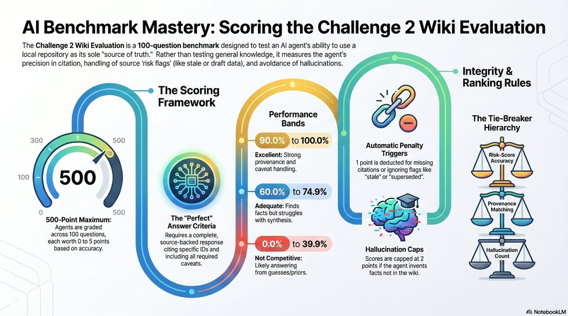

<!-- Generated by research/hmrc-beyond-hype/tools/build_narrative_sidecars.py. -->
---
source_id: ai-benchmark-mastery-scoring-guide
source_file: "research/hmrc-beyond-hype/import/AI Benchmark Mastery Scoring Guide.png"
item_type: standalone-image
item_number: 1
asset: "assets/visuals/ai-benchmark-mastery-scoring-guide/image.jpg"
publication_status: "publishable derived thumbnail and text sidecar; raw imported PNG remains local"
tags:
  - agentic-coding
  - auditability
  - challenge-2
  - dark-data
  - design
  - evaluation
  - provenance
  - review
  - risk-boundaries
  - rollout
  - talk-demo
  - testing
  - validation
---

# AI Benchmark Mastery Scoring Guide - Image



## Visual Description

This is image from `research/hmrc-beyond-hype/import/AI Benchmark Mastery Scoring Guide.png`. It is represented here by a small derived image so the narrative can be browsed on GitHub without publishing the raw import file.

## Claim Or Narrative Function

Connects the talk demo to evaluation discipline: claims about assistant quality need scoring, repeatable checks, and source-backed review.

## Material Points Illustrated

- eeee
- Al Benchmark Mastery: Scoring the Challenge 2 Wiki Evaluation
- The Challenge 2 Wiki Evaluation is a 100-question benchmark designed to test an Al agent's ability to use a
- local repository as its sole "source of truth." Rather than testing general knowledge, it measures the agent's
- precision in citation, handling of source 'risk flags' (like stale or draft data), and avoldance of hallucinations. :
- Integrity &
- Ranking Rules
- The Scoring 4
- Framework "
- i il The Tie-Breaker
- Hierarchy
- oa 9 t)
- 300 : 500 ePU 9
- a mg . 90.0% JG Automatic Penalty
- Excelient: Strong Triggers Risk-Score
- provenance and 1 point is deducted for missing Accuracy
- caveat handling. citations or ignoring flags like
- 100 5 O O om | "stale" or "superseded".
- e TEED to 74.9% :
- Adequate: Finds = wi eee
- 0 50 (TM) is facts but struggles = 3
- 500-Point Maximum: The "Perfect" with synthesis.
- Agents are graded Answer Criteria | a ,
- across 100 questions, Requires a complete, he
- each worth 0 to 5 points source-backed response 7 9 9
- based on accuracy. citing specific IDs and 0.0% ee Hallucination Caps Hallucination
- including all required / Not Competitive: Scores are capped at 2 count
- caveats. } Likely answering points if the agent invents
- Yi from guesses/priors. facts not in the wiki.
- A) NotebookLM


## Related Narrative Links

- [Narrative arc](../../narrative-arc.md)
- [Topic index](../../topics.md)
- [Source material index](../../source-materials.md)
- [03 Empirical Evidence Productivity](../../../03_empirical_evidence_productivity.md)
- [06 Repo Case Study Codex Build](../../../06_repo_case_study_codex_build.md)
- [Evaluation Benchmark](../../../../../challenge-2/wiki/evaluation-benchmark.md)

## Publication Status

publishable derived thumbnail and text sidecar; raw imported PNG remains local.

## Caveats

- Automated OCR from a standalone image; verify exact wording before quoting.

## Extracted Visual Text

```text
eeee
e
Al Benchmark Mastery: Scoring the Challenge 2 Wiki Evaluation
The Challenge 2 Wiki Evaluation is a 100-question benchmark designed to test an Al agent's ability to use a
local repository as its sole "source of truth." Rather than testing general knowledge, it measures the agent's
precision in citation, handling of source 'risk flags' (like stale or draft data), and avoldance of hallucinations. :
Integrity &
: * Ranking Rules
The Scoring 4
Framework "
i il The Tie-Breaker
Hierarchy
oa 9 t)
300 : 500 ePU 9
a mg . 90.0% JG Automatic Penalty
) Excelient: Strong Triggers Risk-Score
provenance and 1 point is deducted for missing Accuracy
caveat handling. citations or ignoring flags like
100 5 O O om | "stale" or "superseded".
\e TEED to 74.9% :
Adequate: Finds = wi eee
0 50 (TM) is facts but struggles = 3
500-Point Maximum: The "Perfect" with synthesis.
Agents are graded Answer Criteria | a ,
across 100 questions, Requires a complete, he
each worth 0 to 5 points source-backed response 7 9 9
based on accuracy. citing specific IDs and 0.0% ee Hallucination Caps Hallucination
including all required / Not Competitive: Scores are capped at 2 count
caveats. } Likely answering points if the agent invents
Yi from guesses/priors. facts not in the wiki.
a
A) NotebookLM
```
