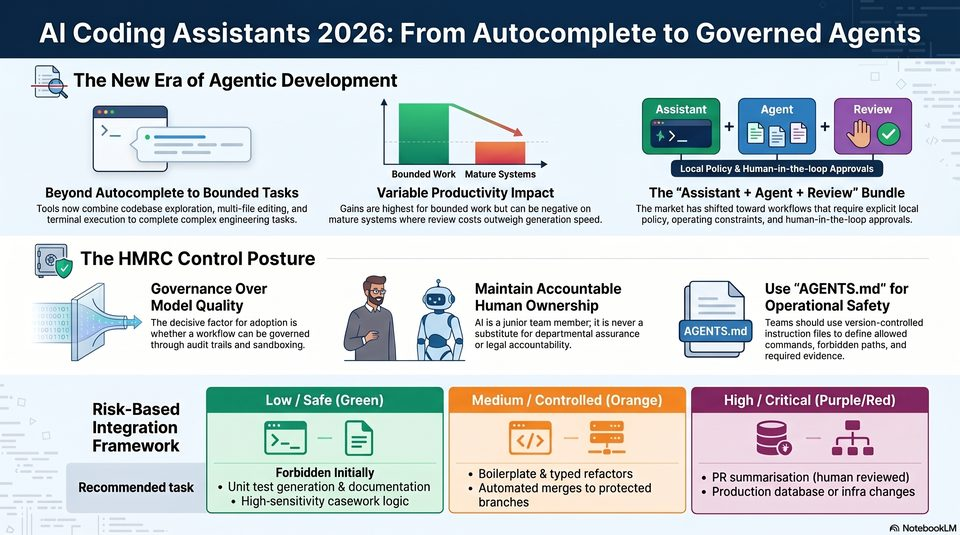

<!-- Generated by research/hmrc-beyond-hype/tools/build_narrative_sidecars.py. -->
---
source_id: ai-coding-assistants-2026-evolution
source_file: "research/hmrc-beyond-hype/import/AI Coding Assistants 2026 Evolution.png"
item_type: standalone-image
item_number: 1
asset: "assets/visuals/ai-coding-assistants-2026-evolution/image.jpg"
publication_status: "publishable derived thumbnail and text sidecar; raw imported PNG remains local"
tags:
  - agentic-coding
  - ai-assistants
  - auditability
  - evaluation
  - governance
  - provenance
  - risk-boundaries
  - timeline
  - validation
  - workflow
---

# AI Coding Assistants 2026 Evolution - Image



## Visual Description

This is image from `research/hmrc-beyond-hype/import/AI Coding Assistants 2026 Evolution.png`. It is represented here by a small derived image so the narrative can be browsed on GitHub without publishing the raw import file.

## Claim Or Narrative Function

Shows the evolution from coding assistance to agentic engineering workflows that operate across repositories, tools, tests, and review loops.

## Material Points Illustrated

- Al Coding Assistants 2026: From Autocomplete to Governed Agents
- E- The New Era of Agentic Development
- Assistant Agent Review
- SNS + ill
- Bounded Work Mature Systems Local Policy & Human-in-the-loop Approvals
- Beyond Autocomplete to Bounded Tasks Variable Productivity Impact The "Assistant + Agent + Review" Bundle
- Tools now combine codebase exploration, multi-file editing, and Gains are highest for bounded work but can be negative on The market has shifted toward workflows that require explicit local
- terminal execution to complete complex engineering tasks.
- mature systems where review costs outweigh generation speed.
- policy, operating constraints, and human-in-the-loop approvals.
- g The HMRC Control Posture
- Governance Over ey @) Maintain Accountable Use "AGENTS.md" for
- 701 Model Quality SD Human Ownership Operational Safety
- 104 The decisive factor for adoption is (aq Al is a junior team member; it is never a Teams should use version-controlled
- an whether a workflow can be governed E A substitute for departmental assurance instruction files to define allowed
- through audit trails and sandboxing. Vs f q or legal accountability. commands, forbidden paths, and
- IK A/ required evidence.
- 4 Low / Safe (Green Medium / Controlled (Orange High / Critical (Purple/Red
- Risk-Based / ( ) (Orange) g (Purp )
- Integration ~~ a = - ae =
- Framework - : -_ =o eee
- Recommended task | Unit test generation & documentation Automated merges to protected * Production database or infra changes
- High-sensitivity casework logic branches
- A) NotebookLM

## Related Narrative Links

- [Narrative arc](../../narrative-arc.md)
- [Topic index](../../topics.md)
- [Source material index](../../source-materials.md)
- [02 Timeline Ai Software Engineering](../../../02_timeline_ai_software_engineering.md)
- [04 Agentic Coding Capabilities](../../../04_agentic_coding_capabilities.md)
- [Clawpilot Project Lobster](../../notes/clawpilot-project-lobster.md)

## Publication Status

publishable derived thumbnail and text sidecar; raw imported PNG remains local.

## Caveats

- Automated OCR from a standalone image; verify exact wording before quoting.

## Extracted Visual Text

```text
e e
Al Coding Assistants 2026: From Autocomplete to Governed Agents
E- The New Era of Agentic Development
Assistant Agent Review
+ SNS + ill
Bounded Work Mature Systems Local Policy & Human-in-the-loop Approvals
Beyond Autocomplete to Bounded Tasks Variable Productivity Impact The "Assistant + Agent + Review" Bundle
Tools now combine codebase exploration, multi-file editing, and Gains are highest for bounded work but can be negative on The market has shifted toward workflows that require explicit local
terminal execution to complete complex engineering tasks. mature systems where review costs outweigh generation speed. policy, operating constraints, and human-in-the-loop approvals.
&g The HMRC Control Posture
Governance Over ey @) Maintain Accountable Use "AGENTS.md" for
701 Model Quality SD Human Ownership Operational Safety
104 The decisive factor for adoption is (aq Al is a junior team member; it is never a Teams should use version-controlled
'an whether a workflow can be governed E A substitute for departmental assurance instruction files to define allowed
through audit trails and sandboxing. Vs f q or legal accountability. commands, forbidden paths, and
IK A/ required evidence.
4 Low / Safe (Green Medium / Controlled (Orange High / Critical (Purple/Red
Risk-Based / ( ) (Orange) g (Purp )
Integration ~~ a = - ae =
Framework - : -_ =o eee
Recommended task | Unit test generation & documentation Automated merges to protected * Production database or infra changes
High-sensitivity casework logic branches
A) NotebookLM
```
