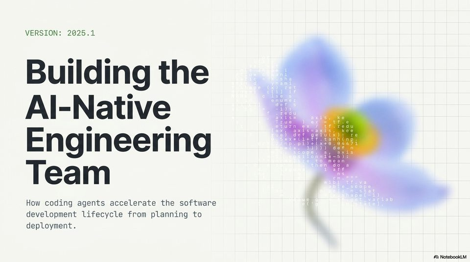

<!-- Generated by research/hmrc-beyond-hype/tools/build_narrative_sidecars.py. -->
---
source_id: ai-native-engineering-blueprint
source_file: "research/hmrc-beyond-hype/import/AI-Native_Engineering_Blueprint.pptx"
item_type: pptx-slide
item_number: 1
asset: "assets/visuals/ai-native-engineering-blueprint/slide-01.jpg"
publication_status: "publishable derived thumbnail and text sidecar; raw imported PowerPoint remains local"
tags:
  - agentic-coding
  - ai-assistants
  - build
  - codex
  - operating-model
  - operations
  - planning
  - talk-demo
  - validation
  - workflow
---

# Slide 01 - Building the AI-Native Engineering Team



## Visual Description

Title slide for the AI-native engineering team story. The visible subtitle frames coding agents as accelerators across the whole software lifecycle, from planning through deployment.

## Claim Or Narrative Function

Sets the deck's scope: the issue is no longer only faster typing or inline code completion, but a team operating model for steering agents across an end-to-end engineering lifecycle.

## Material Points Illustrated

- The subject is the engineering team and lifecycle, not a single IDE feature.
- The lifecycle explicitly runs from planning to deployment.
- The title is a clean transition from the talk's dark-data case study into the broader agentic-engineering workflow.

## Talk Path

- Stage: Opening frame.
- Use in talk: Use as the section opener after the Challenge 2 problem: this is where the talk moves from what was built to how agentic coding changes the work.
- Bridge: Next, explain why this shift is plausible: task horizons have lengthened.

## OCR-Derived Checkpoints

These are preserved as a mechanical cross-check against the source image. Prefer the curated material points above for navigation.

- VERSION: 2025.1
- e e (TM)
- Building the :
- Al-Native
- is k
- ue eitt
- e i Ree
- def gelu(k): :
- iit t tT . tar
- B)oe(xt+0.644
- Engineering st
- gc-5)i
- mean
- do a
- Team
- How coding agents accelerate the software
- development lifecycle from planning to
- deployment.
- A\ NotebookLV


## Related Narrative Links

- [Narrative arc](../../narrative-arc.md)
- [Topic index](../../topics.md)
- [Source material index](../../source-materials.md)
- [AI-Native deck index](index.md)
- [AI-Native narrative guide](narrative-guide.md)
- [Next slide](slide-02.md)
- [04 Agentic Coding Capabilities](../../../04_agentic_coding_capabilities.md)
- [07 Operating Model For Public Sector Engineering](../../../07_operating_model_for_public_sector_engineering.md)
- [Governing Agentic Ai In Software Engineering.Speakers](../../../transcripts/governing-agentic-ai-in-software-engineering.speakers.md)

## Publication Status

publishable derived thumbnail and text sidecar; raw imported PowerPoint remains local.

## Caveats

- Automated OCR from an image-only PowerPoint slide; verify exact wording before quoting.

## Extracted Visual Text

```text
VERSION: 2025.1
e e (TM)
Building the :
e
Al-Native
is k
ue eitt
e i Ree
def gelu(k): :
iit t tT . tar
B)oe(xt+0.644
Engineering st
gc-5)i-
mean
do a
Team
How coding agents accelerate the software
development lifecycle from planning to
deployment.
'A\ NotebookLV
```
