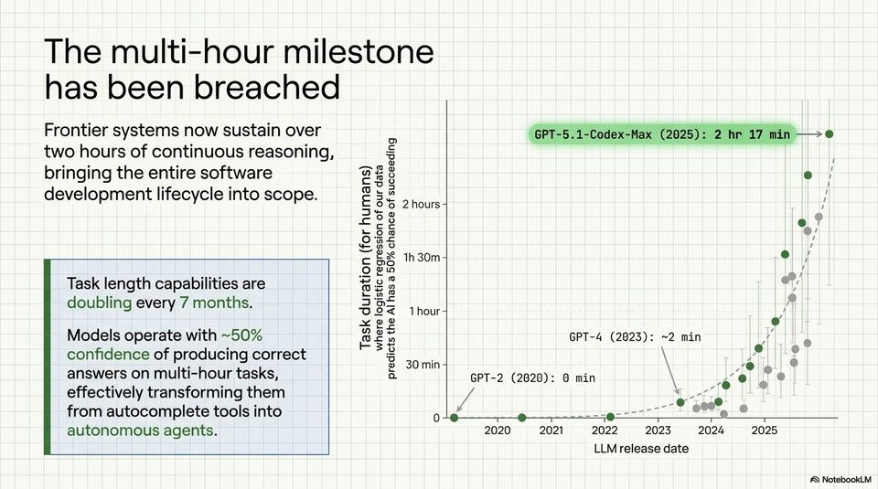

<!-- Generated by research/hmrc-beyond-hype/tools/build_narrative_sidecars.py. -->
---
source_id: ai-native-engineering-blueprint
source_file: "research/hmrc-beyond-hype/import/AI-Native_Engineering_Blueprint.pptx"
item_type: pptx-slide
item_number: 2
asset: "assets/visuals/ai-native-engineering-blueprint/slide-02.jpg"
publication_status: "publishable derived thumbnail and text sidecar; raw imported PowerPoint remains local"
tags:
  - agentic-coding
  - ai-assistants
  - codex
  - validation
  - workflow
---

# AI-Native Engineering Blueprint - Slide 02



## Visual Description

This is slide 02 from `research/hmrc-beyond-hype/import/AI-Native_Engineering_Blueprint.pptx`. It is represented here by a small derived image so the narrative can be browsed on GitHub without publishing the raw import file.

## Claim Or Narrative Function

Shows the talk's main workflow shift: engineering moves from typing code towards framing intent, giving context, steering agents, and validating evidence.

## Material Points Illustrated

- Frontier systems now sustain over a GPT-5.1-Codex-Max (2025): 2 hr 17 min ->@
- two hours of continuous reasoning, 5
- bringing the entire software ess e
- e + Geez 1
- development lifecycle into scope. E35 2hours f
- c Bs 1h30m oy
- fo [Ots) ,
- Task length capabilities are S83
- nm See
- doubling every 7 months. = 83 aout u
- Models operate with ~50% Bee GPT-4 (2023): ~2 min HI
- confidence of producing correct 3 aya \ af
- answers on multi-hour tasks, a GPT-2 (2620): min : "gy
- effectively transforming them oe v- ihe
- from autocomplete tools into 0 scum ee
- autonomous agents. 2020 2021 2022 2023 2024 2025
- LLM release date
- A\ NotebookLV

## Related Narrative Links

- [Narrative arc](../../narrative-arc.md)
- [Topic index](../../topics.md)
- [Source material index](../../source-materials.md)
- [04 Agentic Coding Capabilities](../../../04_agentic_coding_capabilities.md)
- [07 Operating Model For Public Sector Engineering](../../../07_operating_model_for_public_sector_engineering.md)
- [Governing Agentic Ai In Software Engineering.Speakers](../../../transcripts/governing-agentic-ai-in-software-engineering.speakers.md)

## Publication Status

publishable derived thumbnail and text sidecar; raw imported PowerPoint remains local.

## Caveats

- Automated OCR from an image-only PowerPoint slide; verify exact wording before quoting.

## Extracted Visual Text

```text
Frontier systems now sustain over a GPT-5.1-Codex-Max (2025): 2 hr 17 min ->@
two hours of continuous reasoning, 5 |
bringing the entire software ess e
e + Geez 1
development lifecycle into scope. E35 2hours f
"c Bs 1h30m oy
fo [Ots) ,
Task length capabilities are S83
nm See
doubling every 7 months. = 83 aout u
xe
Models operate with ~50% Bee GPT-4 (2023): ~2 min HI
confidence of producing correct 3 aya \ af
answers on multi-hour tasks, a GPT-2 (2620): min : "gy
effectively transforming them oe v- ihe
from autocomplete tools into 0 scum ee
autonomous agents. 2020 2021 2022 2023 2024 2025
LLM release date
'A\ NotebookLV
```
