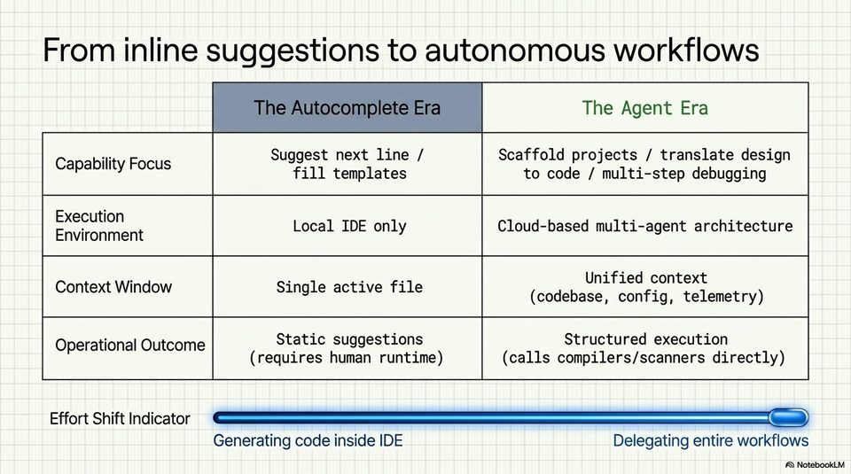

<!-- Generated by research/hmrc-beyond-hype/tools/build_narrative_sidecars.py. -->
---
source_id: ai-native-engineering-blueprint
source_file: "research/hmrc-beyond-hype/import/AI-Native_Engineering_Blueprint.pptx"
item_type: pptx-slide
item_number: 3
asset: "assets/visuals/ai-native-engineering-blueprint/slide-03.jpg"
publication_status: "publishable derived thumbnail and text sidecar; raw imported PowerPoint remains local"
tags:
  - agentic-coding
  - ai-assistants
  - build
  - codex
  - design
  - review
  - validation
  - workflow
---

# Slide 03 - From Inline Suggestions To Autonomous Workflows



## Visual Description

A comparison table between the autocomplete era and the agent era. It contrasts line suggestions and local IDE context with multi-step debugging, cloud/repo execution, unified context, and structured execution.

## Claim Or Narrative Function

Makes the core talk distinction visible: coding assistants are shifting from suggesting code inside an editor to operating across tools, context, tests, and review loops.

## Material Points Illustrated

- Autocomplete focuses on suggesting the next line or filling templates.
- The agent era focuses on scaffolding projects, translating designs to code, and multi-step debugging.
- The execution environment expands from local IDE-only assistance to cloud or repo-connected agent workflows.
- The outcome shifts from static suggestions that need human runtime to structured execution that can call compilers, scanners, and tests.

## Talk Path

- Stage: Workflow contrast.
- Use in talk: Use this as the clearest mixed-audience explanation of what changed: the assistant is not just in the editor anymore.
- Bridge: Having defined the shift, explain the architectural pillars that make it work.

## OCR-Derived Checkpoints

These are preserved as a mechanical cross-check against the source image. Prefer the curated material points above for navigation.

- From inline suggestions to autonomous workflows
- If The Agent Era
- a Suggest next line / Scaffold projects / translate design
- Capability Focus fill templates to code / multi-step debugging
- Execution | ,
- Local IDE only Cloud-based multi-agent architecture
- A 7 . Unified context
- Context Window Single active file (coucbascMconfigttclenctry)
- Operational Outcome Static suggestions Structured execution
- requires human runtime) (calls compilers/scanners directly)
- Effort Shift Indicator <<<
- Generating code inside IDE Delegating entire workflows
- A\ NotebookLV


## Related Narrative Links

- [Narrative arc](../../narrative-arc.md)
- [Topic index](../../topics.md)
- [Source material index](../../source-materials.md)
- [AI-Native deck index](index.md)
- [AI-Native narrative guide](narrative-guide.md)
- [Previous slide](slide-02.md)
- [Next slide](slide-04.md)
- [04 Agentic Coding Capabilities](../../../04_agentic_coding_capabilities.md)
- [07 Operating Model For Public Sector Engineering](../../../07_operating_model_for_public_sector_engineering.md)
- [Governing Agentic Ai In Software Engineering.Speakers](../../../transcripts/governing-agentic-ai-in-software-engineering.speakers.md)

## Publication Status

publishable derived thumbnail and text sidecar; raw imported PowerPoint remains local.

## Caveats

- Automated OCR from an image-only PowerPoint slide; verify exact wording before quoting.

## Extracted Visual Text

```text
From inline suggestions to autonomous workflows
If The Agent Era
a Suggest next line / Scaffold projects / translate design
Capability Focus fill templates to code / multi-step debugging
Execution | ,
Local IDE only Cloud-based multi-agent architecture
A 7 . Unified context
Context Window Single active file (coucbascMconfigttclenctry)
Operational Outcome Static suggestions Structured execution
(requires human runtime) (calls compilers/scanners directly)
Effort Shift Indicator <<< -----------
Generating code inside IDE Delegating entire workflows
'A\ NotebookLV
```
