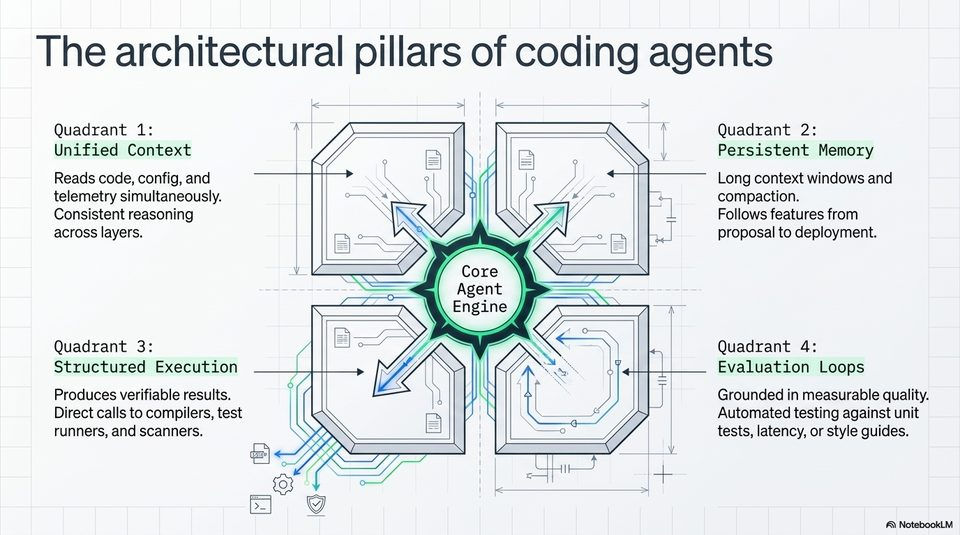

<!-- Generated by research/hmrc-beyond-hype/tools/build_narrative_sidecars.py. -->
---
source_id: ai-native-engineering-blueprint
source_file: "research/hmrc-beyond-hype/import/AI-Native_Engineering_Blueprint.pptx"
item_type: pptx-slide
item_number: 4
asset: "assets/visuals/ai-native-engineering-blueprint/slide-04.jpg"
publication_status: "publishable derived thumbnail and text sidecar; raw imported PowerPoint remains local"
tags:
  - agentic-coding
  - ai-assistants
  - architecture
  - build
  - codex
  - evaluation
  - operations
  - review
  - testing
  - validation
  - workflow
---

# Slide 04 - The Architectural Pillars Of Coding Agents



## Visual Description

A four-quadrant diagram around a core agent engine. The quadrants are unified context, persistent memory, structured execution, and evaluation loops.

## Claim Or Narrative Function

Turns the term agent into an inspectable architecture: broad context, retained state, tool execution, and measurable evaluation are what make agentic workflows different from chat prompts.

## Material Points Illustrated

- Unified context means the agent can read code, configuration, and related material together.
- Persistent memory means work can be followed from proposal to deployment, where the tool and policy allow it.
- Structured execution means direct calls to compilers, test runners, scanners, and other tools.
- Evaluation loops keep output grounded in measurable quality such as tests, latency, style, or lint checks.

## Talk Path

- Stage: Agent architecture.
- Use in talk: Use this to anchor safety: any team adopting agents must decide what context, memory, execution, and evaluation are allowed.
- Bridge: Those pillars lead to the human operating model: delegate, review, own.

## OCR-Derived Checkpoints

These are preserved as a mechanical cross-check against the source image. Prefer the curated material points above for navigation.

- Quadrant 1: K EEE 7 sy K Quadrant 2:
- Unified Context h d \ Persistent Memory
- Reads code, config, and H h) 4 4 Long context windows and
- eared simultaneously. a conan ;
- onsistent reasoning Follows features from
- across layers. SAa AS L ale proposal to deployment.
- v --S M/ Core WS
- Agent
- R= We Engine 7 7S
- Sd Cr =
- Quadrant 3: (| N \ < ) ' Quadrant 4:
- Structured Execution | a Evaluation Loops
- Produces verifiable results. i | N f | | J Grounded in measurable quality.
- Direct calls to compilers, test y \ K aes Automated testing against unit
- runners, and scanners. >\ SO. Ve tests, latency, or style guides.
- ke oe aN Lana v
- i jj
- fer ; Lease Ar
- oT Ay NotebookLM


## Related Narrative Links

- [Narrative arc](../../narrative-arc.md)
- [Topic index](../../topics.md)
- [Source material index](../../source-materials.md)
- [AI-Native deck index](index.md)
- [AI-Native narrative guide](narrative-guide.md)
- [Previous slide](slide-03.md)
- [Next slide](slide-05.md)
- [04 Agentic Coding Capabilities](../../../04_agentic_coding_capabilities.md)
- [07 Operating Model For Public Sector Engineering](../../../07_operating_model_for_public_sector_engineering.md)
- [Governing Agentic Ai In Software Engineering.Speakers](../../../transcripts/governing-agentic-ai-in-software-engineering.speakers.md)

## Publication Status

publishable derived thumbnail and text sidecar; raw imported PowerPoint remains local.

## Caveats

- Automated OCR from an image-only PowerPoint slide; verify exact wording before quoting.

## Extracted Visual Text

```text
Quadrant 1: K EEE 7 sy K Quadrant 2:
Unified Context h d \ Persistent Memory
Reads code, config, and H h) 4 4 Long context windows and
eared simultaneously. a conan ;
onsistent reasoning Follows features from
across layers. SAa AS L ale proposal to deployment.
v --S M/ Core WS
= Agent --
R= We Engine 7 7S
Sd Cr =
Quadrant 3: (| N \ < ) ' Quadrant 4:
Structured Execution | a Evaluation Loops
Produces verifiable results. i | N f | | J Grounded in measurable quality.
Direct calls to compilers, test y \ K aes Automated testing against unit
runners, and scanners. >\ SO. Ve tests, latency, or style guides.
ke oe aN Lana v
i jj
fer ; Lease Ar
oT Ay NotebookLM
```
