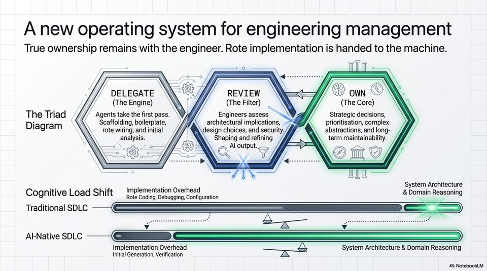

<!-- Generated by research/hmrc-beyond-hype/tools/build_narrative_sidecars.py. -->
---
source_id: ai-native-engineering-blueprint
source_file: "research/hmrc-beyond-hype/import/AI-Native_Engineering_Blueprint.pptx"
item_type: pptx-slide
item_number: 5
asset: "assets/visuals/ai-native-engineering-blueprint/slide-05.jpg"
publication_status: "publishable derived thumbnail and text sidecar; raw imported PowerPoint remains local"
tags:
  - agentic-coding
  - ai-assistants
  - build
  - codex
  - design
  - governance
  - operating-model
  - operations
  - responsibility
  - review
  - security
  - validation
  - workflow
---

# Slide 05 - A New Operating System For Engineering Management



## Visual Description

A triad diagram labelled delegate, review, and own, plus a cognitive-load shift showing implementation overhead moving towards initial generation and verification.

## Claim Or Narrative Function

Introduces the control pattern for the rest of the deck: agents can take the first pass, but engineers still review output and own strategy, risk, and final decisions.

## Material Points Illustrated

- Delegate: agents take first-pass scaffolding, boilerplate, rote wiring, and initial analysis.
- Review: engineers assess architecture, design choices, security, and the shape of AI output.
- Own: humans retain strategic decisions, prioritisation, complex abstractions, and long-term maintainability.
- The intended gain is a cognitive-load shift away from implementation overhead and towards system architecture and domain reasoning.

## Talk Path

- Stage: Human operating model.
- Use in talk: Use as the central safe-use message: the model does more work, but the engineer's accountability becomes more explicit.
- Bridge: The rest of the deck walks this triad through the lifecycle, starting with planning.

## OCR-Derived Checkpoints

These are preserved as a mechanical cross-check against the source image. Prefer the curated material points above for navigation.

- A new operating system for engineering management
- True ownership remains with the engineer. Rote implementation is handed to the machine.
- DELEGATE \\ ao) REVIEW == ow \.
- The Engine) N i (The Filter) (The Core)
- The Triad Y/ Agents take the first pass. N yj Engineers assess Strategic decisions,
- Diagram \. Scaffolding, boilerplate, ///7 architectural implications, prioritisation, complex
- lag \ rote wiring, and initial Y | design choices, and security, abstractions, and long
- analysis. y/ Shaping and refining term maintainability.
- oN, Mie &@ Al output. - =
- We i me VOY 7 im fj
- as tN I
- os rar eim@reten System Architecture
- Cognitive Load Shift Ra Cau Debicaeal Coenceeton & Domain Reasoning
- Traditional SDLC
- AtNative SDLC LL. SSeS)
- Implementation Overhead oy System Architecture & Domain Reasoning
- Initial Generation, Verification A
- A) NotebookLM


## Related Narrative Links

- [Narrative arc](../../narrative-arc.md)
- [Topic index](../../topics.md)
- [Source material index](../../source-materials.md)
- [AI-Native deck index](index.md)
- [AI-Native narrative guide](narrative-guide.md)
- [Previous slide](slide-04.md)
- [Next slide](slide-06.md)
- [04 Agentic Coding Capabilities](../../../04_agentic_coding_capabilities.md)
- [07 Operating Model For Public Sector Engineering](../../../07_operating_model_for_public_sector_engineering.md)
- [Governing Agentic Ai In Software Engineering.Speakers](../../../transcripts/governing-agentic-ai-in-software-engineering.speakers.md)

## Publication Status

publishable derived thumbnail and text sidecar; raw imported PowerPoint remains local.

## Caveats

- Automated OCR from an image-only PowerPoint slide; verify exact wording before quoting.

## Extracted Visual Text

```text
A new operating system for engineering management
True ownership remains with the engineer. Rote implementation is handed to the machine.
/ DELEGATE \\ ao) REVIEW == ow \.
// (The Engine) N i (The Filter) (The Core)
The Triad Y/ Agents take the first pass. N yj Engineers assess Strategic decisions,
Diagram \. Scaffolding, boilerplate, ///7 architectural implications, prioritisation, complex
lag \ rote wiring, and initial Y | design choices, and security, abstractions, and long-
\ analysis. y/ Shaping and refining term maintainability.
oN, Mie &@ Al output. - =
We i me VOY 7 im fj
= as tN I
os rar eim@reten System Architecture
Cognitive Load Shift Ra Cau Debicaeal Coenceeton & Domain Reasoning
Traditional SDLC
AtNative SDLC LL. SSeS)
Implementation Overhead oy System Architecture & Domain Reasoning
Initial Generation, Verification A
A) NotebookLM
```
