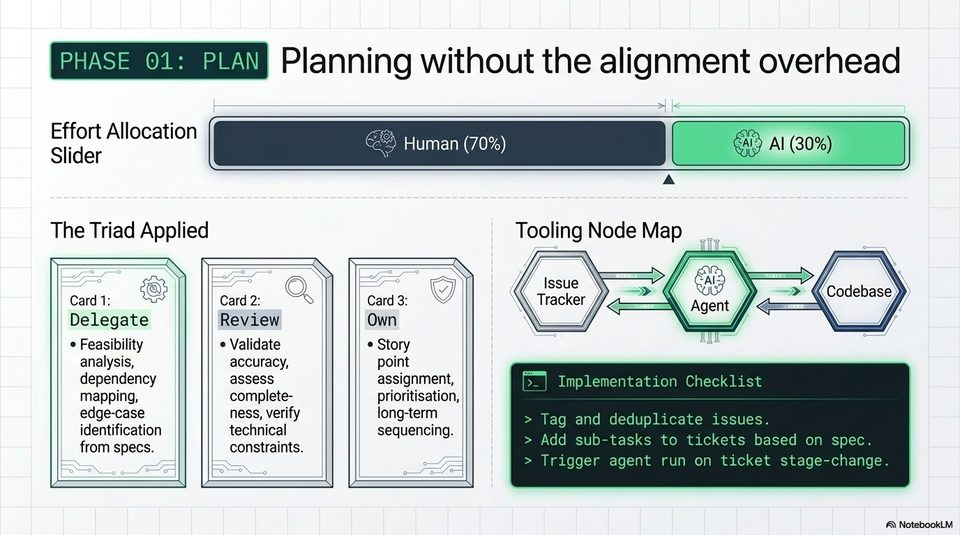

<!-- Generated by research/hmrc-beyond-hype/tools/build_narrative_sidecars.py. -->
---
source_id: ai-native-engineering-blueprint
source_file: "research/hmrc-beyond-hype/import/AI-Native_Engineering_Blueprint.pptx"
item_type: pptx-slide
item_number: 6
asset: "assets/visuals/ai-native-engineering-blueprint/slide-06.jpg"
publication_status: "publishable derived thumbnail and text sidecar; raw imported PowerPoint remains local"
tags:
  - agentic-coding
  - ai-assistants
  - codex
  - governance
  - validation
  - workflow
---

# AI-Native Engineering Blueprint - Slide 06



## Visual Description

This is slide 06 from `research/hmrc-beyond-hype/import/AI-Native_Engineering_Blueprint.pptx`. It is represented here by a small derived image so the narrative can be browsed on GitHub without publishing the raw import file.

## Claim Or Narrative Function

Shows the talk's main workflow shift: engineering moves from typing code towards framing intent, giving context, steering agents, and validating evidence.

## Material Points Illustrated

- GSS Planning without the alignment overhead
- side
- Human (70% Al) Al (30%
- Slider 'F (70%) 9 Al (30%)
- The Triad Applied Tooling Node Map
- Q VY) Sore => + -> {Codebase/
- Card 1: Card 2: S Card3: Tracker <= Agent f#<=-=*\ y
- Delegate Review | Own | / / \. Vy ij
- Feasibility * Validate * Story
- analysis, accuracy, point
- dependency assess assignment, | | Implementation Checklist
- mapping, | complete- prioritisation,
- edge-case ness, verify long-term > Tag and deduplicate issues
- identification technical sequencing. Add a a Pere ec Bee
- from specs. constraints. > Ixele sub-tasks to tickets based on spec.
- Trigger agent run on ticket stage-change.
- A\ NotebookLV

## Related Narrative Links

- [Narrative arc](../../narrative-arc.md)
- [Topic index](../../topics.md)
- [Source material index](../../source-materials.md)
- [04 Agentic Coding Capabilities](../../../04_agentic_coding_capabilities.md)
- [07 Operating Model For Public Sector Engineering](../../../07_operating_model_for_public_sector_engineering.md)
- [Governing Agentic Ai In Software Engineering.Speakers](../../../transcripts/governing-agentic-ai-in-software-engineering.speakers.md)

## Publication Status

publishable derived thumbnail and text sidecar; raw imported PowerPoint remains local.

## Caveats

- Automated OCR from an image-only PowerPoint slide; verify exact wording before quoting.

## Extracted Visual Text

```text
GSS Planning without the alignment overhead
side
; &) Human (70% Al) Al (30%
Slider 'F (70%) 9 Al (30%)
A
The Triad Applied Tooling Node Map
NN NS = = ay / a Y= / \
Q VY) Sore => + -> {Codebase/
Card 1: Card 2: S Card3: Tracker <= Agent f#<=-=*\ y
Delegate Review | Own | / / \. Vy ij
* Feasibility * Validate * Story | -
analysis, accuracy, point
dependency assess assignment, | | Implementation Checklist
mapping, | complete- prioritisation,
edge-case ness, verify long-term > Tag and deduplicate issues
identification technical sequencing. Add a a Pere ec Bee
from specs. constraints. > Ixele sub-tasks to tickets based on spec.
> Trigger agent run on ticket stage-change.
'A\ NotebookLV
```
