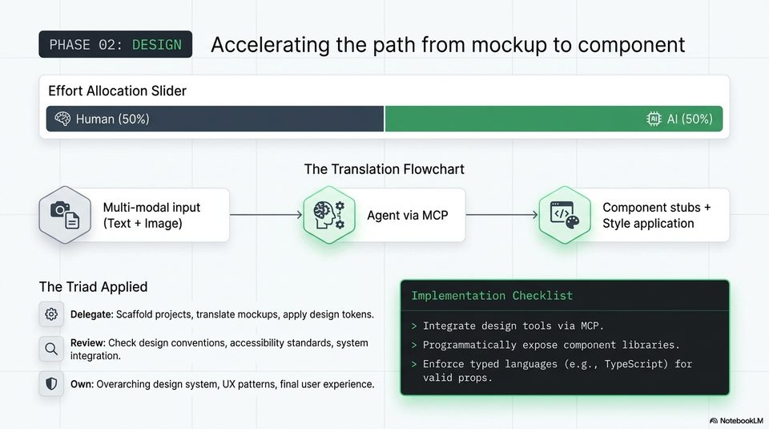

<!-- Generated by research/hmrc-beyond-hype/tools/build_narrative_sidecars.py. -->
---
source_id: ai-native-engineering-blueprint
source_file: "research/hmrc-beyond-hype/import/AI-Native_Engineering_Blueprint.pptx"
item_type: pptx-slide
item_number: 7
asset: "assets/visuals/ai-native-engineering-blueprint/slide-07.jpg"
publication_status: "publishable derived thumbnail and text sidecar; raw imported PowerPoint remains local"
tags:
  - agentic-coding
  - ai-assistants
  - build
  - codex
  - design
  - governance
  - mcp
  - review
  - validation
  - workflow
---

# Slide 07 - Phase 02: Design



## Visual Description

A design slide with a 50/50 human-agent effort split and a translation flow from multimodal input through an MCP-connected agent to component stubs and style application.

## Claim Or Narrative Function

Shows agents as design translators, not design owners: they can scaffold from mockups and apply tokens, while humans retain UX and system-level judgement.

## Material Points Illustrated

- Delegate project scaffolding, mockup translation, and design-token application.
- Review design conventions, accessibility standards, and system integration.
- Own the overarching design system, UX patterns, and final user experience.
- Implementation depends on exposing design tools/component libraries and enforcing typed languages such as TypeScript.

## Talk Path

- Stage: Lifecycle phase.
- Use in talk: Use this to show why MCP-style context matters: agents need controlled access to the design system, not a screenshot alone.
- Bridge: The same pattern then moves into implementation, where delegation can increase.

## OCR-Derived Checkpoints

These are preserved as a mechanical cross-check against the source image. Prefer the curated material points above for navigation.

- PHASE 02: Accelerating the path from mockup to component
- Effort Allocation Slider
- Human (50%) Al (50%)
- The Translation Flowchart
- y-- (TM) Hil,
- od Multi-modal input a : Component stubs +
- 5) (Text + Image) 2 9 ens Style application
- The Triad Applied i
- 3 Delegate: Scaffold projects, translate mockups, apply design tokens.
- Integrate design tools via MCP.
- Q Review: Check design conventions, accessibility standards, system Programmatically expose component libraries.
- integration.
- ae cae Enforce typed languages (e.g., TypeScript) for
- _ own: Overarching design system, UX patterns, final user experience. wens EPS.
- A) NotebookLM


## Related Narrative Links

- [Narrative arc](../../narrative-arc.md)
- [Topic index](../../topics.md)
- [Source material index](../../source-materials.md)
- [AI-Native deck index](index.md)
- [AI-Native narrative guide](narrative-guide.md)
- [Previous slide](slide-06.md)
- [Next slide](slide-08.md)
- [04 Agentic Coding Capabilities](../../../04_agentic_coding_capabilities.md)
- [07 Operating Model For Public Sector Engineering](../../../07_operating_model_for_public_sector_engineering.md)
- [Governing Agentic Ai In Software Engineering.Speakers](../../../transcripts/governing-agentic-ai-in-software-engineering.speakers.md)

## Publication Status

publishable derived thumbnail and text sidecar; raw imported PowerPoint remains local.

## Caveats

- Automated OCR from an image-only PowerPoint slide; verify exact wording before quoting.

## Extracted Visual Text

```text
PHASE 02: Accelerating the path from mockup to component
Effort Allocation Slider
@ Human (50%) Al (50%)
The Translation Flowchart
y-- (TM) Hil,
[od Multi-modal input a : Component stubs +
a i Agent via MCP. }~=-----_>| |</ ie
5) (Text + Image) 2 9 ens Style application
The Triad Applied i
{3 Delegate: Scaffold projects, translate mockups, apply design tokens.
Integrate design tools via MCP.
Q Review: Check design conventions, accessibility standards, system Programmatically expose component libraries.
integration.
ae cae Enforce typed languages (e.g., TypeScript) for
_ own: Overarching design system, UX patterns, final user experience. wens EPS.
A) NotebookLM
```
