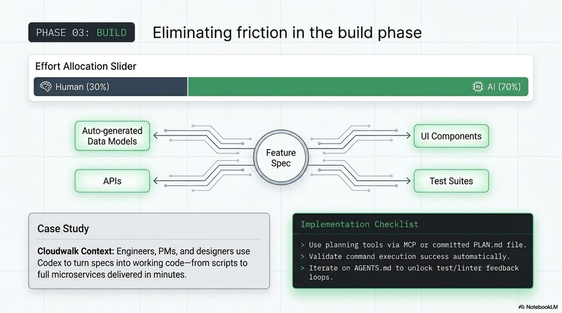

<!-- Generated by research/hmrc-beyond-hype/tools/build_narrative_sidecars.py. -->
---
source_id: ai-native-engineering-blueprint
source_file: "research/hmrc-beyond-hype/import/AI-Native_Engineering_Blueprint.pptx"
item_type: pptx-slide
item_number: 8
asset: "assets/visuals/ai-native-engineering-blueprint/slide-08.jpg"
publication_status: "publishable derived thumbnail and text sidecar; raw imported PowerPoint remains local"
tags:
  - agentic-coding
  - ai-assistants
  - codex
  - mcp
  - validation
  - workflow
---

# AI-Native Engineering Blueprint - Slide 08



## Visual Description

This is slide 08 from `research/hmrc-beyond-hype/import/AI-Native_Engineering_Blueprint.pptx`. It is represented here by a small derived image so the narrative can be browsed on GitHub without publishing the raw import file.

## Claim Or Narrative Function

Shows the talk's main workflow shift: engineering moves from typing code towards framing intent, giving context, steering agents, and validating evidence.

## Material Points Illustrated

- PHASE 03: Eliminating friction in the build phase
- Effort Allocation Slider
- Human (30%) Al (70%)
- Auto-generated -- x0 : ---- UI Components
- Data Models = N j : YA :
- Feature ; "
- BD i ee 3 \ z
- Case Study
- an z Use planning tools via MCP or committed PLAN.md file.
- Cloudwalk Context: Engineers, PMs, and designers use Validate command execution success automatically.
- Codex to turn specs into working code-from scripts to Iterate on AGENTS.md to unlock test/linter feedback
- full microservices delivered in minutes. loops.
- A\ NotebookLV

## Related Narrative Links

- [Narrative arc](../../narrative-arc.md)
- [Topic index](../../topics.md)
- [Source material index](../../source-materials.md)
- [04 Agentic Coding Capabilities](../../../04_agentic_coding_capabilities.md)
- [07 Operating Model For Public Sector Engineering](../../../07_operating_model_for_public_sector_engineering.md)
- [Governing Agentic Ai In Software Engineering.Speakers](../../../transcripts/governing-agentic-ai-in-software-engineering.speakers.md)

## Publication Status

publishable derived thumbnail and text sidecar; raw imported PowerPoint remains local.

## Caveats

- Automated OCR from an image-only PowerPoint slide; verify exact wording before quoting.

## Extracted Visual Text

```text
PHASE 03: Eliminating friction in the build phase
Effort Allocation Slider
& Human (30%) Al (70%)
Auto-generated -- x0 : ---- UI Components
Data Models = N j : YA :
< Feature ; "
BD i ee 3 \ z
Case Study |
an z Use planning tools via MCP or committed PLAN.md file. |
Cloudwalk Context: Engineers, PMs, and designers use Validate command execution success automatically.
Codex to turn specs into working code-from scripts to Iterate on AGENTS.md to unlock test/linter feedback
full microservices delivered in minutes. loops. |
'A\ NotebookLV
```
