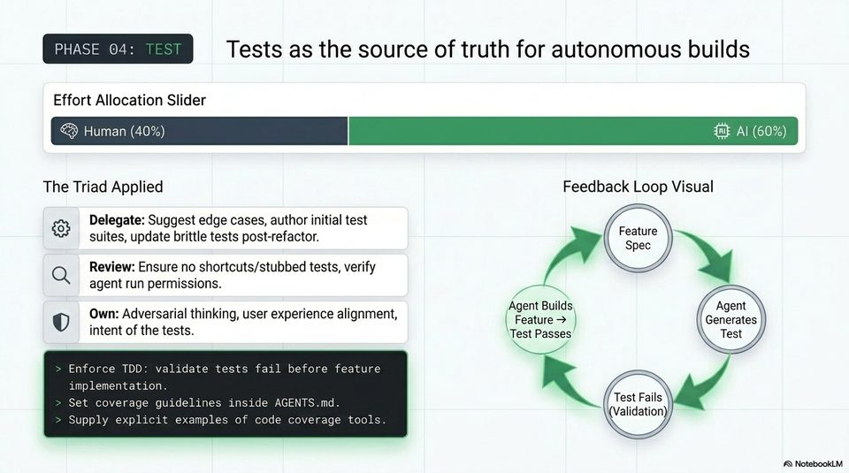

<!-- Generated by research/hmrc-beyond-hype/tools/build_narrative_sidecars.py. -->
---
source_id: ai-native-engineering-blueprint
source_file: "research/hmrc-beyond-hype/import/AI-Native_Engineering_Blueprint.pptx"
item_type: pptx-slide
item_number: 9
asset: "assets/visuals/ai-native-engineering-blueprint/slide-09.jpg"
publication_status: "publishable derived thumbnail and text sidecar; raw imported PowerPoint remains local"
tags:
  - agentic-coding
  - ai-assistants
  - codex
  - dark-data
  - governance
  - security
  - validation
  - workflow
---

# AI-Native Engineering Blueprint - Slide 09



## Visual Description

This is slide 09 from `research/hmrc-beyond-hype/import/AI-Native_Engineering_Blueprint.pptx`. It is represented here by a small derived image so the narrative can be browsed on GitHub without publishing the raw import file.

## Claim Or Narrative Function

Shows the talk's main workflow shift: engineering moves from typing code towards framing intent, giving context, steering agents, and validating evidence.

## Material Points Illustrated

- PHASE 04: Tests as the source of truth for autonomous builds
- Effort Allocation Slider
- Human (40%) Al (60%)
- The Triad Applied Feedback Loop Visual
- Delegate: Suggest edge cases, author initial test
- suites, update brittle tests post-refactor. ee
- Review: Ensure no shortcuts/stubbed tests, verify
- agent run permissions. a
- oO Own: Adversarial thinking, user experience alignment, (eee on fa
- intent of the tests. Test Passes Test
- Enforce TDD: validate tests fail before feature
- implementation. P
- Set coverage guidelines inside AGENTS.md. Jestifallg
- Supp . 94 Sone -otecad 4 Validation)
- Supply explicit examples of code coverage tools.
- A\ NotebookLV

## Related Narrative Links

- [Narrative arc](../../narrative-arc.md)
- [Topic index](../../topics.md)
- [Source material index](../../source-materials.md)
- [04 Agentic Coding Capabilities](../../../04_agentic_coding_capabilities.md)
- [07 Operating Model For Public Sector Engineering](../../../07_operating_model_for_public_sector_engineering.md)
- [Governing Agentic Ai In Software Engineering.Speakers](../../../transcripts/governing-agentic-ai-in-software-engineering.speakers.md)

## Publication Status

publishable derived thumbnail and text sidecar; raw imported PowerPoint remains local.

## Caveats

- Automated OCR from an image-only PowerPoint slide; verify exact wording before quoting.

## Extracted Visual Text

```text
PHASE 04: Tests as the source of truth for autonomous builds
Effort Allocation Slider
Human (40%) Al (60%)
The Triad Applied Feedback Loop Visual
& Delegate: Suggest edge cases, author initial test
suites, update brittle tests post-refactor. ee
@ Review: Ensure no shortcuts/stubbed tests, verify
agent run permissions. a
oO Own: Adversarial thinking, user experience alignment, (eee on fa
intent of the tests. Test Passes Test
Enforce TDD: validate tests fail before feature
implementation. P
Set coverage guidelines inside AGENTS.md. Jestifallg
Supp . 94 Sone -otecad 4 Validation)
Supply explicit examples of code coverage tools.
'A\ NotebookLV
```
