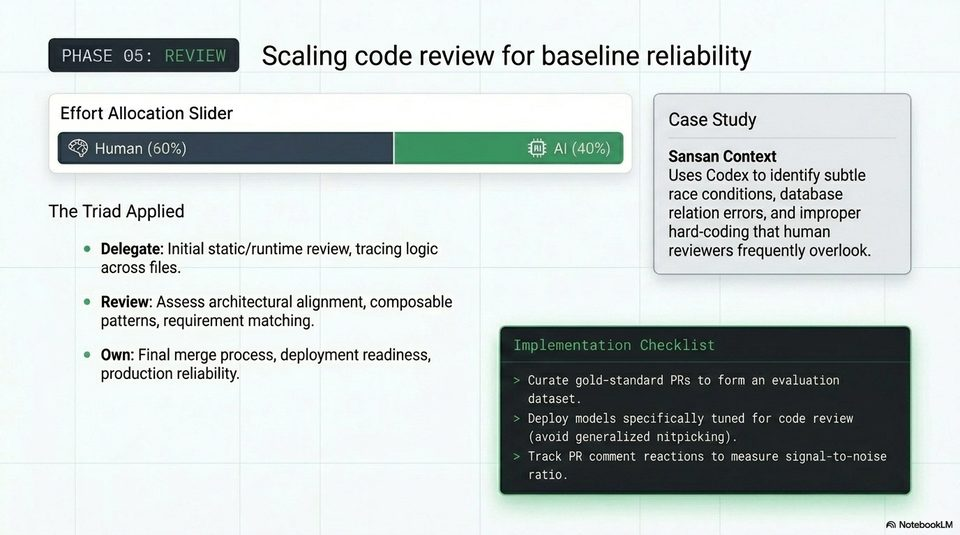

<!-- Generated by research/hmrc-beyond-hype/tools/build_narrative_sidecars.py. -->
---
source_id: ai-native-engineering-blueprint
source_file: "research/hmrc-beyond-hype/import/AI-Native_Engineering_Blueprint.pptx"
item_type: pptx-slide
item_number: 10
asset: "assets/visuals/ai-native-engineering-blueprint/slide-10.jpg"
publication_status: "publishable derived thumbnail and text sidecar; raw imported PowerPoint remains local"
tags:
  - agentic-coding
  - ai-assistants
  - build
  - codex
  - evaluation
  - governance
  - operations
  - review
  - validation
  - workflow
---

# Slide 10 - Phase 05: Review



## Visual Description

A code-review slide with a human-heavy effort split, a Sansan case-study inset, and implementation guidance for review datasets, tuned models, and signal-to-noise tracking.

## Claim Or Narrative Function

Positions agents as review amplifiers: useful for broad tracing and defect hints, but not a replacement for final merge authority or production-readiness judgement.

## Material Points Illustrated

- Delegate initial static/runtime review and tracing logic across files.
- Review architectural alignment, composable patterns, and requirement matching.
- Own final merge process, deployment readiness, and production reliability.
- Curate gold-standard pull requests as an evaluation dataset, tune models for review, and track comment reactions to measure signal-to-noise.

## Talk Path

- Stage: Lifecycle phase.
- Use in talk: Use this to explain that AI review can find issues humans miss, but the acceptance decision remains a human engineering responsibility.
- Bridge: Once a change is accepted, documentation should be generated as a byproduct.

## OCR-Derived Checkpoints

These are preserved as a mechanical cross-check against the source image. Prefer the curated material points above for navigation.

- PHASE 05: Scaling code review for baseline reliability
- Effort Allocation Slider Case Study
- Human (60%) HE Al (40%) SaneantContert
- Uses Codex to identify subtle
- i race conditions, database
- The Triad Applied relation errors, and improper
- hard-coding that human
- Delegate: Initial static/runtime review, tracing logic reviewers frequently overlook.
- across files. ( Sivecses aeeaeee
- e Review: Assess architectural alignment, composable
- patterns, requirement matching.
- e Own: Final merge process, deployment readiness,
- production reliability. Curate gold-standard PRs to form an evaluation
- dataset.
- Deploy models specifically tuned for code review
- avoid generalized nitpicking).
- Track PR comment reactions to measure signal-to-noise
- ratio.
- A\ NotebookLV


## Related Narrative Links

- [Narrative arc](../../narrative-arc.md)
- [Topic index](../../topics.md)
- [Source material index](../../source-materials.md)
- [AI-Native deck index](index.md)
- [AI-Native narrative guide](narrative-guide.md)
- [Previous slide](slide-09.md)
- [Next slide](slide-11.md)
- [04 Agentic Coding Capabilities](../../../04_agentic_coding_capabilities.md)
- [07 Operating Model For Public Sector Engineering](../../../07_operating_model_for_public_sector_engineering.md)
- [Governing Agentic Ai In Software Engineering.Speakers](../../../transcripts/governing-agentic-ai-in-software-engineering.speakers.md)

## Publication Status

publishable derived thumbnail and text sidecar; raw imported PowerPoint remains local.

## Caveats

- Automated OCR from an image-only PowerPoint slide; verify exact wording before quoting.

## Extracted Visual Text

```text
PHASE 05: Scaling code review for baseline reliability
Effort Allocation Slider Case Study
|
& Human (60%) HE Al (40%) SaneantContert
Uses Codex to identify subtle
: i race conditions, database
The Triad Applied relation errors, and improper
hard-coding that human
Delegate: Initial static/runtime review, tracing logic reviewers frequently overlook.
across files. ( Sivecses aeeaeee
e Review: Assess architectural alignment, composable
patterns, requirement matching.
e Own: Final merge process, deployment readiness,
production reliability. Curate gold-standard PRs to form an evaluation
dataset.
Deploy models specifically tuned for code review
(avoid generalized nitpicking).
Track PR comment reactions to measure signal-to-noise
ratio.
'A\ NotebookLV
```
