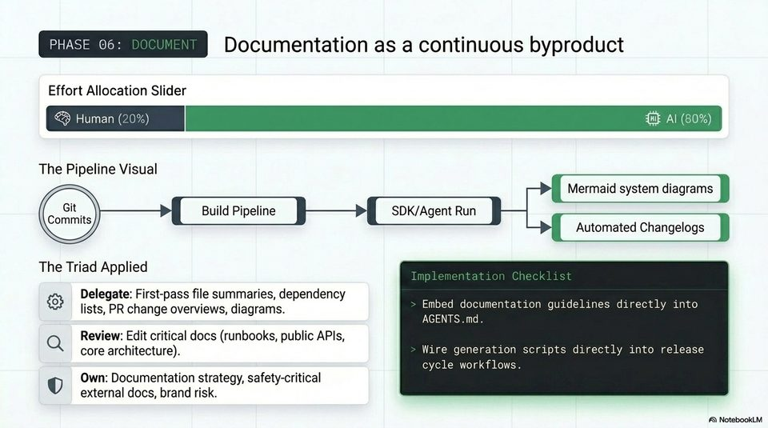

<!-- Generated by research/hmrc-beyond-hype/tools/build_narrative_sidecars.py. -->
---
source_id: ai-native-engineering-blueprint
source_file: "research/hmrc-beyond-hype/import/AI-Native_Engineering_Blueprint.pptx"
item_type: pptx-slide
item_number: 11
asset: "assets/visuals/ai-native-engineering-blueprint/slide-11.jpg"
publication_status: "publishable derived thumbnail and text sidecar; raw imported PowerPoint remains local"
tags:
  - agentic-coding
  - ai-assistants
  - codex
  - governance
  - risk-boundaries
  - validation
  - workflow
---

# AI-Native Engineering Blueprint - Slide 11



## Visual Description

This is slide 11 from `research/hmrc-beyond-hype/import/AI-Native_Engineering_Blueprint.pptx`. It is represented here by a small derived image so the narrative can be browsed on GitHub without publishing the raw import file.

## Claim Or Narrative Function

Shows the talk's main workflow shift: engineering moves from typing code towards framing intent, giving context, steering agents, and validating evidence.

## Material Points Illustrated

- PHASE 06: Documentation as a continuous byproduct
- Effort Allocation Slider
- The Pipeline Visual
- Mermaid system diagrams
- Build Pipeline SDK/Agent Run
- Automated Changelogs
- The Triad Applied
- Delegate: First-pass file summaries, dependency z e
- lists, PR change overviews, diagrams. Embed documentation guidelines directly into
- AGENTS .md.
- Q Review: Edit critical docs (runbooks, public APIs,
- core architecture). Wire generation scripts directly into release
- cycle workflows.
- ry) Own: Documentation strategy, safety-critical
- external docs, brand risk.
- A\ NotebookLV

## Related Narrative Links

- [Narrative arc](../../narrative-arc.md)
- [Topic index](../../topics.md)
- [Source material index](../../source-materials.md)
- [04 Agentic Coding Capabilities](../../../04_agentic_coding_capabilities.md)
- [07 Operating Model For Public Sector Engineering](../../../07_operating_model_for_public_sector_engineering.md)
- [Governing Agentic Ai In Software Engineering.Speakers](../../../transcripts/governing-agentic-ai-in-software-engineering.speakers.md)

## Publication Status

publishable derived thumbnail and text sidecar; raw imported PowerPoint remains local.

## Caveats

- Automated OCR from an image-only PowerPoint slide; verify exact wording before quoting.

## Extracted Visual Text

```text
PHASE 06: Documentation as a continuous byproduct
Effort Allocation Slider
The Pipeline Visual
Mermaid system diagrams
Build Pipeline SDK/Agent Run
Automated Changelogs
The Triad Applied
& Delegate: First-pass file summaries, dependency z e
lists, PR change overviews, diagrams. Embed documentation guidelines directly into
AGENTS .md. |
Q Review: Edit critical docs (runbooks, public APIs, |
core architecture). Wire generation scripts directly into release
cycle workflows.
ry) Own: Documentation strategy, safety-critical
external docs, brand risk.
'A\ NotebookLV
```
