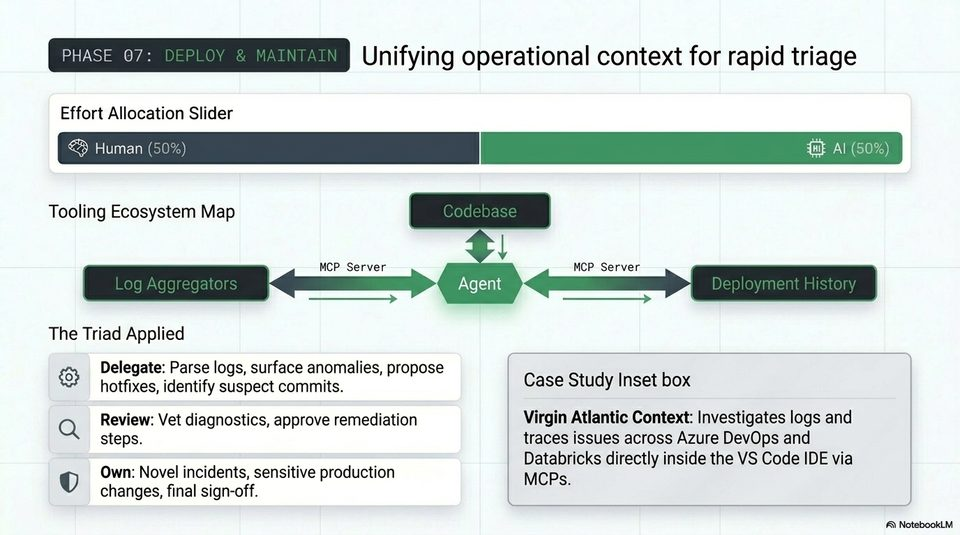

<!-- Generated by research/hmrc-beyond-hype/tools/build_narrative_sidecars.py. -->
---
source_id: ai-native-engineering-blueprint
source_file: "research/hmrc-beyond-hype/import/AI-Native_Engineering_Blueprint.pptx"
item_type: pptx-slide
item_number: 12
asset: "assets/visuals/ai-native-engineering-blueprint/slide-12.jpg"
publication_status: "publishable derived thumbnail and text sidecar; raw imported PowerPoint remains local"
tags:
  - agentic-coding
  - ai-assistants
  - auditability
  - build
  - codex
  - governance
  - mcp
  - operations
  - review
  - risk-boundaries
  - validation
  - workflow
---

# Slide 12 - Phase 07: Deploy And Maintain



## Visual Description

An operations slide showing log aggregators and deployment history connected to an agent through MCP servers, plus a case-study inset about operational investigation inside the IDE.

## Claim Or Narrative Function

Draws the boundary for operational use: agents can help triage logs and propose remediation, but production incidents and sensitive changes need human sign-off.

## Material Points Illustrated

- Delegate log parsing, anomaly surfacing, hotfix proposals, and suspect-commit identification.
- Review diagnostics and approve remediation steps.
- Own novel incidents, sensitive production changes, and final sign-off.
- Controlled MCP access to logs, code, deployment history, and data platforms raises the value of agents and the assurance burden.

## Talk Path

- Stage: Lifecycle phase.
- Use in talk: Use this as the strongest public-sector caution: the closer agents get to operations, the more identity, audit, and approval controls matter.
- Bridge: Having walked through the lifecycle, consolidate responsibilities in one matrix.

## OCR-Derived Checkpoints

These are preserved as a mechanical cross-check against the source image. Prefer the curated material points above for navigation.

- Unifying operational context for rapid triage
- Effort Allocation Slider
- Tooling Ecosystem Map
- MCP Server u MCP Server
- I EE
- The Triad Applied
- Delegate: Parse logs, surface anomalies, propose (
- hotfixes, identify suspect commits. Case Study Inset box
- Q Review: Vet diagnostics, approve remediation Virgin Atlantic Context: Investigates logs and
- steps. traces issues across Azure DevOps and
- 5 Databricks directly inside the VS Code IDE via
- Own: Novel incidents, sensitive production
- MCPs.
- changes, final sign-off.
- A\ NotebookLV


## Related Narrative Links

- [Narrative arc](../../narrative-arc.md)
- [Topic index](../../topics.md)
- [Source material index](../../source-materials.md)
- [AI-Native deck index](index.md)
- [AI-Native narrative guide](narrative-guide.md)
- [Previous slide](slide-11.md)
- [Next slide](slide-13.md)
- [04 Agentic Coding Capabilities](../../../04_agentic_coding_capabilities.md)
- [07 Operating Model For Public Sector Engineering](../../../07_operating_model_for_public_sector_engineering.md)
- [Governing Agentic Ai In Software Engineering.Speakers](../../../transcripts/governing-agentic-ai-in-software-engineering.speakers.md)

## Publication Status

publishable derived thumbnail and text sidecar; raw imported PowerPoint remains local.

## Caveats

- Automated OCR from an image-only PowerPoint slide; verify exact wording before quoting.

## Extracted Visual Text

```text
Unifying operational context for rapid triage
Effort Allocation Slider
Tooling Ecosystem Map
MCP Server u MCP Server
I EE
The Triad Applied
Delegate: Parse logs, surface anomalies, propose ( |
& hotfixes, identify suspect commits. Case Study Inset box
Q Review: Vet diagnostics, approve remediation Virgin Atlantic Context: Investigates logs and
steps. traces issues across Azure DevOps and
= = 5 Databricks directly inside the VS Code IDE via
Own: Novel incidents, sensitive production
MCPs.
changes, final sign-off.
'A\ NotebookLV
```
