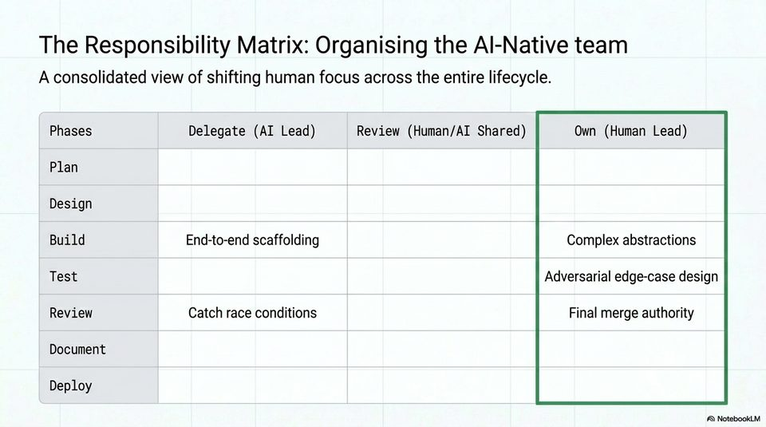

<!-- Generated by research/hmrc-beyond-hype/tools/build_narrative_sidecars.py. -->
---
source_id: ai-native-engineering-blueprint
source_file: "research/hmrc-beyond-hype/import/AI-Native_Engineering_Blueprint.pptx"
item_type: pptx-slide
item_number: 13
asset: "assets/visuals/ai-native-engineering-blueprint/slide-13.jpg"
publication_status: "publishable derived thumbnail and text sidecar; raw imported PowerPoint remains local"
tags:
  - agentic-coding
  - ai-assistants
  - build
  - codex
  - design
  - documentation
  - governance
  - operating-model
  - operations
  - planning
  - responsibility
  - review
  - testing
  - validation
  - workflow
---

# Slide 13 - Responsibility Matrix



## Visual Description

A table organising phases against delegate, review, and own responsibilities. The visible examples include AI-led scaffolding, human ownership of complex abstractions, adversarial edge-case design, and final merge authority.

## Claim Or Narrative Function

Provides the deck's practical governance artefact: a team can decide, phase by phase, what AI leads, what is shared, and what humans must own.

## Material Points Illustrated

- The lifecycle should be governed as a responsibility matrix, not a vague adoption policy.
- AI can lead bounded delegation such as scaffolding and issue detection.
- Humans must own complex abstractions, adversarial testing strategy, and final merge authority.
- The matrix gives teams a way to turn agent adoption into reviewable operating rules.

## Talk Path

- Stage: Consolidation.
- Use in talk: Use this as the handout-style summary for teams asking 'where do we start and what do we keep human-owned?'.
- Bridge: The matrix explains control; the flywheel explains why disciplined control compounds.

## OCR-Derived Checkpoints

These are preserved as a mechanical cross-check against the source image. Prefer the curated material points above for navigation.

- The Responsibility Matrix: Organising the Al-Native team
- A consolidated view of shifting human focus across the entire lifecycle.
- Phases Delegate (AI Lead) Review (Human/AI Shared) Own (Human Lead)
- Plan
- Design
- Build End-to-end scaffolding Complex abstractions
- Test Adversarial edge-case design
- Review Catch race conditions Final merge authority
- Document
- Deploy
- A NotebookiM


## Related Narrative Links

- [Narrative arc](../../narrative-arc.md)
- [Topic index](../../topics.md)
- [Source material index](../../source-materials.md)
- [AI-Native deck index](index.md)
- [AI-Native narrative guide](narrative-guide.md)
- [Previous slide](slide-12.md)
- [Next slide](slide-14.md)
- [04 Agentic Coding Capabilities](../../../04_agentic_coding_capabilities.md)
- [07 Operating Model For Public Sector Engineering](../../../07_operating_model_for_public_sector_engineering.md)
- [Governing Agentic Ai In Software Engineering.Speakers](../../../transcripts/governing-agentic-ai-in-software-engineering.speakers.md)

## Publication Status

publishable derived thumbnail and text sidecar; raw imported PowerPoint remains local.

## Caveats

- Automated OCR from an image-only PowerPoint slide; verify exact wording before quoting.

## Extracted Visual Text

```text
The Responsibility Matrix: Organising the Al-Native team
A consolidated view of shifting human focus across the entire lifecycle.
Phases Delegate (AI Lead) Review (Human/AI Shared) Own (Human Lead)
Plan
Design
Build End-to-end scaffolding Complex abstractions
Test Adversarial edge-case design
Review Catch race conditions Final merge authority
Document
Deploy
A NotebookiM
```
