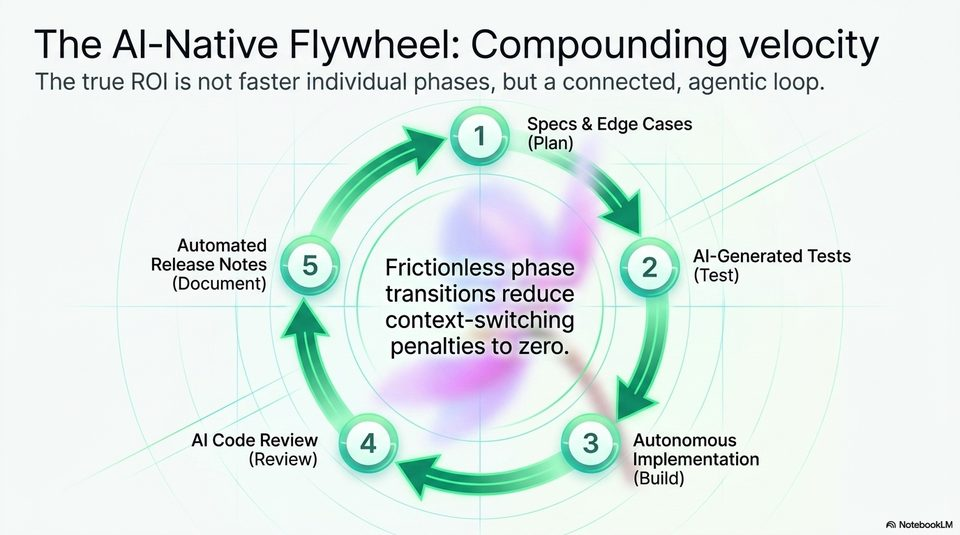

<!-- Generated by research/hmrc-beyond-hype/tools/build_narrative_sidecars.py. -->
---
source_id: ai-native-engineering-blueprint
source_file: "research/hmrc-beyond-hype/import/AI-Native_Engineering_Blueprint.pptx"
item_type: pptx-slide
item_number: 14
asset: "assets/visuals/ai-native-engineering-blueprint/slide-14.jpg"
publication_status: "publishable derived thumbnail and text sidecar; raw imported PowerPoint remains local"
tags:
  - agentic-coding
  - ai-assistants
  - build
  - codex
  - flywheel
  - governance
  - review
  - testing
  - validation
  - workflow
---

# Slide 14 - The AI-Native Flywheel



## Visual Description

A circular flywheel with five connected stages: specs and edge cases, AI-generated tests, autonomous implementation, AI code review, and automated release notes.

## Claim Or Narrative Function

Shows the higher-level productivity argument: the return is not just faster phases, but a connected workflow where each stage creates context for the next.

## Material Points Illustrated

- The loop starts with clear specs and edge cases.
- Tests, implementation, review, and release notes become connected agent-assisted steps.
- The claimed gain is reduced context switching across phase transitions.
- The flywheel works only if each stage leaves reviewable evidence for the next one.

## Talk Path

- Stage: Compounding loop.
- Use in talk: Use this as the closing concept before practical rollout: discipline compounds when outputs are structured for the next agent or human review step.
- Bridge: Close the deck with the concrete rollout steps.

## OCR-Derived Checkpoints

These are preserved as a mechanical cross-check against the source image. Prefer the curated material points above for navigation.

- The Al-Native Flywheel: Compounding velocity
- The true ROI is not faster individual phases, but a connected, agentic loop.
- Specs & Edge Cases
- Automated ,
- Release Notes G) esc phase 2;
- ae | transitions reduce
- context-switching ]
- penalties to zero. /
- Al Code Review \ 4 ) (3) Autonomous
- Review) Implementation
- Build)


## Related Narrative Links

- [Narrative arc](../../narrative-arc.md)
- [Topic index](../../topics.md)
- [Source material index](../../source-materials.md)
- [AI-Native deck index](index.md)
- [AI-Native narrative guide](narrative-guide.md)
- [Previous slide](slide-13.md)
- [Next slide](slide-15.md)
- [04 Agentic Coding Capabilities](../../../04_agentic_coding_capabilities.md)
- [07 Operating Model For Public Sector Engineering](../../../07_operating_model_for_public_sector_engineering.md)
- [Governing Agentic Ai In Software Engineering.Speakers](../../../transcripts/governing-agentic-ai-in-software-engineering.speakers.md)

## Publication Status

publishable derived thumbnail and text sidecar; raw imported PowerPoint remains local.

## Caveats

- Automated OCR from an image-only PowerPoint slide; verify exact wording before quoting.

## Extracted Visual Text

```text
The Al-Native Flywheel: Compounding velocity
The true ROI is not faster individual phases, but a connected, agentic loop.
Specs & Edge Cases
= \
Automated ,
Release Notes G) esc phase 2;
ae | transitions reduce
context-switching ]
penalties to zero. /
-_
Al Code Review \ 4 ) (3) Autonomous
(Review) Implementation
= (Build)
```
