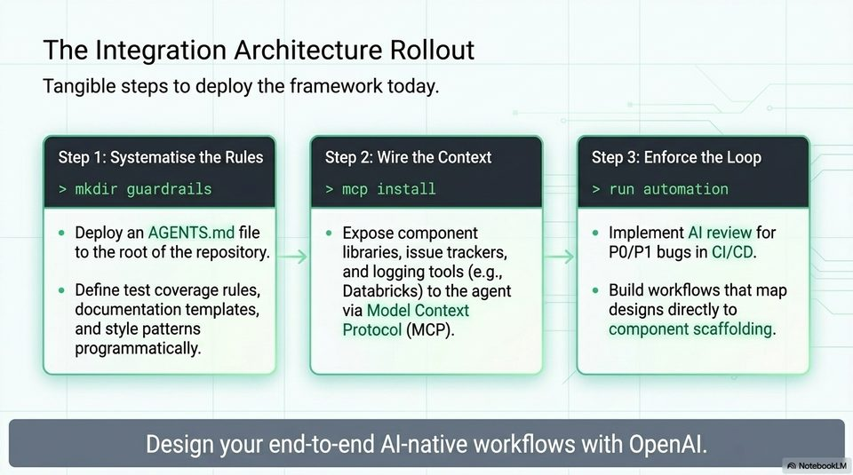

<!-- Generated by research/hmrc-beyond-hype/tools/build_narrative_sidecars.py. -->
---
source_id: ai-native-engineering-blueprint
source_file: "research/hmrc-beyond-hype/import/AI-Native_Engineering_Blueprint.pptx"
item_type: pptx-slide
item_number: 15
asset: "assets/visuals/ai-native-engineering-blueprint/slide-15.jpg"
publication_status: "publishable derived thumbnail and text sidecar; raw imported PowerPoint remains local"
tags:
  - agentic-coding
  - ai-assistants
  - build
  - challenge-2
  - codex
  - design
  - documentation
  - governance
  - mcp
  - operations
  - review
  - rollout
  - testing
  - validation
  - workflow
---

# Slide 15 - Integration Architecture Rollout



## Visual Description

A three-step rollout slide: systematise the rules, wire the context, and enforce the loop. The visible examples include `AGENTS.md`, MCP context, CI/CD review, and design-to-component workflows.

## Claim Or Narrative Function

Turns the deck into an action plan: write repo rules, connect bounded context, and enforce validation loops before expanding agent authority.

## Material Points Illustrated

- Systematise rules through `AGENTS.md`, test coverage expectations, documentation templates, and style patterns.
- Wire context through controlled access to component libraries, issue trackers, and logging tools via MCP.
- Enforce the loop through AI review for priority bugs in CI/CD and workflows that map designs to component scaffolding.
- The practical public-sector version is start narrow, make rules explicit, and keep the validation loop visible.

## Talk Path

- Stage: Practical rollout.
- Use in talk: Use this as the call to action for the HMRC audience: do not begin with full autonomy; begin with rules, context, and checks.
- Bridge: Return to the talk's closing line: the productivity gain comes from discipline.

## OCR-Derived Checkpoints

These are preserved as a mechanical cross-check against the source image. Prefer the curated material points above for navigation.

- The Integration Architecture Rollout
- Tangible steps to deploy the framework today.
- Step 1: Systematise the Rules Step 2: Wire the Context Step 3: Enforce the Loop
- mkdir guardrails > mcep install > run automation
- e Deploy an AGENTS.md file Expose component Implement Al review for
- to the root of the repository. libraries, issue trackers, P0/P1 bugs in CI/CD.
- and logging tools (e.g.,
- Define test coverage rules, Databricks) to the agent Build workflows that map
- documentation templates, via Model Context designs directly to
- and style patterns Protocol (MCP). component scaffolding.
- programmatically.
- Design your end-to-end Al-native workflows with OpenAl.


## Related Narrative Links

- [Narrative arc](../../narrative-arc.md)
- [Topic index](../../topics.md)
- [Source material index](../../source-materials.md)
- [AI-Native deck index](index.md)
- [AI-Native narrative guide](narrative-guide.md)
- [Previous slide](slide-14.md)
- [04 Agentic Coding Capabilities](../../../04_agentic_coding_capabilities.md)
- [07 Operating Model For Public Sector Engineering](../../../07_operating_model_for_public_sector_engineering.md)
- [Governing Agentic Ai In Software Engineering.Speakers](../../../transcripts/governing-agentic-ai-in-software-engineering.speakers.md)

## Publication Status

publishable derived thumbnail and text sidecar; raw imported PowerPoint remains local.

## Caveats

- Automated OCR from an image-only PowerPoint slide; verify exact wording before quoting.

## Extracted Visual Text

```text
The Integration Architecture Rollout
Tangible steps to deploy the framework today.
Step 1: Systematise the Rules Step 2: Wire the Context Step 3: Enforce the Loop
> mkdir guardrails > mcep install > run automation
e Deploy an AGENTS.md file Expose component Implement Al review for
to the root of the repository. libraries, issue trackers, P0/P1 bugs in CI/CD.
and logging tools (e.g.,
Define test coverage rules, Databricks) to the agent Build workflows that map
documentation templates, via Model Context designs directly to
and style patterns Protocol (MCP). component scaffolding.
programmatically.
Design your end-to-end Al-native workflows with OpenAl.
```
