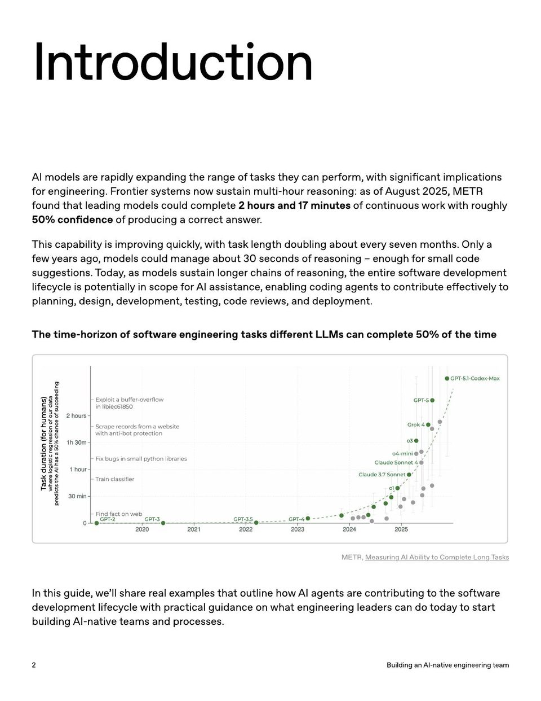

<!-- Generated by research/hmrc-beyond-hype/tools/build_narrative_sidecars.py. -->
---
source_id: ai-native-engineering-team-source-openai
source_file: "research/hmrc-beyond-hype/import/AI-Native-Engineering-Team-source_openAI.pdf"
item_type: pdf-page
item_number: 2
asset: "assets/visuals/ai-native-engineering-team-source-openai/page-02.jpg"
publication_status: "publishable derived thumbnail and text sidecar; raw imported PDF remains local"
tags:
  - agentic-coding
  - ai-assistants
  - dark-data
  - operating-model
  - workflow
---

# % con fidence o f pr oducing a corr ec t ans w er .



## Visual Description

This is page 02 from `research/hmrc-beyond-hype/import/AI-Native-Engineering-Team-source_openAI.pdf`. It is represented here by a small derived image so the narrative can be browsed on GitHub without publishing the raw import file.

## Claim Or Narrative Function

Provides the external operating-model backdrop for AI-native engineering: plan, design, build, test, review, document, deploy, and maintain with agents.

## Material Points Illustrated

- Introduction
- AI models ar e r apidly e xpanding the r ange o f task s the y can perf orm, with significan t implica tions
- f or engineering. F r on tier s y st ems no w sustain multi-hour r easoning: as ofA ugust 2025, METR
- f ound tha t leading models could comple t e 2 hour s and 17 minut es o f con tinuous w ork with r oughly
- 50% con fidence o f pr oducing a corr ec t ans w er .
- This capability is impr oving quickly , with task length doubling about every seven mon ths. Only a
- fewy ear s ago , models could manage about 30 seconds ofr easoning - enough f or small code
- suggestions. T oda y , as models sustain longer chains ofr easoning, the en tir e so ftw ar e developmen t
- lif ec y cle is po t en tially in scope f or AI assistance , enabling coding agen ts t o con tribut e e ff ec tively t o
- planning, design, developmen t, t esting, code r evie w s, and deplo ymen t.
- The time-horiz on o f so ftw ar e engineering task s diff er en t LLM s can comple t e 50% oft he time
- METR, M easuring AI Ability t o Comple teL ong T ask s
- In this guide , w e 'll shar e r eal e x amples tha t outline ho w AI agen ts ar e con tributing t o the so ftw ar e
- developmen t lif ec y cle with pr ac tical guidance on wha t engineering leader s can do t oda yto start
- building AI-na tive t eams and pr ocesses.
- 2 BuildinganAI - nativeengineeringteam

## Related Narrative Links

- [Narrative arc](../../narrative-arc.md)
- [Topic index](../../topics.md)
- [Source material index](../../source-materials.md)
- [04 Agentic Coding Capabilities](../../../04_agentic_coding_capabilities.md)
- [07 Operating Model For Public Sector Engineering](../../../07_operating_model_for_public_sector_engineering.md)
- [Clawpilot Project Lobster](../../notes/clawpilot-project-lobster.md)

## Publication Status

publishable derived thumbnail and text sidecar; raw imported PDF remains local.

## Caveats

- Text extracted from a local imported PDF and paired with a derived thumbnail; check the original before quoting exact wording.

## Extracted Visual Text

```text
Introduction
AI models ar e r apidly e xpanding the r ange o f task s the y can perf orm, with significan t implica tions
f or engineering. F r on tier s y st ems no w sustain multi-hour r easoning: as ofA ugust 2025, METR
f ound tha t leading models could comple t e 2 hour s and 17 minut es o f con tinuous w ork with r oughly
50% con fidence o f pr oducing a corr ec t ans w er .
This capability is impr oving quickly , with task length doubling about every seven mon ths. Only a
fewy ear s ago , models could manage about 30 seconds ofr easoning - enough f or small code
suggestions. T oda y , as models sustain longer chains ofr easoning, the en tir e so ftw ar e developmen t
lif ec y cle is po t en tially in scope f or AI assistance , enabling coding agen ts t o con tribut e e ff ec tively t o
planning, design, developmen t, t esting, code r evie w s, and deplo ymen t.
The time-horiz on o f so ftw ar e engineering task s diff er en t LLM s can comple t e 50% oft he time
METR, M easuring AI Ability t o Comple teL ong T ask s
In this guide , w e 'll shar e r eal e x amples tha t outline ho w AI agen ts ar e con tributing t o the so ftw ar e
developmen t lif ec y cle with pr ac tical guidance on wha t engineering leader s can do t oda yto start
building AI-na tive t eams and pr ocesses.
2 BuildinganAI - nativeengineeringteam
```
