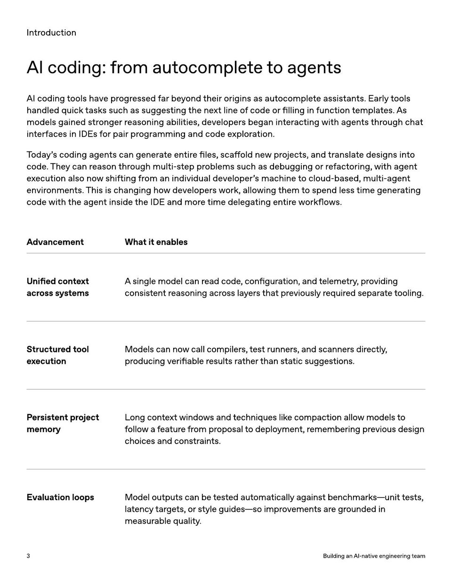

<!-- Generated by research/hmrc-beyond-hype/tools/build_narrative_sidecars.py. -->
---
source_id: ai-native-engineering-team-source-openai
source_file: "research/hmrc-beyond-hype/import/AI-Native-Engineering-Team-source_openAI.pdf"
item_type: pdf-page
item_number: 3
asset: "assets/visuals/ai-native-engineering-team-source-openai/page-03.jpg"
publication_status: "publishable derived thumbnail and text sidecar; raw imported PDF remains local"
tags:
  - agentic-coding
  - ai-assistants
  - build
  - design
  - evaluation
  - operating-model
  - operations
  - review
  - testing
  - validation
  - workflow
---

# I n tr oduc tion



## Visual Description

This is page 03 from `research/hmrc-beyond-hype/import/AI-Native-Engineering-Team-source_openAI.pdf`. It is represented here by a small derived image so the narrative can be browsed on GitHub without publishing the raw import file.

## Claim Or Narrative Function

Provides the external operating-model backdrop for AI-native engineering: plan, design, build, test, review, document, deploy, and maintain with agents.

## Material Points Illustrated

- I n tr oduc tion
- AIcoding : fromautocompletetoagents
- AI coding t ools have pr ogr essed f ar be y ond their origins as aut ocomple t e assistan ts. E arly t ools
- handled quick task s such as suggesting the ne xt line o f code or filling in func tion t empla t es. A s
- models gained str onger r easoning abilities, developer s began in t er ac ting with agen ts thr ough cha t
- in t erf aces in IDE s f or pair pr ogr amming and code e xplor a tion.
- T oda y' s coding agen ts can gener ate en tir e files, sca ff old ne w pr ojec ts, and tr ansla t e designs in t o
- code . The y can r eason thr ough multi-st ep pr oblems such as debugging or ref ac t oring, with agen t
- ex ecution also no w shifting fr om an individual developer ' s machine t o cloud-based, multi-agen t
- envir onmen ts. This is changing ho w developer s w ork, allo wing them t o spend less time gener a ting
- code with the agen t inside the IDE and mor e time delega ting en tir e w orkflo w s.
- AdvancementWhatitenables
- Uni fi edcontext
- acrosssystems
- Asinglemodelcanreadcode , con fi guration , andtelemetry , providing
- consistentreasoningacrosslayersthatpreviouslyrequiredseparatetooling .
- Structuredtool
- execution
- Modelscannowcallcompilers , testrunners , andscannersdirectly ,
- producingveri fi ableresultsratherthanstaticsuggestions .
- Persistentproject
- memory
- Longcontextwindowsandtechniqueslikecompactionallowmodelsto
- followafeaturefromproposaltodeployment , rememberingpreviousdesign
- choicesandconstraints .
- EvaluationloopsModeloutputscanbetestedautomaticallyagainstbenchmarks - unittests ,
- latencytargets , orstyleguides - soimprovementsaregroundedin
- measurablequality .
- 3 BuildinganAI - nativeengineeringteam


## Related Narrative Links

- [Narrative arc](../../narrative-arc.md)
- [Topic index](../../topics.md)
- [Source material index](../../source-materials.md)
- [04 Agentic Coding Capabilities](../../../04_agentic_coding_capabilities.md)
- [07 Operating Model For Public Sector Engineering](../../../07_operating_model_for_public_sector_engineering.md)
- [Clawpilot Project Lobster](../../notes/clawpilot-project-lobster.md)

## Publication Status

publishable derived thumbnail and text sidecar; raw imported PDF remains local.

## Caveats

- Text extracted from a local imported PDF and paired with a derived thumbnail; check the original before quoting exact wording.

## Extracted Visual Text

```text
I n tr oduc tion
AIcoding : fromautocompletetoagents
AI coding t ools have pr ogr essed f ar be y ond their origins as aut ocomple t e assistan ts. E arly t ools
handled quick task s such as suggesting the ne xt line o f code or filling in func tion t empla t es. A s
models gained str onger r easoning abilities, developer s began in t er ac ting with agen ts thr ough cha t
in t erf aces in IDE s f or pair pr ogr amming and code e xplor a tion.
T oda y' s coding agen ts can gener ate en tir e files, sca ff old ne w pr ojec ts, and tr ansla t e designs in t o
code . The y can r eason thr ough multi-st ep pr oblems such as debugging or ref ac t oring, with agen t
ex ecution also no w shifting fr om an individual developer ' s machine t o cloud-based, multi-agen t
envir onmen ts. This is changing ho w developer s w ork, allo wing them t o spend less time gener a ting
code with the agen t inside the IDE and mor e time delega ting en tir e w orkflo w s.
AdvancementWhatitenables
Uni fi edcontext
acrosssystems
Asinglemodelcanreadcode , con fi guration , andtelemetry , providing
consistentreasoningacrosslayersthatpreviouslyrequiredseparatetooling .
Structuredtool
execution
Modelscannowcallcompilers , testrunners , andscannersdirectly ,
producingveri fi ableresultsratherthanstaticsuggestions .
Persistentproject
memory
Longcontextwindowsandtechniqueslikecompactionallowmodelsto
followafeaturefromproposaltodeployment , rememberingpreviousdesign
choicesandconstraints .
EvaluationloopsModeloutputscanbetestedautomaticallyagainstbenchmarks - unittests ,
latencytargets , orstyleguides - soimprovementsaregroundedin
measurablequality .
3 BuildinganAI - nativeengineeringteam
```
