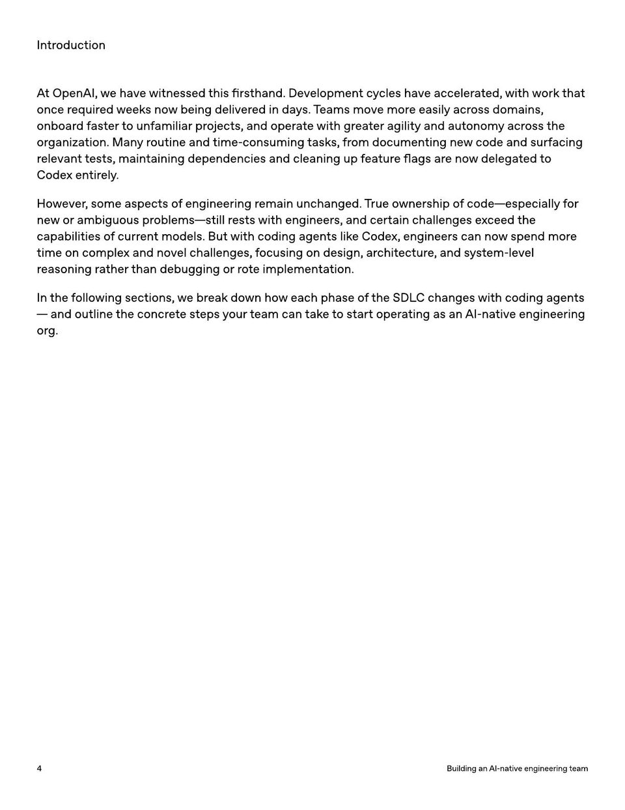

<!-- Generated by research/hmrc-beyond-hype/tools/build_narrative_sidecars.py. -->
---
source_id: ai-native-engineering-team-source-openai
source_file: "research/hmrc-beyond-hype/import/AI-Native-Engineering-Team-source_openAI.pdf"
item_type: pdf-page
item_number: 4
asset: "assets/visuals/ai-native-engineering-team-source-openai/page-04.jpg"
publication_status: "publishable derived thumbnail and text sidecar; raw imported PDF remains local"
tags:
  - agentic-coding
  - ai-assistants
  - operating-model
  - workflow
---

# I n tr oduc tion



## Visual Description

This is page 04 from `research/hmrc-beyond-hype/import/AI-Native-Engineering-Team-source_openAI.pdf`. It is represented here by a small derived image so the narrative can be browsed on GitHub without publishing the raw import file.

## Claim Or Narrative Function

Provides the external operating-model backdrop for AI-native engineering: plan, design, build, test, review, document, deploy, and maintain with agents.

## Material Points Illustrated

- I n tr oduc tion
- A t OpenAI, w e have witnessed this fir sthand. Developmen tcy cles have acceler a t ed, with w ork tha t
- once r equir ed w eek s no w being deliver ed in da y s. T eams move mor e easily acr oss domains,
- onboar d f ast er t o un f amiliar pr ojec ts, and oper ate with gr ea t er agility and aut onom y acr oss the
- or ganiz a tion. M an y r outine and time-consuming task s, fr om documen ting ne w code and surf acing
- r elevan t t ests, main taining dependencies and cleaning up f ea tur e flags ar e no w delega t ed t o
- Code x en tir ely .
- How ever , some aspec ts o f engineering r emain unchanged. T rue o wner ship o f code-especially f or
- ne w or ambiguous pr oblems-still r ests with engineer s, and certain challenges e x ceed the
- capabilities o f curr en t models. But with coding agen ts lik e Code x, engineer s can no w spend mor e
- time on comple x and novel challenges, f ocusing on design, ar chit ec tur e , and s y st em-level
- r easoning r a ther than debugging or rote implemen ta tion.
- I n the f ollo wing sec tions, w e br eak do wn ho w each phase o f the SDL C changes with coding agen ts
- and outline the concr ete st eps y our t eam can tak eto start oper a ting as an AI-na tive engineering
- or g.
- 4 BuildinganAI - nativeengineeringteam

## Related Narrative Links

- [Narrative arc](../../narrative-arc.md)
- [Topic index](../../topics.md)
- [Source material index](../../source-materials.md)
- [04 Agentic Coding Capabilities](../../../04_agentic_coding_capabilities.md)
- [07 Operating Model For Public Sector Engineering](../../../07_operating_model_for_public_sector_engineering.md)
- [Clawpilot Project Lobster](../../notes/clawpilot-project-lobster.md)

## Publication Status

publishable derived thumbnail and text sidecar; raw imported PDF remains local.

## Caveats

- Text extracted from a local imported PDF and paired with a derived thumbnail; check the original before quoting exact wording.

## Extracted Visual Text

```text
I n tr oduc tion
A t OpenAI, w e have witnessed this fir sthand. Developmen tcy cles have acceler a t ed, with w ork tha t
once r equir ed w eek s no w being deliver ed in da y s. T eams move mor e easily acr oss domains,
onboar d f ast er t o un f amiliar pr ojec ts, and oper ate with gr ea t er agility and aut onom y acr oss the
or ganiz a tion. M an y r outine and time-consuming task s, fr om documen ting ne w code and surf acing
r elevan t t ests, main taining dependencies and cleaning up f ea tur e flags ar e no w delega t ed t o
Code x en tir ely .
How ever , some aspec ts o f engineering r emain unchanged. T rue o wner ship o f code-especially f or
ne w or ambiguous pr oblems-still r ests with engineer s, and certain challenges e x ceed the
capabilities o f curr en t models. But with coding agen ts lik e Code x, engineer s can no w spend mor e
time on comple x and novel challenges, f ocusing on design, ar chit ec tur e , and s y st em-level
r easoning r a ther than debugging or rote implemen ta tion.
I n the f ollo wing sec tions, w e br eak do wn ho w each phase o f the SDL C changes with coding agen ts
- and outline the concr ete st eps y our t eam can tak eto start oper a ting as an AI-na tive engineering
or g.
4 BuildinganAI - nativeengineeringteam
```
