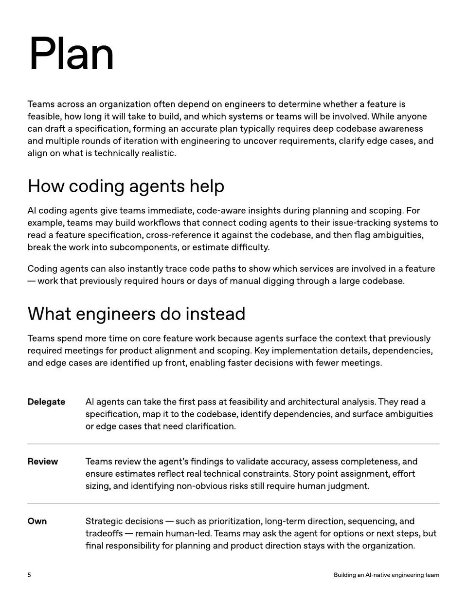

<!-- Generated by research/hmrc-beyond-hype/tools/build_narrative_sidecars.py. -->
---
source_id: ai-native-engineering-team-source-openai
source_file: "research/hmrc-beyond-hype/import/AI-Native-Engineering-Team-source_openAI.pdf"
item_type: pdf-page
item_number: 5
asset: "assets/visuals/ai-native-engineering-team-source-openai/page-05.jpg"
publication_status: "publishable derived thumbnail and text sidecar; raw imported PDF remains local"
tags:
  - agentic-coding
  - ai-assistants
  - governance
  - operating-model
  - risk-boundaries
  - workflow
---

# align on wha t is t echnically r ealistic .



## Visual Description

This is page 05 from `research/hmrc-beyond-hype/import/AI-Native-Engineering-Team-source_openAI.pdf`. It is represented here by a small derived image so the narrative can be browsed on GitHub without publishing the raw import file.

## Claim Or Narrative Function

Provides the external operating-model backdrop for AI-native engineering: plan, design, build, test, review, document, deploy, and maintain with agents.

## Material Points Illustrated

- Plan
- T eams acr oss an or ganiz a tion o ft en depend on engineer sto de t ermine whe ther a f ea tur e is
- f easible , ho w long it will tak eto build, and which s y st ems or t eams will be involved. While an y one
- can dr a ft a specifica tion, f orming an accur ate plan typically r equir es deep codebase a w ar eness
- and multiple r ounds o f it er a tion with engineering t o uncover r equir emen ts, clarify edge cases, and
- align on wha t is t echnically r ealistic .
- Howcodingagentshelp
- AI coding agen ts give t eams immedia t e , code-a w ar e insigh ts during planning and scoping. F or
- e x ample , t eams ma y build w orkflo w s tha t connec t coding agen ts t o their issue- tr acking s y st ems to
- r ead a f ea tur e specifica tion, cr oss-ref er ence it against the codebase , and then flag ambiguities,
- br eak the w ork in t o subcomponen ts, or estima t e difficulty .
- Coding agen ts can also instan tly tr ace code pa ths t o sho w which services ar e involved in a f ea tur e
- w ork tha t pr eviously r equir ed hour s or da ysof manual digging thr ough a lar ge codebase .
- Whatengineersdoinstead
- T eams spend mor e time on cor e f ea tur e w ork because agen ts surf ace the con t e xt tha t pr eviously
- r equir ed mee tings f or pr oduc t alignmen t and scoping. Key implemen ta tion de tails, dependencies,
- and edge cases ar e iden tified up fr on t, enabling f ast er decisions with few er mee tings.
- DelegateAIagentscantakethe fi rstpassatfeasibilityandarchitecturalanalysis . Theyreada
- speci fi cation , mapittothecodebase , identifydependencies , andsurfaceambiguities
- oredgecasesthatneedclari fi cation .
- ReviewTeamsreviewtheagent ' s fi ndingstovalidateaccuracy , assesscompleteness , and
- ensureestimatesre fl ectrealtechnicalconstraints . Storypointassignment , e ff ort
- sizing , andidentifyingnon - obviousrisksstillrequirehumanjudgment .
- OwnStrategicdecisions - suchasprioritization , long - termdirection , sequencing , and
- tradeo ff s - remainhuman - led . Teamsmayasktheagentforoptionsornextsteps , but
- fi nalresponsibilityforplanningandproductdirectionstayswiththeorganization .
- 5 BuildinganAI - nativeengineeringteam

## Related Narrative Links

- [Narrative arc](../../narrative-arc.md)
- [Topic index](../../topics.md)
- [Source material index](../../source-materials.md)
- [04 Agentic Coding Capabilities](../../../04_agentic_coding_capabilities.md)
- [07 Operating Model For Public Sector Engineering](../../../07_operating_model_for_public_sector_engineering.md)
- [Clawpilot Project Lobster](../../notes/clawpilot-project-lobster.md)

## Publication Status

publishable derived thumbnail and text sidecar; raw imported PDF remains local.

## Caveats

- Text extracted from a local imported PDF and paired with a derived thumbnail; check the original before quoting exact wording.

## Extracted Visual Text

```text
Plan
T eams acr oss an or ganiz a tion o ft en depend on engineer sto de t ermine whe ther a f ea tur e is
f easible , ho w long it will tak eto build, and which s y st ems or t eams will be involved. While an y one
can dr a ft a specifica tion, f orming an accur ate plan typically r equir es deep codebase a w ar eness
and multiple r ounds o f it er a tion with engineering t o uncover r equir emen ts, clarify edge cases, and
align on wha t is t echnically r ealistic .
Howcodingagentshelp
AI coding agen ts give t eams immedia t e , code-a w ar e insigh ts during planning and scoping. F or
e x ample , t eams ma y build w orkflo w s tha t connec t coding agen ts t o their issue- tr acking s y st ems to
r ead a f ea tur e specifica tion, cr oss-ref er ence it against the codebase , and then flag ambiguities,
br eak the w ork in t o subcomponen ts, or estima t e difficulty .
Coding agen ts can also instan tly tr ace code pa ths t o sho w which services ar e involved in a f ea tur e
- w ork tha t pr eviously r equir ed hour s or da ysof manual digging thr ough a lar ge codebase .
Whatengineersdoinstead
T eams spend mor e time on cor e f ea tur e w ork because agen ts surf ace the con t e xt tha t pr eviously
r equir ed mee tings f or pr oduc t alignmen t and scoping. Key implemen ta tion de tails, dependencies,
and edge cases ar e iden tified up fr on t, enabling f ast er decisions with few er mee tings.
DelegateAIagentscantakethe fi rstpassatfeasibilityandarchitecturalanalysis . Theyreada
speci fi cation , mapittothecodebase , identifydependencies , andsurfaceambiguities
oredgecasesthatneedclari fi cation .
ReviewTeamsreviewtheagent ' s fi ndingstovalidateaccuracy , assesscompleteness , and
ensureestimatesre fl ectrealtechnicalconstraints . Storypointassignment , e ff ort
sizing , andidentifyingnon - obviousrisksstillrequirehumanjudgment .
OwnStrategicdecisions - suchasprioritization , long - termdirection , sequencing , and
tradeo ff s - remainhuman - led . Teamsmayasktheagentforoptionsornextsteps , but
fi nalresponsibilityforplanningandproductdirectionstayswiththeorganization .
5 BuildinganAI - nativeengineeringteam
```
