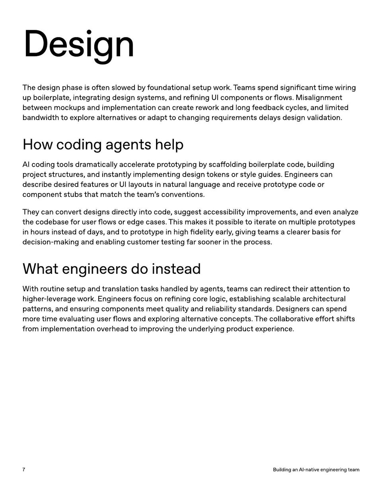

<!-- Generated by research/hmrc-beyond-hype/tools/build_narrative_sidecars.py. -->
---
source_id: ai-native-engineering-team-source-openai
source_file: "research/hmrc-beyond-hype/import/AI-Native-Engineering-Team-source_openAI.pdf"
item_type: pdf-page
item_number: 7
asset: "assets/visuals/ai-native-engineering-team-source-openai/page-07.jpg"
publication_status: "publishable derived thumbnail and text sidecar; raw imported PDF remains local"
tags:
  - agentic-coding
  - ai-assistants
  - build
  - design
  - evaluation
  - operating-model
  - review
  - risk-boundaries
  - testing
  - workflow
---

# componen t stubs tha t ma t ch the t eam ' s conven tions.



## Visual Description

This is page 07 from `research/hmrc-beyond-hype/import/AI-Native-Engineering-Team-source_openAI.pdf`. It is represented here by a small derived image so the narrative can be browsed on GitHub without publishing the raw import file.

## Claim Or Narrative Function

Provides the external operating-model backdrop for AI-native engineering: plan, design, build, test, review, document, deploy, and maintain with agents.

## Material Points Illustrated

- Design
- The design phase is o ft en slo w ed byf ounda tional se tup w ork. T eams spend significan t time wiring
- up boilerpla t e , in t egr a ting design s y st ems, and r e fining UI componen ts or flo w s. M isalignmen t
- be tw een mockups and implemen ta tion can cr ea terew ork and long f eedback c y cles, and limit ed
- bandwidth toe xplor e alt erna tives or adap tto changing r equir emen ts dela y s design valida tion.
- Howcodingagentshelp
- AI coding t ools dr ama tically acceler ate pr oto typing b y sca ff olding boilerpla t e code , building
- pr ojec t struc tur es, and instan tly implemen ting design t ok ens or style guides. E ngineer s can
- describe desir ed f ea tur es or UI la y outs in na tur al language and r eceive pr oto type code or
- componen t stubs tha t ma t ch the t eam ' s conven tions.
- The y can convert designs dir ec tly in t o code , suggest accessibility impr ovemen ts, and even analyz e
- the codebase f or user flo w s or edge cases. This mak es it possible t o it er ate on multiple pr oto types
- in hour s inst ead o f da y s, and t o pr oto type in high fidelity early , giving t eams a clear er basis f or
- decision-making and enabling cust omer t esting f ar sooner in the pr ocess.
- Whatengineersdoinstead
- With r outine se tup and tr ansla tion task s handled b y agen ts, t eams can r edir ec t their a tt en tion t o
- higher -lever age w ork. E ngineer s f ocus on r e fining cor e logic , establishing scalable ar chit ec tur al
- pa tt erns, and ensuring componen ts mee t quality and r eliability standar ds. Designer s can spend
- mor e time evalua ting user flo w s and e xploring alt erna tive concep ts. The collabor a tive e ff ort shifts
- fr om implemen ta tion overhead t o impr oving the underlying pr oduc t e xperience .
- 7 BuildinganAI - nativeengineeringteam


## Related Narrative Links

- [Narrative arc](../../narrative-arc.md)
- [Topic index](../../topics.md)
- [Source material index](../../source-materials.md)
- [04 Agentic Coding Capabilities](../../../04_agentic_coding_capabilities.md)
- [07 Operating Model For Public Sector Engineering](../../../07_operating_model_for_public_sector_engineering.md)
- [Clawpilot Project Lobster](../../notes/clawpilot-project-lobster.md)

## Publication Status

publishable derived thumbnail and text sidecar; raw imported PDF remains local.

## Caveats

- Text extracted from a local imported PDF and paired with a derived thumbnail; check the original before quoting exact wording.

## Extracted Visual Text

```text
Design
The design phase is o ft en slo w ed byf ounda tional se tup w ork. T eams spend significan t time wiring
up boilerpla t e , in t egr a ting design s y st ems, and r e fining UI componen ts or flo w s. M isalignmen t
be tw een mockups and implemen ta tion can cr ea terew ork and long f eedback c y cles, and limit ed
bandwidth toe xplor e alt erna tives or adap tto changing r equir emen ts dela y s design valida tion.
Howcodingagentshelp
AI coding t ools dr ama tically acceler ate pr oto typing b y sca ff olding boilerpla t e code , building
pr ojec t struc tur es, and instan tly implemen ting design t ok ens or style guides. E ngineer s can
describe desir ed f ea tur es or UI la y outs in na tur al language and r eceive pr oto type code or
componen t stubs tha t ma t ch the t eam ' s conven tions.
The y can convert designs dir ec tly in t o code , suggest accessibility impr ovemen ts, and even analyz e
the codebase f or user flo w s or edge cases. This mak es it possible t o it er ate on multiple pr oto types
in hour s inst ead o f da y s, and t o pr oto type in high fidelity early , giving t eams a clear er basis f or
decision-making and enabling cust omer t esting f ar sooner in the pr ocess.
Whatengineersdoinstead
With r outine se tup and tr ansla tion task s handled b y agen ts, t eams can r edir ec t their a tt en tion t o
higher -lever age w ork. E ngineer s f ocus on r e fining cor e logic , establishing scalable ar chit ec tur al
pa tt erns, and ensuring componen ts mee t quality and r eliability standar ds. Designer s can spend
mor e time evalua ting user flo w s and e xploring alt erna tive concep ts. The collabor a tive e ff ort shifts
fr om implemen ta tion overhead t o impr oving the underlying pr oduc t e xperience .
7 BuildinganAI - nativeengineeringteam
```
