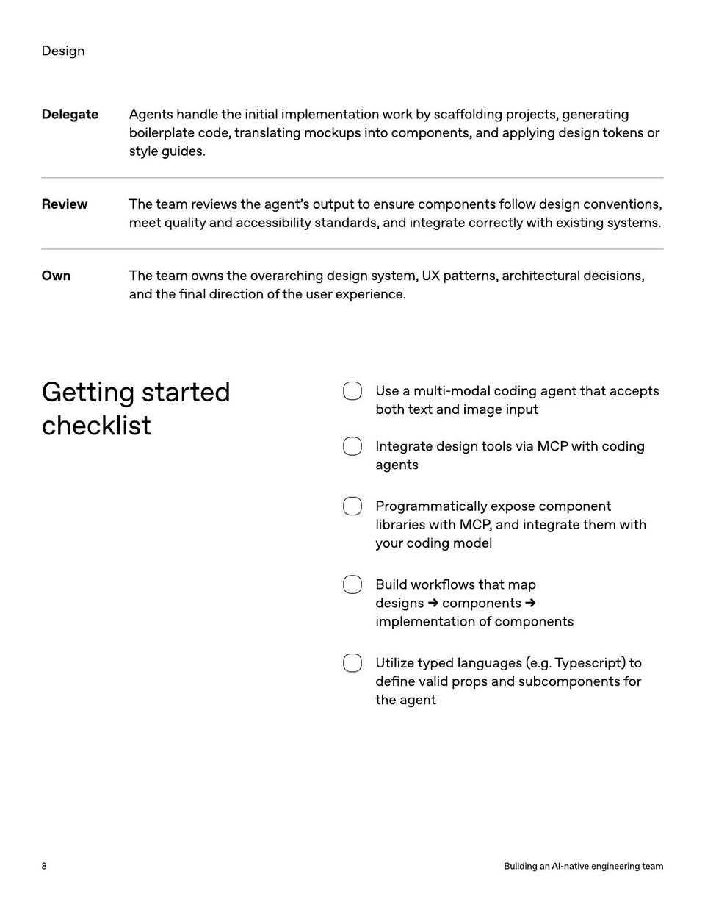

<!-- Generated by research/hmrc-beyond-hype/tools/build_narrative_sidecars.py. -->
---
source_id: ai-native-engineering-team-source-openai
source_file: "research/hmrc-beyond-hype/import/AI-Native-Engineering-Team-source_openAI.pdf"
item_type: pdf-page
item_number: 8
asset: "assets/visuals/ai-native-engineering-team-source-openai/page-08.jpg"
publication_status: "publishable derived thumbnail and text sidecar; raw imported PDF remains local"
tags:
  - agentic-coding
  - ai-assistants
  - build
  - design
  - evaluation
  - governance
  - mcp
  - operating-model
  - review
  - workflow
---

# DelegateAgentshandletheinitialimplementationworkbysca ff oldingprojects , generating



## Visual Description

This is page 08 from `research/hmrc-beyond-hype/import/AI-Native-Engineering-Team-source_openAI.pdf`. It is represented here by a small derived image so the narrative can be browsed on GitHub without publishing the raw import file.

## Claim Or Narrative Function

Provides the external operating-model backdrop for AI-native engineering: plan, design, build, test, review, document, deploy, and maintain with agents.

## Material Points Illustrated

- Design
- DelegateAgentshandletheinitialimplementationworkbysca ff oldingprojects , generating
- boilerplatecode , translatingmockupsintocomponents , andapplyingdesigntokensor
- styleguides .
- ReviewTheteamreviewstheagent ' soutputtoensurecomponentsfollowdesignconventions ,
- meetqualityandaccessibilitystandards , andintegratecorrectlywithexistingsystems .
- OwnTheteamownstheoverarchingdesignsystem , UXpatterns , architecturaldecisions ,
- andthe fi naldirectionoftheuserexperience .
- Gettingstarted
- checklist
- U se a multi-modal coding agen t tha t accep ts
- bo th t e xt and image input
- Int egr ate design t ools via MCP with coding
- agen ts
- Pr ogr amma tically e xpose componen t
- libr aries with MCP , and in t egr ate them with
- y our coding model
- Build w orkflo w s tha t map
- designs componen ts
- implemen ta tion o f componen ts
- Utiliz e typed languages ( e . g. T ypescrip t) t o
- de fine valid pr ops and subcomponen ts f or
- the agen t
- 8 BuildinganAI - nativeengineeringteam


## Related Narrative Links

- [Narrative arc](../../narrative-arc.md)
- [Topic index](../../topics.md)
- [Source material index](../../source-materials.md)
- [04 Agentic Coding Capabilities](../../../04_agentic_coding_capabilities.md)
- [07 Operating Model For Public Sector Engineering](../../../07_operating_model_for_public_sector_engineering.md)
- [Clawpilot Project Lobster](../../notes/clawpilot-project-lobster.md)

## Publication Status

publishable derived thumbnail and text sidecar; raw imported PDF remains local.

## Caveats

- Text extracted from a local imported PDF and paired with a derived thumbnail; check the original before quoting exact wording.

## Extracted Visual Text

```text
Design
DelegateAgentshandletheinitialimplementationworkbysca ff oldingprojects , generating
boilerplatecode , translatingmockupsintocomponents , andapplyingdesigntokensor
styleguides .
ReviewTheteamreviewstheagent ' soutputtoensurecomponentsfollowdesignconventions ,
meetqualityandaccessibilitystandards , andintegratecorrectlywithexistingsystems .
OwnTheteamownstheoverarchingdesignsystem , UXpatterns , architecturaldecisions ,
andthe fi naldirectionoftheuserexperience .
Gettingstarted
checklist
U se a multi-modal coding agen t tha t accep ts
bo th t e xt and image input
Int egr ate design t ools via MCP with coding
agen ts
Pr ogr amma tically e xpose componen t
libr aries with MCP , and in t egr ate them with
y our coding model
Build w orkflo w s tha t map
designs componen ts
implemen ta tion o f componen ts
Utiliz e typed languages ( e . g. T ypescrip t) t o
de fine valid pr ops and subcomponen ts f or
the agen t
8 BuildinganAI - nativeengineeringteam
```
