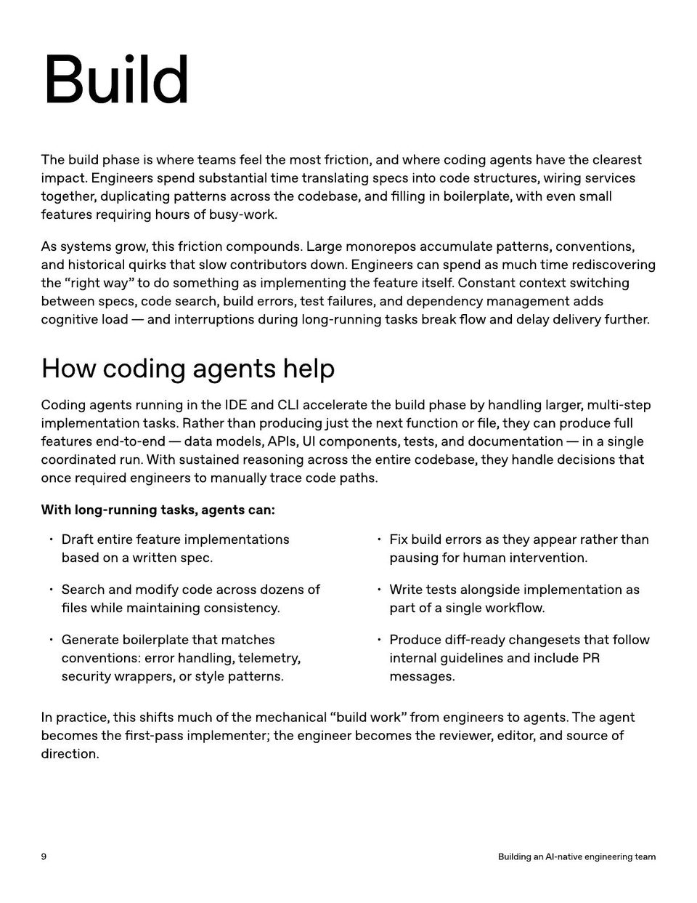

<!-- Generated by research/hmrc-beyond-hype/tools/build_narrative_sidecars.py. -->
---
source_id: ai-native-engineering-team-source-openai
source_file: "research/hmrc-beyond-hype/import/AI-Native-Engineering-Team-source_openAI.pdf"
item_type: pdf-page
item_number: 9
asset: "assets/visuals/ai-native-engineering-team-source-openai/page-09.jpg"
publication_status: "publishable derived thumbnail and text sidecar; raw imported PDF remains local"
tags:
  - agentic-coding
  - ai-assistants
  - build
  - operating-model
  - review
  - security
  - workflow
---

# f ea tur es r equiring hour sof bus y-w ork.



## Visual Description

This is page 09 from `research/hmrc-beyond-hype/import/AI-Native-Engineering-Team-source_openAI.pdf`. It is represented here by a small derived image so the narrative can be browsed on GitHub without publishing the raw import file.

## Claim Or Narrative Function

Provides the external operating-model backdrop for AI-native engineering: plan, design, build, test, review, document, deploy, and maintain with agents.

## Material Points Illustrated

- Build
- The build phase is wher e t eams f eel the most fric tion, and wher e coding agen ts have the clear est
- impac t. E ngineer s spend substan tial time tr ansla ting specs in t o code struc tur es, wiring services
- t oge ther , duplica ting pa tt erns acr oss the codebase , and filling in boilerpla t e , with even small
- f ea tur es r equiring hour sof bus y-w ork.
- Assy st ems gr o w , this fric tion compounds. L ar ge monor epos accumula t e pa tt erns, conven tions,
- and hist orical quirk s tha t slo w con tribut or s do wn. E ngineer s can spend as much time r ediscovering
- the " righ tway" t o do some thing as implemen ting the f ea tur e itself . Constan t con t e xt s wit ching
- be tw een specs, code sear ch, build err or s, t est f ailur es, and dependenc y managemen t adds
- cognitive load - and in t errup tions during long-running task s br eak flo w and dela y delivery further .
- Howcodingagentshelp
- Coding agen ts running in the IDE and CLI acceler ate the build phase b y handling lar ger , multi-st ep
- implemen ta tion task s. R a ther than pr oducing just the ne xt func tion or file , the y can pr oduce full
- f ea tur es end- t o-end - da ta models, API s, UI componen ts, t ests, and documen ta tion - in a single
- coor dina t ed run. With sustained r easoning acr oss the en tir e codebase , the y handle decisions tha t
- once r equir ed engineer sto manually tr ace code pa ths.
- Wit h long-running task s, agen ts can:
- Dr a ft en tir e f ea tur e implemen ta tions
- based on a writt en spec .
- Sear ch and modify code acr oss do z ens o f
- files while main taining consist enc y .
- Gener ate boilerpla t e tha t ma t ches
- conven tions: err or handling, t eleme try ,
- security wr apper s, or style pa tt erns.
- Fix build err or s as the y appear r a ther than
- pausing f or human in t erven tion.
- W rit e t ests alongside implemen ta tion as
- part ofa single w orkflo w .
- Pr oduce diff -r eady changese ts tha t f ollo w
- in t ernal guidelines and include PR
- messages.
- I n pr ac tice , this shifts much o f the mechanical "build w ork" fr om engineer sto agen ts. The agen t
- becomes the fir st -pass implemen t er; the engineer becomes the r evie w er , edit or , and sour ce o f
- dir ec tion.
- 9 BuildinganAI - nativeengineeringteam


## Related Narrative Links

- [Narrative arc](../../narrative-arc.md)
- [Topic index](../../topics.md)
- [Source material index](../../source-materials.md)
- [04 Agentic Coding Capabilities](../../../04_agentic_coding_capabilities.md)
- [07 Operating Model For Public Sector Engineering](../../../07_operating_model_for_public_sector_engineering.md)
- [Clawpilot Project Lobster](../../notes/clawpilot-project-lobster.md)

## Publication Status

publishable derived thumbnail and text sidecar; raw imported PDF remains local.

## Caveats

- Text extracted from a local imported PDF and paired with a derived thumbnail; check the original before quoting exact wording.

## Extracted Visual Text

```text
Build
The build phase is wher e t eams f eel the most fric tion, and wher e coding agen ts have the clear est
impac t. E ngineer s spend substan tial time tr ansla ting specs in t o code struc tur es, wiring services
t oge ther , duplica ting pa tt erns acr oss the codebase , and filling in boilerpla t e , with even small
f ea tur es r equiring hour sof bus y-w ork.
Assy st ems gr o w , this fric tion compounds. L ar ge monor epos accumula t e pa tt erns, conven tions,
and hist orical quirk s tha t slo w con tribut or s do wn. E ngineer s can spend as much time r ediscovering
the " righ tway" t o do some thing as implemen ting the f ea tur e itself . Constan t con t e xt s wit ching
be tw een specs, code sear ch, build err or s, t est f ailur es, and dependenc y managemen t adds
cognitive load - and in t errup tions during long-running task s br eak flo w and dela y delivery further .
Howcodingagentshelp
Coding agen ts running in the IDE and CLI acceler ate the build phase b y handling lar ger , multi-st ep
implemen ta tion task s. R a ther than pr oducing just the ne xt func tion or file , the y can pr oduce full
f ea tur es end- t o-end - da ta models, API s, UI componen ts, t ests, and documen ta tion - in a single
coor dina t ed run. With sustained r easoning acr oss the en tir e codebase , the y handle decisions tha t
once r equir ed engineer sto manually tr ace code pa ths.
Wit h long-running task s, agen ts can:
Dr a ft en tir e f ea tur e implemen ta tions
based on a writt en spec .
Sear ch and modify code acr oss do z ens o f
files while main taining consist enc y .
Gener ate boilerpla t e tha t ma t ches
conven tions: err or handling, t eleme try ,
security wr apper s, or style pa tt erns.
Fix build err or s as the y appear r a ther than
pausing f or human in t erven tion.
W rit e t ests alongside implemen ta tion as
part ofa single w orkflo w .
Pr oduce diff -r eady changese ts tha t f ollo w
in t ernal guidelines and include PR
messages.
I n pr ac tice , this shifts much o f the mechanical "build w ork" fr om engineer sto agen ts. The agen t
becomes the fir st -pass implemen t er; the engineer becomes the r evie w er , edit or , and sour ce o f
dir ec tion.
9 BuildinganAI - nativeengineeringteam
```
