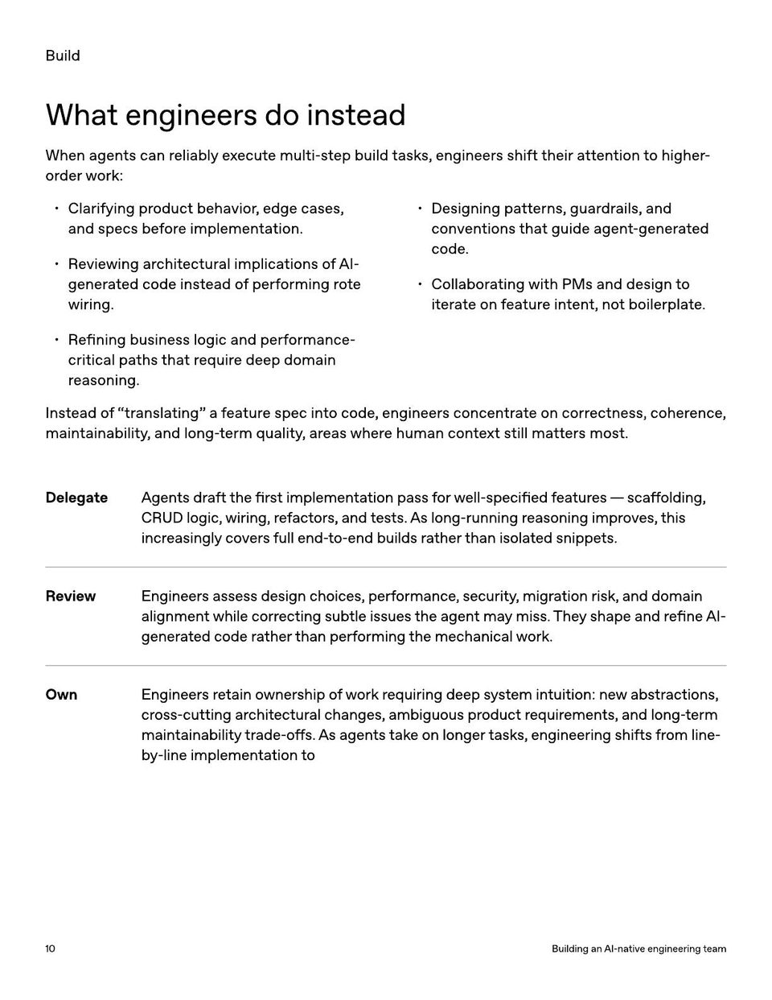

<!-- Generated by research/hmrc-beyond-hype/tools/build_narrative_sidecars.py. -->
---
source_id: ai-native-engineering-team-source-openai
source_file: "research/hmrc-beyond-hype/import/AI-Native-Engineering-Team-source_openAI.pdf"
item_type: pdf-page
item_number: 10
asset: "assets/visuals/ai-native-engineering-team-source-openai/page-10.jpg"
publication_status: "publishable derived thumbnail and text sidecar; raw imported PDF remains local"
tags:
  - agentic-coding
  - ai-assistants
  - build
  - design
  - evaluation
  - governance
  - operating-model
  - operations
  - review
  - risk-boundaries
  - security
  - testing
  - validation
  - workflow
---

# or der w ork:



## Visual Description

This is page 10 from `research/hmrc-beyond-hype/import/AI-Native-Engineering-Team-source_openAI.pdf`. It is represented here by a small derived image so the narrative can be browsed on GitHub without publishing the raw import file.

## Claim Or Narrative Function

Provides the external operating-model backdrop for AI-native engineering: plan, design, build, test, review, document, deploy, and maintain with agents.

## Material Points Illustrated

- Build
- Whatengineersdoinstead
- When agen ts can r eliably e x ecut e multi-st ep build task s, engineer s shift their a tt en tion t o higher
- or der w ork:
- Clarifying pr oduc t behavior , edge cases,
- and specs be f or e implemen ta tion.
- R evie wing ar chit ec tur al implica tions o f AI
- gener a t ed code inst ead o f perf orming rote
- wiring.
- R e fining business logic and perf ormance
- critical pa ths tha t r equir e deep domain
- r easoning.
- Designing pa tt erns, guar dr ails, and
- conven tions tha t guide agen t -gener a t ed
- code .
- Collabor a ting with PM s and design t o
- it er ate on f ea tur e in t en t, no t boilerpla t e .
- I nst ead o f "tr ansla ting" a f ea tur e spec in t o code , engineer s concen tr ate on corr ec tness, coher ence ,
- main tainability , and long- t erm quality , ar eas wher e human con t e xt still ma tt er s most.
- DelegateAgentsdraftthe fi rstimplementationpassforwell - speci fi edfeatures - sca ff olding ,
- CRUDlogic , wiring , refactors , andtests . Aslong - runningreasoningimproves , this
- increasinglycoversfullend - t o - endbuildsratherthanisolatedsnippets .
- ReviewEngineersassessdesignchoices , performance , security , migrationrisk , anddomain
- alignmentwhilecorrectingsubtleissuestheagentmaymiss . Theyshapeandre fi neAI
- generatedcoderatherthanperformingthemechanicalwork .
- OwnEngineersretainownershipofworkrequiringdeepsystemintuition : newabstractions ,
- cross - cuttingarchitecturalchanges , ambiguousproductrequirements , andlong - term
- maintainabilitytrade - o ff s . Asagentstakeonlongertasks , engineeringshiftsfromline
- b y - lineimplementationto
- 1 0 BuildinganAI - nativeengineeringteam


## Related Narrative Links

- [Narrative arc](../../narrative-arc.md)
- [Topic index](../../topics.md)
- [Source material index](../../source-materials.md)
- [04 Agentic Coding Capabilities](../../../04_agentic_coding_capabilities.md)
- [07 Operating Model For Public Sector Engineering](../../../07_operating_model_for_public_sector_engineering.md)
- [Clawpilot Project Lobster](../../notes/clawpilot-project-lobster.md)

## Publication Status

publishable derived thumbnail and text sidecar; raw imported PDF remains local.

## Caveats

- Text extracted from a local imported PDF and paired with a derived thumbnail; check the original before quoting exact wording.

## Extracted Visual Text

```text
Build
Whatengineersdoinstead
When agen ts can r eliably e x ecut e multi-st ep build task s, engineer s shift their a tt en tion t o higher -
or der w ork:
Clarifying pr oduc t behavior , edge cases,
and specs be f or e implemen ta tion.
R evie wing ar chit ec tur al implica tions o f AI-
gener a t ed code inst ead o f perf orming rote
wiring.
R e fining business logic and perf ormance-
critical pa ths tha t r equir e deep domain
r easoning.
Designing pa tt erns, guar dr ails, and
conven tions tha t guide agen t -gener a t ed
code .
Collabor a ting with PM s and design t o
it er ate on f ea tur e in t en t, no t boilerpla t e .
I nst ead o f "tr ansla ting" a f ea tur e spec in t o code , engineer s concen tr ate on corr ec tness, coher ence ,
main tainability , and long- t erm quality , ar eas wher e human con t e xt still ma tt er s most.
DelegateAgentsdraftthe fi rstimplementationpassforwell - speci fi edfeatures - sca ff olding ,
CRUDlogic , wiring , refactors , andtests . Aslong - runningreasoningimproves , this
increasinglycoversfullend - t o - endbuildsratherthanisolatedsnippets .
ReviewEngineersassessdesignchoices , performance , security , migrationrisk , anddomain
alignmentwhilecorrectingsubtleissuestheagentmaymiss . Theyshapeandre fi neAI -
generatedcoderatherthanperformingthemechanicalwork .
OwnEngineersretainownershipofworkrequiringdeepsystemintuition : newabstractions ,
cross - cuttingarchitecturalchanges , ambiguousproductrequirements , andlong - term
maintainabilitytrade - o ff s . Asagentstakeonlongertasks , engineeringshiftsfromline -
b y - lineimplementationto
1 0 BuildinganAI - nativeengineeringteam
```
