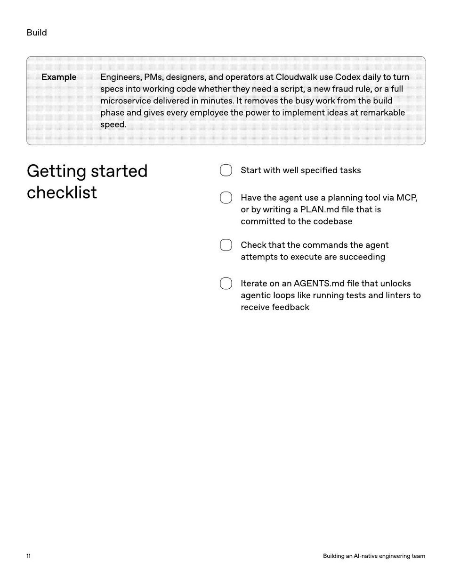

<!-- Generated by research/hmrc-beyond-hype/tools/build_narrative_sidecars.py. -->
---
source_id: ai-native-engineering-team-source-openai
source_file: "research/hmrc-beyond-hype/import/AI-Native-Engineering-Team-source_openAI.pdf"
item_type: pdf-page
item_number: 11
asset: "assets/visuals/ai-native-engineering-team-source-openai/page-11.jpg"
publication_status: "publishable derived thumbnail and text sidecar; raw imported PDF remains local"
tags:
  - agentic-coding
  - ai-assistants
  - mcp
  - operating-model
  - workflow
---

# ExampleEngineers , PMs , designers , andoperatorsatCloudwalkuseCodexdailytoturn



## Visual Description

This is page 11 from `research/hmrc-beyond-hype/import/AI-Native-Engineering-Team-source_openAI.pdf`. It is represented here by a small derived image so the narrative can be browsed on GitHub without publishing the raw import file.

## Claim Or Narrative Function

Provides the external operating-model backdrop for AI-native engineering: plan, design, build, test, review, document, deploy, and maintain with agents.

## Material Points Illustrated

- Build
- ExampleEngineers , PMs , designers , andoperatorsatCloudwalkuseCodexdailytoturn
- specsintoworkingcodewhethertheyneedascript , anewfraudrule , orafull
- microservicedeliveredinminutes . Itremovesthebusyworkfromthebuild
- phaseandgiveseveryemployeethepowertoimplementideasatremarkable
- speed .
- Gettingstarted
- checklist
- Start with w ell specified task s
- H ave the agen t use a planning t ool via MCP ,
- or b y writing a PLAN.md file tha t is
- committ ed t o the codebase
- Check tha t the commands the agen t
- a tt emp ts toex ecut e ar e succeeding
- It er ate on an A GENT S .md file tha t unlock s
- agen tic loops lik e running t ests and lin t er sto
- r eceive f eedback
- 1 1 BuildinganAI - nativeengineeringteam

## Related Narrative Links

- [Narrative arc](../../narrative-arc.md)
- [Topic index](../../topics.md)
- [Source material index](../../source-materials.md)
- [04 Agentic Coding Capabilities](../../../04_agentic_coding_capabilities.md)
- [07 Operating Model For Public Sector Engineering](../../../07_operating_model_for_public_sector_engineering.md)
- [Clawpilot Project Lobster](../../notes/clawpilot-project-lobster.md)

## Publication Status

publishable derived thumbnail and text sidecar; raw imported PDF remains local.

## Caveats

- Text extracted from a local imported PDF and paired with a derived thumbnail; check the original before quoting exact wording.

## Extracted Visual Text

```text
Build
ExampleEngineers , PMs , designers , andoperatorsatCloudwalkuseCodexdailytoturn
specsintoworkingcodewhethertheyneedascript , anewfraudrule , orafull
microservicedeliveredinminutes . Itremovesthebusyworkfromthebuild
phaseandgiveseveryemployeethepowertoimplementideasatremarkable
speed .
Gettingstarted
checklist
Start with w ell specified task s
H ave the agen t use a planning t ool via MCP ,
or b y writing a PLAN.md file tha t is
committ ed t o the codebase
Check tha t the commands the agen t
a tt emp ts toex ecut e ar e succeeding
It er ate on an A GENT S .md file tha t unlock s
agen tic loops lik e running t ests and lin t er sto
r eceive f eedback
1 1 BuildinganAI - nativeengineeringteam
```
