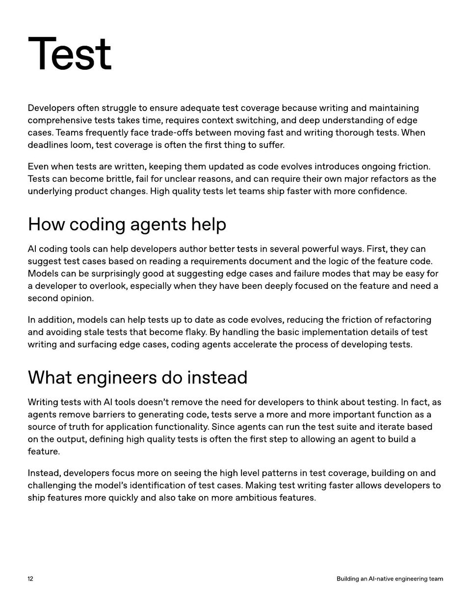

<!-- Generated by research/hmrc-beyond-hype/tools/build_narrative_sidecars.py. -->
---
source_id: ai-native-engineering-team-source-openai
source_file: "research/hmrc-beyond-hype/import/AI-Native-Engineering-Team-source_openAI.pdf"
item_type: pdf-page
item_number: 12
asset: "assets/visuals/ai-native-engineering-team-source-openai/page-12.jpg"
publication_status: "publishable derived thumbnail and text sidecar; raw imported PDF remains local"
tags:
  - agentic-coding
  - ai-assistants
  - build
  - evaluation
  - operating-model
  - review
  - testing
  - validation
  - workflow
---

# deadlines loom, t est cover age is o ft en the fir st thing t o suff er .



## Visual Description

This is page 12 from `research/hmrc-beyond-hype/import/AI-Native-Engineering-Team-source_openAI.pdf`. It is represented here by a small derived image so the narrative can be browsed on GitHub without publishing the raw import file.

## Claim Or Narrative Function

Provides the external operating-model backdrop for AI-native engineering: plan, design, build, test, review, document, deploy, and maintain with agents.

## Material Points Illustrated

- Test
- Developer s o ft en struggle t o ensur e adequa tet est cover age because writing and main taining
- compr ehensive t ests tak es time , r equir es con t e xt s wit ching, and deep under standing o f edge
- cases. T eams fr equen tly f ace tr ade-o ffs be tw een moving f ast and writing thor ough t ests. When
- deadlines loom, t est cover age is o ft en the fir st thing t o suff er .
- Even when t ests ar e writt en, k eeping them upda t ed as code evolves in tr oduces ongoing fric tion.
- T ests can become brittle , f ail f or unclear r easons, and can r equir e their o wn major ref ac t or s as the
- underlying pr oduc t changes. H igh quality t ests le t t eams ship f ast er with mor e con fidence .
- Howcodingagentshelp
- AI coding t ools can help developer s author be tt er t ests in sever al po w erful ways. Fir st, the y can
- suggest t est cases based on r eading a r equir emen ts documen t and the logic o f the f ea tur e code .
- M odels can be surprisingly good a t suggesting edge cases and f ailur e modes tha t ma y be eas y f or
- a developer t o overlook, especially when the y have been deeply f ocused on the f ea tur e and need a
- second opinion.
- I n addition, models can help t ests up t o da t e as code evolves, r educing the fric tion ofref ac t oring
- and avoiding stale t ests tha t become flaky . B y handling the basic implemen ta tion de tails oft est
- writing and surf acing edge cases, coding agen ts acceler ate the pr ocess o f developing t ests.
- Whatengineersdoinstead
- W riting t ests with AI t ools doesn 't r emove the need f or developer sto think about t esting. Inf ac t, as
- agen ts r emove barrier sto gener a ting code , t ests serve a mor e and mor e importan t func tion as a
- sour ce o f truth f or applica tion func tionality . Since agen ts can run the t est suit e and it er ate based
- on the output, de fining high quality t ests is o ft en the fir st st ep t o allo wing an agen tto build a
- f ea tur e .
- I nst ead, developer s f ocus mor e on seeing the high level pa tt erns in t est cover age , building on and
- challenging the model' s iden tifica tion oft est cases. M aking t est writing f ast er allo w s developer sto
- ship f ea tur es mor e quickly and also tak e on mor e ambitious f ea tur es.
- 1 2 BuildinganAI - nativeengineeringteam


## Related Narrative Links

- [Narrative arc](../../narrative-arc.md)
- [Topic index](../../topics.md)
- [Source material index](../../source-materials.md)
- [04 Agentic Coding Capabilities](../../../04_agentic_coding_capabilities.md)
- [07 Operating Model For Public Sector Engineering](../../../07_operating_model_for_public_sector_engineering.md)
- [Clawpilot Project Lobster](../../notes/clawpilot-project-lobster.md)

## Publication Status

publishable derived thumbnail and text sidecar; raw imported PDF remains local.

## Caveats

- Text extracted from a local imported PDF and paired with a derived thumbnail; check the original before quoting exact wording.

## Extracted Visual Text

```text
Test
Developer s o ft en struggle t o ensur e adequa tet est cover age because writing and main taining
compr ehensive t ests tak es time , r equir es con t e xt s wit ching, and deep under standing o f edge
cases. T eams fr equen tly f ace tr ade-o ffs be tw een moving f ast and writing thor ough t ests. When
deadlines loom, t est cover age is o ft en the fir st thing t o suff er .
Even when t ests ar e writt en, k eeping them upda t ed as code evolves in tr oduces ongoing fric tion.
T ests can become brittle , f ail f or unclear r easons, and can r equir e their o wn major ref ac t or s as the
underlying pr oduc t changes. H igh quality t ests le t t eams ship f ast er with mor e con fidence .
Howcodingagentshelp
AI coding t ools can help developer s author be tt er t ests in sever al po w erful ways. Fir st, the y can
suggest t est cases based on r eading a r equir emen ts documen t and the logic o f the f ea tur e code .
M odels can be surprisingly good a t suggesting edge cases and f ailur e modes tha t ma y be eas y f or
a developer t o overlook, especially when the y have been deeply f ocused on the f ea tur e and need a
second opinion.
I n addition, models can help t ests up t o da t e as code evolves, r educing the fric tion ofref ac t oring
and avoiding stale t ests tha t become flaky . B y handling the basic implemen ta tion de tails oft est
writing and surf acing edge cases, coding agen ts acceler ate the pr ocess o f developing t ests.
Whatengineersdoinstead
W riting t ests with AI t ools doesn 't r emove the need f or developer sto think about t esting. Inf ac t, as
agen ts r emove barrier sto gener a ting code , t ests serve a mor e and mor e importan t func tion as a
sour ce o f truth f or applica tion func tionality . Since agen ts can run the t est suit e and it er ate based
on the output, de fining high quality t ests is o ft en the fir st st ep t o allo wing an agen tto build a
f ea tur e .
I nst ead, developer s f ocus mor e on seeing the high level pa tt erns in t est cover age , building on and
challenging the model' s iden tifica tion oft est cases. M aking t est writing f ast er allo w s developer sto
ship f ea tur es mor e quickly and also tak e on mor e ambitious f ea tur es.
1 2 BuildinganAI - nativeengineeringteam
```
