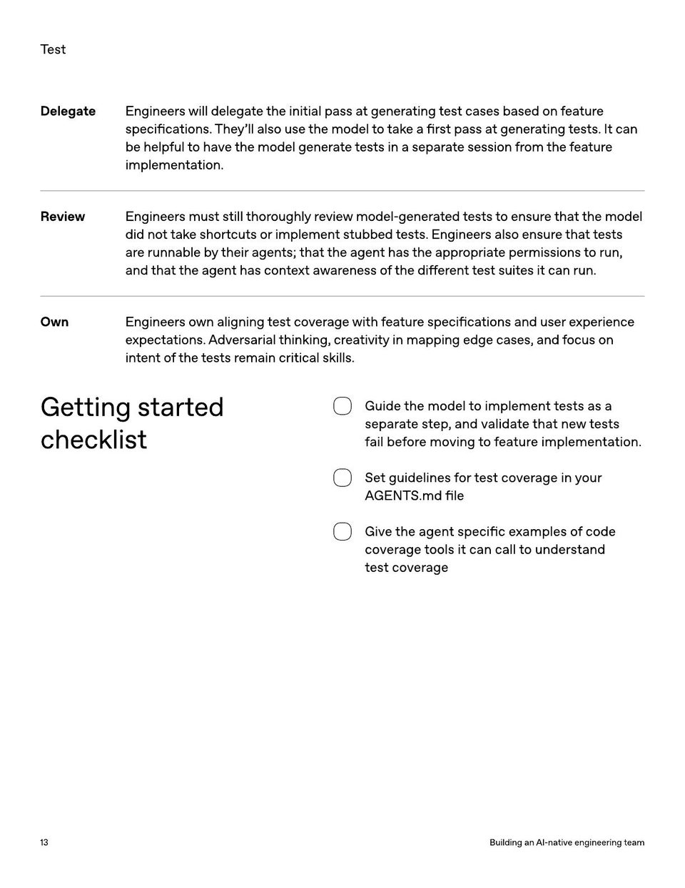

<!-- Generated by research/hmrc-beyond-hype/tools/build_narrative_sidecars.py. -->
---
source_id: ai-native-engineering-team-source-openai
source_file: "research/hmrc-beyond-hype/import/AI-Native-Engineering-Team-source_openAI.pdf"
item_type: pdf-page
item_number: 13
asset: "assets/visuals/ai-native-engineering-team-source-openai/page-13.jpg"
publication_status: "publishable derived thumbnail and text sidecar; raw imported PDF remains local"
tags:
  - agentic-coding
  - ai-assistants
  - build
  - governance
  - operating-model
  - review
  - risk-boundaries
  - security
  - testing
  - validation
  - workflow
---

# speci fi cations . They ' llalsousethemodeltotakea fi rstpassatgeneratingtests . Itcan



## Visual Description

This is page 13 from `research/hmrc-beyond-hype/import/AI-Native-Engineering-Team-source_openAI.pdf`. It is represented here by a small derived image so the narrative can be browsed on GitHub without publishing the raw import file.

## Claim Or Narrative Function

Provides the external operating-model backdrop for AI-native engineering: plan, design, build, test, review, document, deploy, and maintain with agents.

## Material Points Illustrated

- T est
- DelegateEngineerswilldelegatetheinitialpassatgeneratingtestcasesbasedonfeature
- speci fi cations . They ' llalsousethemodeltotakea fi rstpassatgeneratingtests . Itcan
- behelpfultohavethemodelgeneratetestsinaseparatesessionfromthefeature
- implementation .
- ReviewEngineersmuststillthoroughlyreviewmodel - generatedteststoensurethatthemodel
- didnottakeshortcutsorimplementstubbedtests . Engineersalsoensurethattests
- arerunnablebytheiragents ; thattheagenthastheappropriatepermissionstorun ,
- andthattheagenthascontextawarenessofthedi ff erenttestsuitesitcanrun .
- OwnEngineersownaligningtestcoveragewithfeaturespeci fi cationsanduserexperience
- expectations . Adversarialthinking , creativityinmappingedgecases , andfocuson
- intentofthetestsremaincriticalskills .
- Gettingstarted
- checklist
- Guide the model t o implemen t t ests as a
- separ ate st ep , and valida t e tha t ne w t ests
- f ail be f or e moving tof ea tur e implemen ta tion.
- Se t guidelines f or t est cover age in y our
- A GENT S .md file
- Give the agen t specific e x amples o f code
- cover age t ools it can call t o under stand
- t est cover age
- 1 3 BuildinganAI - nativeengineeringteam


## Related Narrative Links

- [Narrative arc](../../narrative-arc.md)
- [Topic index](../../topics.md)
- [Source material index](../../source-materials.md)
- [04 Agentic Coding Capabilities](../../../04_agentic_coding_capabilities.md)
- [07 Operating Model For Public Sector Engineering](../../../07_operating_model_for_public_sector_engineering.md)
- [Clawpilot Project Lobster](../../notes/clawpilot-project-lobster.md)

## Publication Status

publishable derived thumbnail and text sidecar; raw imported PDF remains local.

## Caveats

- Text extracted from a local imported PDF and paired with a derived thumbnail; check the original before quoting exact wording.

## Extracted Visual Text

```text
T est
DelegateEngineerswilldelegatetheinitialpassatgeneratingtestcasesbasedonfeature
speci fi cations . They ' llalsousethemodeltotakea fi rstpassatgeneratingtests . Itcan
behelpfultohavethemodelgeneratetestsinaseparatesessionfromthefeature
implementation .
ReviewEngineersmuststillthoroughlyreviewmodel - generatedteststoensurethatthemodel
didnottakeshortcutsorimplementstubbedtests . Engineersalsoensurethattests
arerunnablebytheiragents ; thattheagenthastheappropriatepermissionstorun ,
andthattheagenthascontextawarenessofthedi ff erenttestsuitesitcanrun .
OwnEngineersownaligningtestcoveragewithfeaturespeci fi cationsanduserexperience
expectations . Adversarialthinking , creativityinmappingedgecases , andfocuson
intentofthetestsremaincriticalskills .
Gettingstarted
checklist
Guide the model t o implemen t t ests as a
separ ate st ep , and valida t e tha t ne w t ests
f ail be f or e moving tof ea tur e implemen ta tion.
Se t guidelines f or t est cover age in y our
A GENT S .md file
Give the agen t specific e x amples o f code
cover age t ools it can call t o under stand
t est cover age
1 3 BuildinganAI - nativeengineeringteam
```
