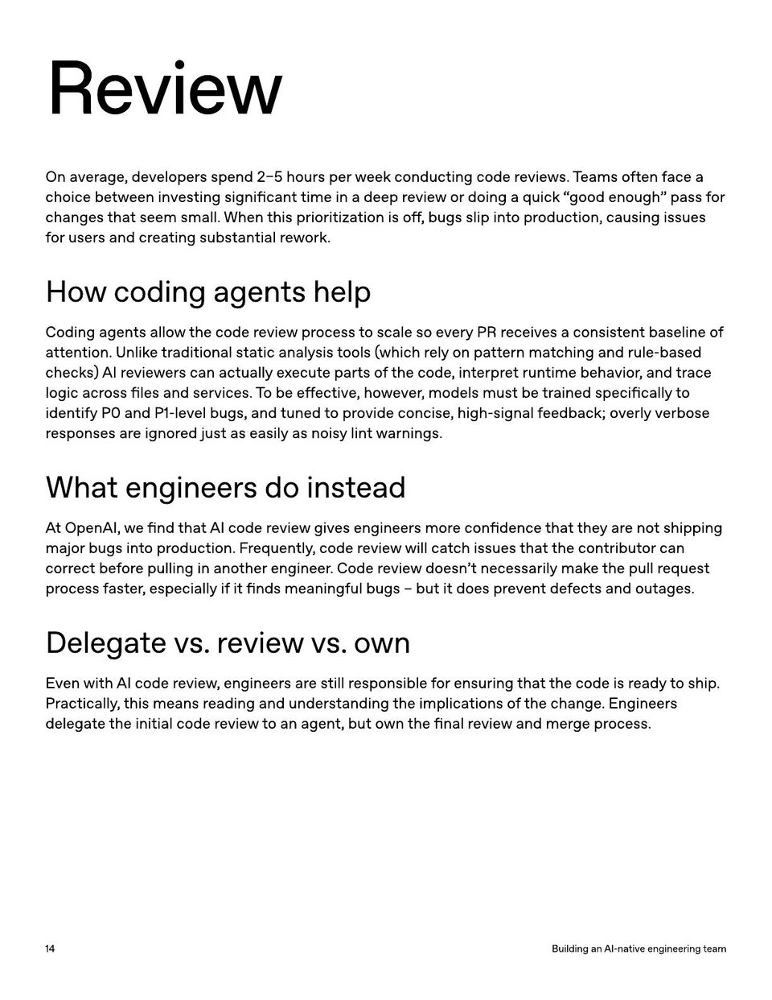

<!-- Generated by research/hmrc-beyond-hype/tools/build_narrative_sidecars.py. -->
---
source_id: ai-native-engineering-team-source-openai
source_file: "research/hmrc-beyond-hype/import/AI-Native-Engineering-Team-source_openAI.pdf"
item_type: pdf-page
item_number: 14
asset: "assets/visuals/ai-native-engineering-team-source-openai/page-14.jpg"
publication_status: "publishable derived thumbnail and text sidecar; raw imported PDF remains local"
tags:
  - agentic-coding
  - ai-assistants
  - governance
  - operating-model
  - workflow
---

# f or user s and cr ea ting substan tial rew ork.



## Visual Description

This is page 14 from `research/hmrc-beyond-hype/import/AI-Native-Engineering-Team-source_openAI.pdf`. It is represented here by a small derived image so the narrative can be browsed on GitHub without publishing the raw import file.

## Claim Or Narrative Function

Provides the external operating-model backdrop for AI-native engineering: plan, design, build, test, review, document, deploy, and maintain with agents.

## Material Points Illustrated

- Review
- On aver age , developer s spend 2-5 hour s per w eek conduc ting code r evie w s. T eams o ft en f ace a
- choice be tw een investing significan t time in a deep r evie w or doing a quick " good enough " pass f or
- changes tha t seem small. When this prioritiz a tion is o ff , bugs slip in t o pr oduc tion, causing issues
- f or user s and cr ea ting substan tial rew ork.
- Howcodingagentshelp
- Coding agen ts allo w the code r evie w pr ocess t o scale so every PR r eceives a consist en t baseline of
- a tt en tion. U nlik e tr aditional sta tic analy sis t ools ( which r ely on pa tt ern ma t ching and rule-based
- check s ) AI r evie w er s can ac tually e x ecut e parts o f the code , in t erpr e t run time behavior , and tr ace
- logic acr oss files and services. T o be e ff ec tive , ho w ever , models must be tr ained specifically t o
- iden tify P0 and P1-level bugs, and tuned t o pr ovide concise , high-signal f eedback; overly verbose
- r esponses ar e ignor ed just as easily as nois y lin t w arnings.
- Whatengineersdoinstead
- At OpenAI, w e find tha t AI code r evie w gives engineer s mor e con fidence tha t the y ar e no t shipping
- major bugs in t o pr oduc tion. F r equen tly , code r evie w will ca t ch issues tha t the con tribut or can
- corr ec t be f or e pulling in ano ther engineer . Code r evie w doesn 't necessarily mak e the pull r equest
- pr ocess f ast er , especially if it finds meaningful bugs - but it does pr even t de f ec ts and outages.
- Delegatevs . reviewvs . own
- Even with AI code r evie w , engineer s ar e still r esponsible f or ensuring tha t the code is r eady t o ship .
- Pr ac tically , this means r eading and under standing the implica tions o f the change . E ngineer s
- delega t e the initial code r evie wto an agen t, but o wn the final r evie w and mer ge pr ocess.
- 1 4 BuildinganAI - nativeengineeringteam

## Related Narrative Links

- [Narrative arc](../../narrative-arc.md)
- [Topic index](../../topics.md)
- [Source material index](../../source-materials.md)
- [04 Agentic Coding Capabilities](../../../04_agentic_coding_capabilities.md)
- [07 Operating Model For Public Sector Engineering](../../../07_operating_model_for_public_sector_engineering.md)
- [Clawpilot Project Lobster](../../notes/clawpilot-project-lobster.md)

## Publication Status

publishable derived thumbnail and text sidecar; raw imported PDF remains local.

## Caveats

- Text extracted from a local imported PDF and paired with a derived thumbnail; check the original before quoting exact wording.

## Extracted Visual Text

```text
Review
On aver age , developer s spend 2-5 hour s per w eek conduc ting code r evie w s. T eams o ft en f ace a
choice be tw een investing significan t time in a deep r evie w or doing a quick " good enough " pass f or
changes tha t seem small. When this prioritiz a tion is o ff , bugs slip in t o pr oduc tion, causing issues
f or user s and cr ea ting substan tial rew ork.
Howcodingagentshelp
Coding agen ts allo w the code r evie w pr ocess t o scale so every PR r eceives a consist en t baseline of
a tt en tion. U nlik e tr aditional sta tic analy sis t ools ( which r ely on pa tt ern ma t ching and rule-based
check s ) AI r evie w er s can ac tually e x ecut e parts o f the code , in t erpr e t run time behavior , and tr ace
logic acr oss files and services. T o be e ff ec tive , ho w ever , models must be tr ained specifically t o
iden tify P0 and P1-level bugs, and tuned t o pr ovide concise , high-signal f eedback; overly verbose
r esponses ar e ignor ed just as easily as nois y lin t w arnings.
Whatengineersdoinstead
At OpenAI, w e find tha t AI code r evie w gives engineer s mor e con fidence tha t the y ar e no t shipping
major bugs in t o pr oduc tion. F r equen tly , code r evie w will ca t ch issues tha t the con tribut or can
corr ec t be f or e pulling in ano ther engineer . Code r evie w doesn 't necessarily mak e the pull r equest
pr ocess f ast er , especially if it finds meaningful bugs - but it does pr even t de f ec ts and outages.
Delegatevs . reviewvs . own
Even with AI code r evie w , engineer s ar e still r esponsible f or ensuring tha t the code is r eady t o ship .
Pr ac tically , this means r eading and under standing the implica tions o f the change . E ngineer s
delega t e the initial code r evie wto an agen t, but o wn the final r evie w and mer ge pr ocess.
1 4 BuildinganAI - nativeengineeringteam
```
