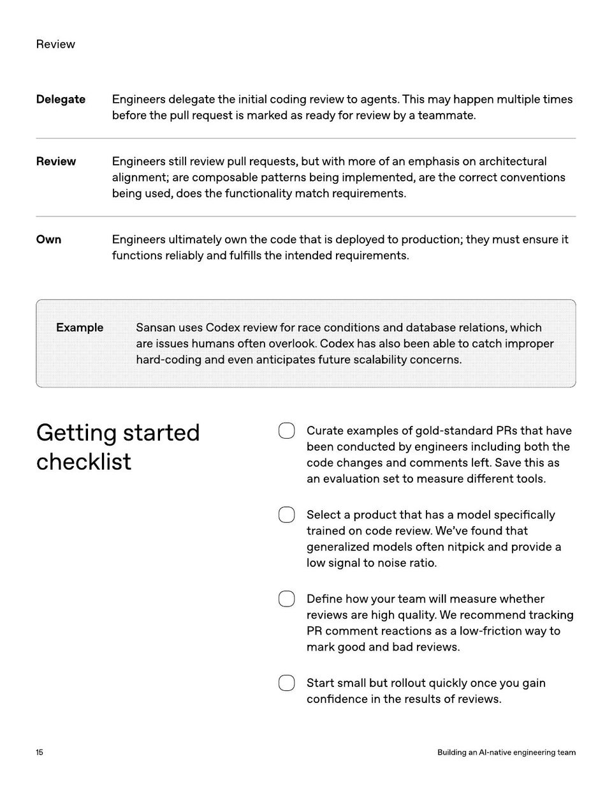

<!-- Generated by research/hmrc-beyond-hype/tools/build_narrative_sidecars.py. -->
---
source_id: ai-native-engineering-team-source-openai
source_file: "research/hmrc-beyond-hype/import/AI-Native-Engineering-Team-source_openAI.pdf"
item_type: pdf-page
item_number: 15
asset: "assets/visuals/ai-native-engineering-team-source-openai/page-15.jpg"
publication_status: "publishable derived thumbnail and text sidecar; raw imported PDF remains local"
tags:
  - agentic-coding
  - ai-assistants
  - build
  - evaluation
  - governance
  - operating-model
  - operations
  - review
  - workflow
---

# DelegateEngineersdelegatetheinitialcodingreviewtoagents . Thismayhappenmultipletimes



## Visual Description

This is page 15 from `research/hmrc-beyond-hype/import/AI-Native-Engineering-Team-source_openAI.pdf`. It is represented here by a small derived image so the narrative can be browsed on GitHub without publishing the raw import file.

## Claim Or Narrative Function

Provides the external operating-model backdrop for AI-native engineering: plan, design, build, test, review, document, deploy, and maintain with agents.

## Material Points Illustrated

- R evie w
- DelegateEngineersdelegatetheinitialcodingreviewtoagents . Thismayhappenmultipletimes
- beforethepullrequestismarkedasreadyforreviewbyateammate .
- ReviewEngineersstillreviewpullrequests , butwithmoreofanemphasisonarchitectural
- alignment ; arecomposablepatternsbeingimplemented , arethecorrectconventions
- beingused , doesthefunctionalitymatchrequirements .
- OwnEngineersultimatelyownthecodethatisdeployedtoproduction ; theymustensureit
- functionsreliablyandful fi llstheintendedrequirements .
- ExampleSansanusesCodexreviewforraceconditionsanddatabaserelations , which
- areissueshumansoftenoverlook . Codexhasalsobeenabletocatchimproper
- hard - codingandevenanticipatesfuturescalabilityconcerns .
- Gettingstarted
- checklist
- Cur ateex amples o f gold-standar d PR s tha t have
- been conduc t ed b y engineer s including bo th the
- code changes and commen ts le ft. Save this as
- an evalua tion se tto measur e diff er en t t ools.
- Selec t a pr oduc t tha t has a model specifically
- tr ained on code r evie w . W e 've f ound tha t
- gener aliz ed models o ft en nitpick and pr ovide a
- lo w signal t o noise r a tio .
- De fine ho w y our t eam will measur e whe ther
- r evie w s ar e high quality . Wer ecommend tr acking
- PR commen t r eac tions as a lo w- fric tion wayto
- mark good and bad r evie w s.
- Start small but r ollout quickly once y ou gain
- con fidence in the r esults ofr evie w s.
- 1 5 BuildinganAI - nativeengineeringteam


## Related Narrative Links

- [Narrative arc](../../narrative-arc.md)
- [Topic index](../../topics.md)
- [Source material index](../../source-materials.md)
- [04 Agentic Coding Capabilities](../../../04_agentic_coding_capabilities.md)
- [07 Operating Model For Public Sector Engineering](../../../07_operating_model_for_public_sector_engineering.md)
- [Clawpilot Project Lobster](../../notes/clawpilot-project-lobster.md)

## Publication Status

publishable derived thumbnail and text sidecar; raw imported PDF remains local.

## Caveats

- Text extracted from a local imported PDF and paired with a derived thumbnail; check the original before quoting exact wording.

## Extracted Visual Text

```text
R evie w
DelegateEngineersdelegatetheinitialcodingreviewtoagents . Thismayhappenmultipletimes
beforethepullrequestismarkedasreadyforreviewbyateammate .
ReviewEngineersstillreviewpullrequests , butwithmoreofanemphasisonarchitectural
alignment ; arecomposablepatternsbeingimplemented , arethecorrectconventions
beingused , doesthefunctionalitymatchrequirements .
OwnEngineersultimatelyownthecodethatisdeployedtoproduction ; theymustensureit
functionsreliablyandful fi llstheintendedrequirements .
ExampleSansanusesCodexreviewforraceconditionsanddatabaserelations , which
areissueshumansoftenoverlook . Codexhasalsobeenabletocatchimproper
hard - codingandevenanticipatesfuturescalabilityconcerns .
Gettingstarted
checklist
Cur ateex amples o f gold-standar d PR s tha t have
been conduc t ed b y engineer s including bo th the
code changes and commen ts le ft. Save this as
an evalua tion se tto measur e diff er en t t ools.
Selec t a pr oduc t tha t has a model specifically
tr ained on code r evie w . W e 've f ound tha t
gener aliz ed models o ft en nitpick and pr ovide a
lo w signal t o noise r a tio .
De fine ho w y our t eam will measur e whe ther
r evie w s ar e high quality . Wer ecommend tr acking
PR commen t r eac tions as a lo w- fric tion wayto
mark good and bad r evie w s.
Start small but r ollout quickly once y ou gain
con fidence in the r esults ofr evie w s.
1 5 BuildinganAI - nativeengineeringteam
```
