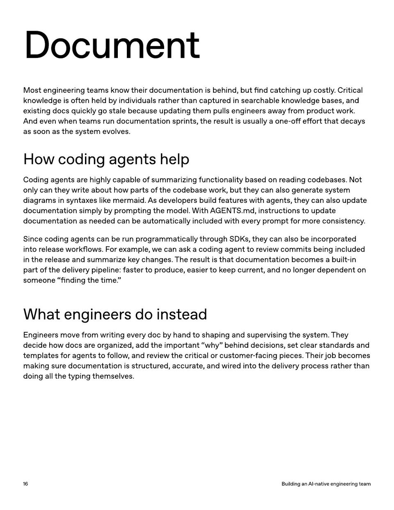

<!-- Generated by research/hmrc-beyond-hype/tools/build_narrative_sidecars.py. -->
---
source_id: ai-native-engineering-team-source-openai
source_file: "research/hmrc-beyond-hype/import/AI-Native-Engineering-Team-source_openAI.pdf"
item_type: pdf-page
item_number: 16
asset: "assets/visuals/ai-native-engineering-team-source-openai/page-16.jpg"
publication_status: "publishable derived thumbnail and text sidecar; raw imported PDF remains local"
tags:
  - agentic-coding
  - ai-assistants
  - build
  - documentation
  - operating-model
  - review
  - risk-boundaries
  - workflow
---

# as soon as the s y st em evolves.



## Visual Description

This is page 16 from `research/hmrc-beyond-hype/import/AI-Native-Engineering-Team-source_openAI.pdf`. It is represented here by a small derived image so the narrative can be browsed on GitHub without publishing the raw import file.

## Claim Or Narrative Function

Provides the external operating-model backdrop for AI-native engineering: plan, design, build, test, review, document, deploy, and maintain with agents.

## Material Points Illustrated

- Document
- M ost engineering t eams kno w their documen ta tion is behind, but find ca t ching up costly . Critical
- kno wledge is o ft en held b y individuals r a ther than cap tur ed in sear chable kno wledge bases, and
- e xisting docs quickly go stale because upda ting them pulls engineer saway fr om pr oduc t w ork.
- And even when t eams run documen ta tion sprin ts, the r esult is usually a one-o ff e ff ort tha t deca y s
- as soon as the s y st em evolves.
- Howcodingagentshelp
- Coding agen ts ar e highly capable o f summarizing func tionality based on r eading codebases. Not
- only can the y writ e about ho w parts o f the codebase w ork, but the y can also gener atesy st em
- diagr ams in s yn tax es lik e mermaid. A s developer s build f ea tur es with agen ts, the y can also upda t e
- documen ta tion simply b y pr omp ting the model. With A GENT S .md, instruc tions t o upda t e
- documen ta tion as needed can be aut oma tically included with every pr omp t f or mor e consist enc y .
- Since coding agen ts can be run pr ogr amma tically thr ough SDK s, the y can also be incorpor a t ed
- in tor elease w orkflo w s. F or e x ample , w e can ask a coding agen ttor evie w commits being included
- in the r elease and summariz ekey changes. The r esult is tha t documen ta tion becomes a built -in
- part o f the delivery pipeline: f ast er t o pr oduce , easier tok eep curr en t, and no longer dependen t on
- someone "finding the time . "
- Whatengineersdoinstead
- E ngineer s move fr om writing every doc b y hand t o shaping and supervising the s y st em. The y
- decide ho w docs ar e or ganiz ed, add the importan t "wh y" behind decisions, se t clear standar ds and
- t empla t es f or agen ts tof ollo w , and r evie w the critical or cust omer - f acing pieces. Their job becomes
- making sur e documen ta tion is struc tur ed, accur ate , and wir ed in t o the delivery pr ocess r a ther than
- doing all the typing themselves.
- 1 6 BuildinganAI - nativeengineeringteam


## Related Narrative Links

- [Narrative arc](../../narrative-arc.md)
- [Topic index](../../topics.md)
- [Source material index](../../source-materials.md)
- [04 Agentic Coding Capabilities](../../../04_agentic_coding_capabilities.md)
- [07 Operating Model For Public Sector Engineering](../../../07_operating_model_for_public_sector_engineering.md)
- [Clawpilot Project Lobster](../../notes/clawpilot-project-lobster.md)

## Publication Status

publishable derived thumbnail and text sidecar; raw imported PDF remains local.

## Caveats

- Text extracted from a local imported PDF and paired with a derived thumbnail; check the original before quoting exact wording.

## Extracted Visual Text

```text
Document
M ost engineering t eams kno w their documen ta tion is behind, but find ca t ching up costly . Critical
kno wledge is o ft en held b y individuals r a ther than cap tur ed in sear chable kno wledge bases, and
e xisting docs quickly go stale because upda ting them pulls engineer saway fr om pr oduc t w ork.
And even when t eams run documen ta tion sprin ts, the r esult is usually a one-o ff e ff ort tha t deca y s
as soon as the s y st em evolves.
Howcodingagentshelp
Coding agen ts ar e highly capable o f summarizing func tionality based on r eading codebases. Not
only can the y writ e about ho w parts o f the codebase w ork, but the y can also gener atesy st em
diagr ams in s yn tax es lik e mermaid. A s developer s build f ea tur es with agen ts, the y can also upda t e
documen ta tion simply b y pr omp ting the model. With A GENT S .md, instruc tions t o upda t e
documen ta tion as needed can be aut oma tically included with every pr omp t f or mor e consist enc y .
Since coding agen ts can be run pr ogr amma tically thr ough SDK s, the y can also be incorpor a t ed
in tor elease w orkflo w s. F or e x ample , w e can ask a coding agen ttor evie w commits being included
in the r elease and summariz ekey changes. The r esult is tha t documen ta tion becomes a built -in
part o f the delivery pipeline: f ast er t o pr oduce , easier tok eep curr en t, and no longer dependen t on
someone "finding the time . "
Whatengineersdoinstead
E ngineer s move fr om writing every doc b y hand t o shaping and supervising the s y st em. The y
decide ho w docs ar e or ganiz ed, add the importan t "wh y" behind decisions, se t clear standar ds and
t empla t es f or agen ts tof ollo w , and r evie w the critical or cust omer - f acing pieces. Their job becomes
making sur e documen ta tion is struc tur ed, accur ate , and wir ed in t o the delivery pr ocess r a ther than
doing all the typing themselves.
1 6 BuildinganAI - nativeengineeringteam
```
