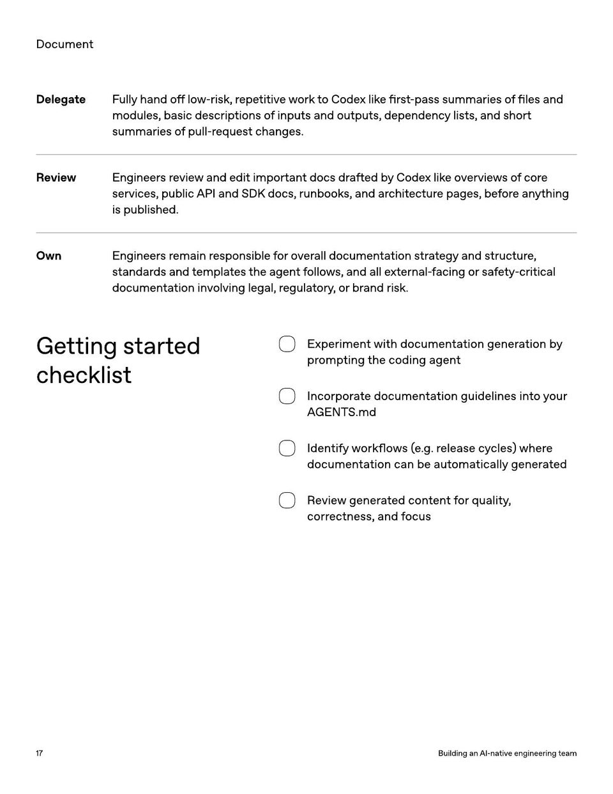

<!-- Generated by research/hmrc-beyond-hype/tools/build_narrative_sidecars.py. -->
---
source_id: ai-native-engineering-team-source-openai
source_file: "research/hmrc-beyond-hype/import/AI-Native-Engineering-Team-source_openAI.pdf"
item_type: pdf-page
item_number: 17
asset: "assets/visuals/ai-native-engineering-team-source-openai/page-17.jpg"
publication_status: "publishable derived thumbnail and text sidecar; raw imported PDF remains local"
tags:
  - agentic-coding
  - ai-assistants
  - build
  - dark-data
  - documentation
  - evaluation
  - governance
  - operating-model
  - planning
  - review
  - risk-boundaries
  - testing
  - validation
  - workflow
---

# modules , basicdescriptionsofinputsandoutputs , dependencylists , andshort



## Visual Description

This is page 17 from `research/hmrc-beyond-hype/import/AI-Native-Engineering-Team-source_openAI.pdf`. It is represented here by a small derived image so the narrative can be browsed on GitHub without publishing the raw import file.

## Claim Or Narrative Function

Provides the external operating-model backdrop for AI-native engineering: plan, design, build, test, review, document, deploy, and maintain with agents.

## Material Points Illustrated

- Documen t
- DelegateFullyhando ff low - risk , repetitiveworktoCodexlike fi rst - passsummariesof fi lesand
- modules , basicdescriptionsofinputsandoutputs , dependencylists , andshort
- summariesofpull - requestchanges .
- ReviewEngineersreviewandeditimportantdocsdraftedbyCodexlikeoverviewsofcore
- services , publicAPIandSDKdocs , runbooks , andarchitecturepages , beforeanything
- ispublished .
- OwnEngineersremainresponsibleforoveralldocumentationstrategyandstructure ,
- standardsandtemplatestheagentfollows , andallexternal - facingorsafety - critical
- documentationinvolvinglegal , regulatory , orbrandrisk .
- Gettingstarted
- checklist
- Experimen t with documen ta tion gener a tion b y
- pr omp ting the coding agen t
- I ncorpor ate documen ta tion guidelines in toy our
- A GENT S .md
- I den tify w orkflo w s ( e . g. r elease c y cles ) wher e
- documen ta tion can be aut oma tically gener a t ed
- R evie w gener a t ed con t en t f or quality ,
- corr ec tness, and f ocus
- 1 7 BuildinganAI - nativeengineeringteam


## Related Narrative Links

- [Narrative arc](../../narrative-arc.md)
- [Topic index](../../topics.md)
- [Source material index](../../source-materials.md)
- [04 Agentic Coding Capabilities](../../../04_agentic_coding_capabilities.md)
- [07 Operating Model For Public Sector Engineering](../../../07_operating_model_for_public_sector_engineering.md)
- [Clawpilot Project Lobster](../../notes/clawpilot-project-lobster.md)

## Publication Status

publishable derived thumbnail and text sidecar; raw imported PDF remains local.

## Caveats

- Text extracted from a local imported PDF and paired with a derived thumbnail; check the original before quoting exact wording.

## Extracted Visual Text

```text
Documen t
DelegateFullyhando ff low - risk , repetitiveworktoCodexlike fi rst - passsummariesof fi lesand
modules , basicdescriptionsofinputsandoutputs , dependencylists , andshort
summariesofpull - requestchanges .
ReviewEngineersreviewandeditimportantdocsdraftedbyCodexlikeoverviewsofcore
services , publicAPIandSDKdocs , runbooks , andarchitecturepages , beforeanything
ispublished .
OwnEngineersremainresponsibleforoveralldocumentationstrategyandstructure ,
standardsandtemplatestheagentfollows , andallexternal - facingorsafety - critical
documentationinvolvinglegal , regulatory , orbrandrisk .
Gettingstarted
checklist
Experimen t with documen ta tion gener a tion b y
pr omp ting the coding agen t
I ncorpor ate documen ta tion guidelines in toy our
A GENT S .md
I den tify w orkflo w s ( e . g. r elease c y cles ) wher e
documen ta tion can be aut oma tically gener a t ed
R evie w gener a t ed con t en t f or quality ,
corr ec tness, and f ocus
1 7 BuildinganAI - nativeengineeringteam
```
