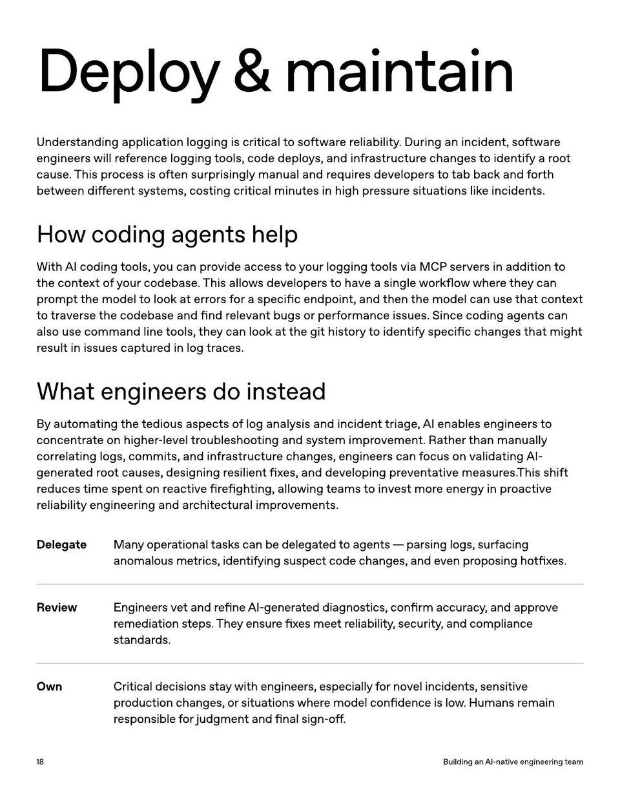

<!-- Generated by research/hmrc-beyond-hype/tools/build_narrative_sidecars.py. -->
---
source_id: ai-native-engineering-team-source-openai
source_file: "research/hmrc-beyond-hype/import/AI-Native-Engineering-Team-source_openAI.pdf"
item_type: pdf-page
item_number: 18
asset: "assets/visuals/ai-native-engineering-team-source-openai/page-18.jpg"
publication_status: "publishable derived thumbnail and text sidecar; raw imported PDF remains local"
tags:
  - agentic-coding
  - ai-assistants
  - build
  - design
  - governance
  - mcp
  - operating-model
  - operations
  - review
  - risk-boundaries
  - security
  - workflow
---

# Deploy & maintain



## Visual Description

This is page 18 from `research/hmrc-beyond-hype/import/AI-Native-Engineering-Team-source_openAI.pdf`. It is represented here by a small derived image so the narrative can be browsed on GitHub without publishing the raw import file.

## Claim Or Narrative Function

Provides the external operating-model backdrop for AI-native engineering: plan, design, build, test, review, document, deploy, and maintain with agents.

## Material Points Illustrated

- Deploy & maintain
- U nder standing applica tion logging is critical t o so ftw ar e r eliability . During an inciden t, so ftw ar e
- engineer s will ref er ence logging t ools, code deplo y s, and in fr astruc tur e changes t o iden tify a r oo t
- cause . This pr ocess is o ft en surprisingly manual and r equir es developer sto tab back and f orth
- be tw een diff er en tsy st ems, costing critical minut es in high pr essur e situa tions lik e inciden ts.
- Howcodingagentshelp
- With AI coding t ools, y ou can pr ovide access toy our logging t ools via MCP server s in addition t o
- the con t e xt ofy our codebase . This allo w s developer sto have a single w orkflo w wher e the y can
- pr omp t the model t o look a t err or s f or a specific endpoin t, and then the model can use tha t con t e xt
- t o tr aver se the codebase and find r elevan t bugs or perf ormance issues. Since coding agen ts can
- also use command line t ools, the y can look a t the git hist ory t o iden tify specific changes tha t migh t
- r esult in issues cap tur ed in log tr aces.
- Whatengineersdoinstead
- By aut oma ting the t edious aspec ts o f log analy sis and inciden t triage , AI enables engineer sto
- concen tr ate on higher -level tr oubleshoo ting and s y st em impr ovemen t. R a ther than manually
- corr ela ting logs, commits, and in fr astruc tur e changes, engineer s can f ocus on valida ting AI
- gener a t ed r oo t causes, designing r esilien t fix es, and developing pr even ta tive measur es. This shift
- r educes time spen t on r eac tive fir e figh ting, allo wing t eams t o invest mor e ener gy in pr oac tive
- r eliability engineering and ar chit ec tur al impr ovemen ts.
- DelegateManyoperationaltaskscanbedelegatedtoagents - parsinglogs , surfacing
- anomalousmetrics , identifyingsuspectcodechanges , andevenproposinghot fi xes .
- ReviewEngineersvetandre fi neAI - generateddiagnostics , con fi rmaccuracy , andapprove
- remediationsteps . Theyensure fi xesmeetreliability , security , andcompliance
- standards .
- OwnCriticaldecisionsstaywithengineers , especiallyfornovelincidents , sensitive
- productionchanges , orsituationswheremodelcon fi denceislow . Humansremain
- responsibleforjudgmentand fi nalsign - o ff .
- 1 8 BuildinganAI - nativeengineeringteam


## Related Narrative Links

- [Narrative arc](../../narrative-arc.md)
- [Topic index](../../topics.md)
- [Source material index](../../source-materials.md)
- [04 Agentic Coding Capabilities](../../../04_agentic_coding_capabilities.md)
- [07 Operating Model For Public Sector Engineering](../../../07_operating_model_for_public_sector_engineering.md)
- [Clawpilot Project Lobster](../../notes/clawpilot-project-lobster.md)

## Publication Status

publishable derived thumbnail and text sidecar; raw imported PDF remains local.

## Caveats

- Text extracted from a local imported PDF and paired with a derived thumbnail; check the original before quoting exact wording.

## Extracted Visual Text

```text
Deploy & maintain
U nder standing applica tion logging is critical t o so ftw ar e r eliability . During an inciden t, so ftw ar e
engineer s will ref er ence logging t ools, code deplo y s, and in fr astruc tur e changes t o iden tify a r oo t
cause . This pr ocess is o ft en surprisingly manual and r equir es developer sto tab back and f orth
be tw een diff er en tsy st ems, costing critical minut es in high pr essur e situa tions lik e inciden ts.
Howcodingagentshelp
With AI coding t ools, y ou can pr ovide access toy our logging t ools via MCP server s in addition t o
the con t e xt ofy our codebase . This allo w s developer sto have a single w orkflo w wher e the y can
pr omp t the model t o look a t err or s f or a specific endpoin t, and then the model can use tha t con t e xt
t o tr aver se the codebase and find r elevan t bugs or perf ormance issues. Since coding agen ts can
also use command line t ools, the y can look a t the git hist ory t o iden tify specific changes tha t migh t
r esult in issues cap tur ed in log tr aces.
Whatengineersdoinstead
By aut oma ting the t edious aspec ts o f log analy sis and inciden t triage , AI enables engineer sto
concen tr ate on higher -level tr oubleshoo ting and s y st em impr ovemen t. R a ther than manually
corr ela ting logs, commits, and in fr astruc tur e changes, engineer s can f ocus on valida ting AI-
gener a t ed r oo t causes, designing r esilien t fix es, and developing pr even ta tive measur es. This shift
r educes time spen t on r eac tive fir e figh ting, allo wing t eams t o invest mor e ener gy in pr oac tive
r eliability engineering and ar chit ec tur al impr ovemen ts.
DelegateManyoperationaltaskscanbedelegatedtoagents - parsinglogs , surfacing
anomalousmetrics , identifyingsuspectcodechanges , andevenproposinghot fi xes .
ReviewEngineersvetandre fi neAI - generateddiagnostics , con fi rmaccuracy , andapprove
remediationsteps . Theyensure fi xesmeetreliability , security , andcompliance
standards .
OwnCriticaldecisionsstaywithengineers , especiallyfornovelincidents , sensitive
productionchanges , orsituationswheremodelcon fi denceislow . Humansremain
responsibleforjudgmentand fi nalsign - o ff .
1 8 BuildinganAI - nativeengineeringteam
```
