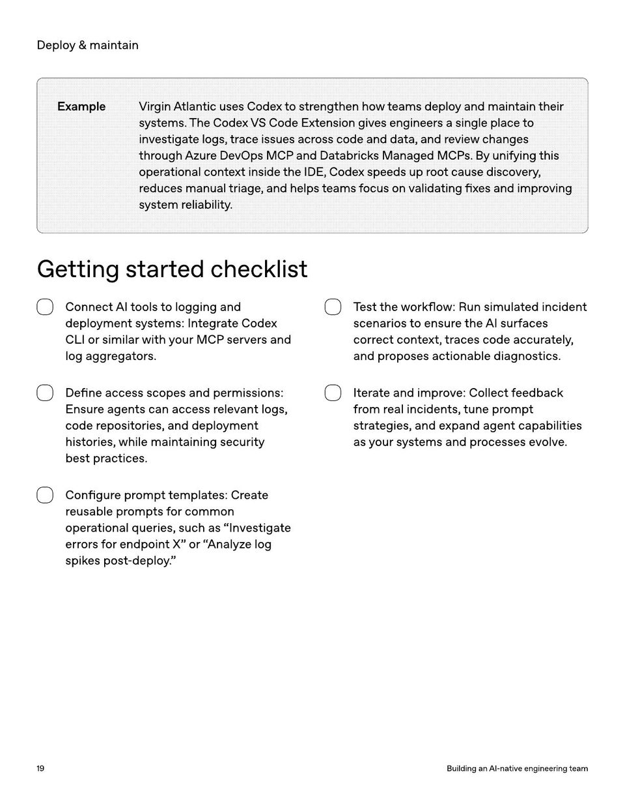

<!-- Generated by research/hmrc-beyond-hype/tools/build_narrative_sidecars.py. -->
---
source_id: ai-native-engineering-team-source-openai
source_file: "research/hmrc-beyond-hype/import/AI-Native-Engineering-Team-source_openAI.pdf"
item_type: pdf-page
item_number: 19
asset: "assets/visuals/ai-native-engineering-team-source-openai/page-19.jpg"
publication_status: "publishable derived thumbnail and text sidecar; raw imported PDF remains local"
tags:
  - agentic-coding
  - ai-assistants
  - auditability
  - build
  - governance
  - mcp
  - operating-model
  - operations
  - review
  - security
  - workflow
---

# Deplo y & main tain



## Visual Description

This is page 19 from `research/hmrc-beyond-hype/import/AI-Native-Engineering-Team-source_openAI.pdf`. It is represented here by a small derived image so the narrative can be browsed on GitHub without publishing the raw import file.

## Claim Or Narrative Function

Provides the external operating-model backdrop for AI-native engineering: plan, design, build, test, review, document, deploy, and maintain with agents.

## Material Points Illustrated

- Deplo y & main tain
- ExampleVirginAtlanticusesCodextostrengthenhowteamsdeployandmaintaintheir
- systems . TheCodexVSCodeExtensiongivesengineersasingleplaceto
- investigatelogs , traceissuesacrosscodeanddata , andreviewchanges
- throughAzureDevOpsMCPandDatabricksManagedMCPs . Byunifyingthis
- operationalcontextinsidetheIDE , Codexspeedsuprootcausediscovery ,
- reducesmanualtriage , andhelpsteamsfocusonvalidating fi xesandimproving
- systemreliability .
- Gettingstartedchecklist
- Connec t AI t ools t o logging and
- deplo ymen tsy st ems: Int egr ate Code x
- CLI or similar with y our MCP server s and
- log aggr ega t or s.
- De fine access scopes and permissions:
- E nsur e agen ts can access r elevan t logs,
- code r eposit ories, and deplo ymen t
- hist ories, while main taining security
- best pr ac tices.
- Con figur e pr omp t t empla t es: Cr ea te
- r eusable pr omp ts f or common
- oper a tional queries, such as "I nvestiga t e
- err or s f or endpoin t X" or " Analyz e log
- spik es post -deplo y . "
- T est the w orkflo w: R un simula t ed inciden t
- scenarios t o ensur e the AI surf aces
- corr ec t con t e xt, tr aces code accur a t ely ,
- and pr oposes ac tionable diagnostics.
- It er ate and impr ove: Collec t f eedback
- fr om r eal inciden ts, tune pr omp t
- str a t egies, and e xpand agen t capabilities
- as y our s y st ems and pr ocesses evolve .
- 1 9 BuildinganAI - nativeengineeringteam


## Related Narrative Links

- [Narrative arc](../../narrative-arc.md)
- [Topic index](../../topics.md)
- [Source material index](../../source-materials.md)
- [04 Agentic Coding Capabilities](../../../04_agentic_coding_capabilities.md)
- [07 Operating Model For Public Sector Engineering](../../../07_operating_model_for_public_sector_engineering.md)
- [Clawpilot Project Lobster](../../notes/clawpilot-project-lobster.md)

## Publication Status

publishable derived thumbnail and text sidecar; raw imported PDF remains local.

## Caveats

- Text extracted from a local imported PDF and paired with a derived thumbnail; check the original before quoting exact wording.

## Extracted Visual Text

```text
Deplo y & main tain
ExampleVirginAtlanticusesCodextostrengthenhowteamsdeployandmaintaintheir
systems . TheCodexVSCodeExtensiongivesengineersasingleplaceto
investigatelogs , traceissuesacrosscodeanddata , andreviewchanges
throughAzureDevOpsMCPandDatabricksManagedMCPs . Byunifyingthis
operationalcontextinsidetheIDE , Codexspeedsuprootcausediscovery ,
reducesmanualtriage , andhelpsteamsfocusonvalidating fi xesandimproving
systemreliability .
Gettingstartedchecklist
Connec t AI t ools t o logging and
deplo ymen tsy st ems: Int egr ate Code x
CLI or similar with y our MCP server s and
log aggr ega t or s.
De fine access scopes and permissions:
E nsur e agen ts can access r elevan t logs,
code r eposit ories, and deplo ymen t
hist ories, while main taining security
best pr ac tices.
Con figur e pr omp t t empla t es: Cr ea te
r eusable pr omp ts f or common
oper a tional queries, such as "I nvestiga t e
err or s f or endpoin t X" or " Analyz e log
spik es post -deplo y . "
T est the w orkflo w: R un simula t ed inciden t
scenarios t o ensur e the AI surf aces
corr ec t con t e xt, tr aces code accur a t ely ,
and pr oposes ac tionable diagnostics.
It er ate and impr ove: Collec t f eedback
fr om r eal inciden ts, tune pr omp t
str a t egies, and e xpand agen t capabilities
as y our s y st ems and pr ocesses evolve .
1 9 BuildinganAI - nativeengineeringteam
```
