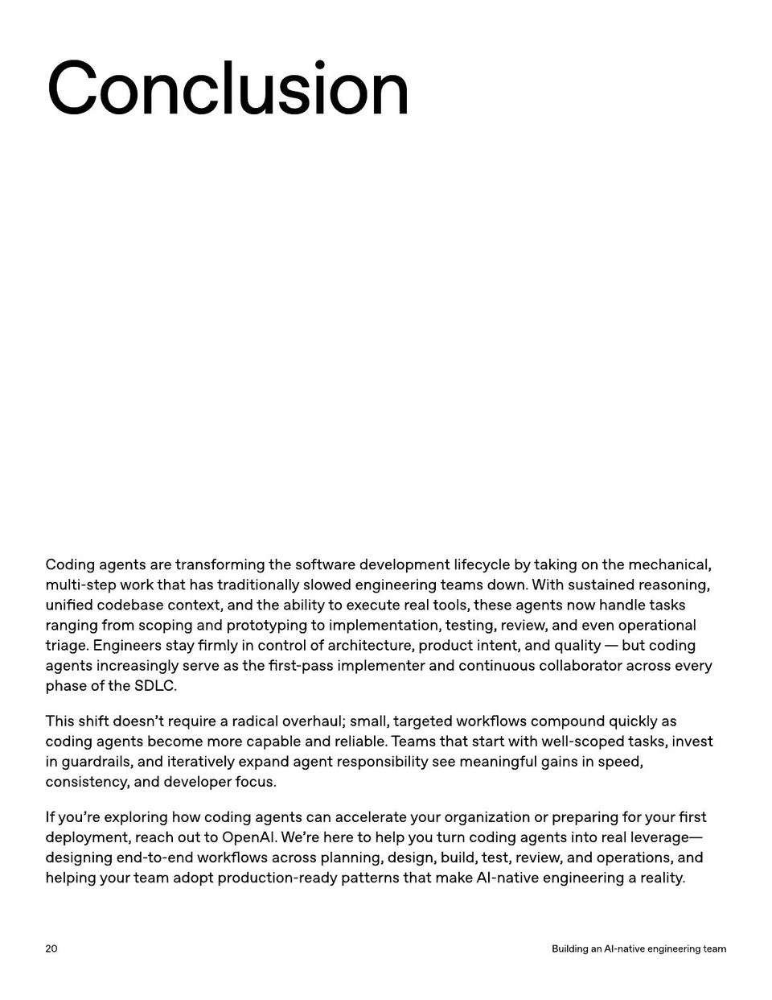

<!-- Generated by research/hmrc-beyond-hype/tools/build_narrative_sidecars.py. -->
---
source_id: ai-native-engineering-team-source-openai
source_file: "research/hmrc-beyond-hype/import/AI-Native-Engineering-Team-source_openAI.pdf"
item_type: pdf-page
item_number: 20
asset: "assets/visuals/ai-native-engineering-team-source-openai/page-20.jpg"
publication_status: "publishable derived thumbnail and text sidecar; raw imported PDF remains local"
tags:
  - agentic-coding
  - ai-assistants
  - evaluation
  - operating-model
  - workflow
---

# phase o f the SDL C .



## Visual Description

This is page 20 from `research/hmrc-beyond-hype/import/AI-Native-Engineering-Team-source_openAI.pdf`. It is represented here by a small derived image so the narrative can be browsed on GitHub without publishing the raw import file.

## Claim Or Narrative Function

Provides the external operating-model backdrop for AI-native engineering: plan, design, build, test, review, document, deploy, and maintain with agents.

## Material Points Illustrated

- Conclusion
- Coding agen ts ar e tr ans f orming the so ftw ar e developmen t lif ec y cle b y taking on the mechanical,
- multi-st ep w ork tha t has tr aditionally slo w ed engineering t eams do wn. With sustained r easoning,
- unified codebase con t e xt, and the ability toex ecut e r eal t ools, these agen ts no w handle task s
- r anging fr om scoping and pr oto typing t o implemen ta tion, t esting, r evie w , and even oper a tional
- triage . E ngineer s sta y firmly in con tr ol o f ar chit ec tur e , pr oduc t in t en t, and quality - but coding
- agen ts incr easingly serve as the fir st -pass implemen t er and con tinuous collabor a t or acr oss every
- phase o f the SDL C .
- This shift doesn 't r equir ear adical overhaul; small, tar ge t ed w orkflo w s compound quickly as
- coding agen ts become mor e capable and r eliable . T eams tha t start with w ell-scoped task s, invest
- in guar dr ails, and it er a tively e xpand agen t r esponsibility see meaningful gains in speed,
- consist enc y , and developer f ocus.
- If y ou' ree xploring ho w coding agen ts can acceler atey our or ganiz a tion or pr eparing f or y our fir st
- deplo ymen t, r each out t o OpenAI. W e ' r e her eto help y ou turn coding agen ts in tor eal lever age
- designing end- t o-end w orkflo w s acr oss planning, design, build, t est, r evie w , and oper a tions, and
- helping y our t eam adop t pr oduc tion-r eady pa tt erns tha t mak e AI-na tive engineering a r eality .
- 2 0 BuildinganAI - nativeengineeringteam

## Related Narrative Links

- [Narrative arc](../../narrative-arc.md)
- [Topic index](../../topics.md)
- [Source material index](../../source-materials.md)
- [04 Agentic Coding Capabilities](../../../04_agentic_coding_capabilities.md)
- [07 Operating Model For Public Sector Engineering](../../../07_operating_model_for_public_sector_engineering.md)
- [Clawpilot Project Lobster](../../notes/clawpilot-project-lobster.md)

## Publication Status

publishable derived thumbnail and text sidecar; raw imported PDF remains local.

## Caveats

- Text extracted from a local imported PDF and paired with a derived thumbnail; check the original before quoting exact wording.

## Extracted Visual Text

```text
Conclusion
Coding agen ts ar e tr ans f orming the so ftw ar e developmen t lif ec y cle b y taking on the mechanical,
multi-st ep w ork tha t has tr aditionally slo w ed engineering t eams do wn. With sustained r easoning,
unified codebase con t e xt, and the ability toex ecut e r eal t ools, these agen ts no w handle task s
r anging fr om scoping and pr oto typing t o implemen ta tion, t esting, r evie w , and even oper a tional
triage . E ngineer s sta y firmly in con tr ol o f ar chit ec tur e , pr oduc t in t en t, and quality - but coding
agen ts incr easingly serve as the fir st -pass implemen t er and con tinuous collabor a t or acr oss every
phase o f the SDL C .
This shift doesn 't r equir ear adical overhaul; small, tar ge t ed w orkflo w s compound quickly as
coding agen ts become mor e capable and r eliable . T eams tha t start with w ell-scoped task s, invest
in guar dr ails, and it er a tively e xpand agen t r esponsibility see meaningful gains in speed,
consist enc y , and developer f ocus.
If y ou' ree xploring ho w coding agen ts can acceler atey our or ganiz a tion or pr eparing f or y our fir st
deplo ymen t, r each out t o OpenAI. W e ' r e her eto help y ou turn coding agen ts in tor eal lever age-
designing end- t o-end w orkflo w s acr oss planning, design, build, t est, r evie w , and oper a tions, and
helping y our t eam adop t pr oduc tion-r eady pa tt erns tha t mak e AI-na tive engineering a r eality .
2 0 BuildinganAI - nativeengineeringteam
```
