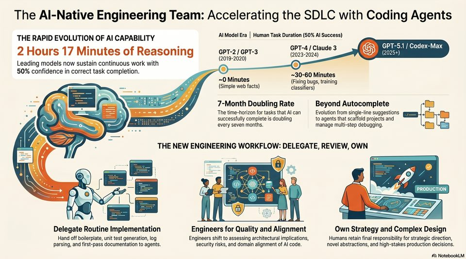

<!-- Generated by research/hmrc-beyond-hype/tools/build_narrative_sidecars.py. -->
---
source_id: ai-native-engineering-team-workflow
source_file: "research/hmrc-beyond-hype/import/AI-Native Engineering Team Workflow.png"
item_type: standalone-image
item_number: 1
asset: "assets/visuals/ai-native-engineering-team-workflow/image.jpg"
publication_status: "publishable derived thumbnail and text sidecar; raw imported PNG remains local"
tags:
  - agentic-coding
  - ai-assistants
  - build
  - design
  - documentation
  - evaluation
  - governance
  - operating-model
  - review
  - risk-boundaries
  - security
  - testing
  - validation
  - workflow
---

# AI-Native Engineering Team Workflow - Image



## Visual Description

This is image from `research/hmrc-beyond-hype/import/AI-Native Engineering Team Workflow.png`. It is represented here by a small derived image so the narrative can be browsed on GitHub without publishing the raw import file.

## Claim Or Narrative Function

Summarises the practical work pattern for the talk: delegate bounded work, review the diff, validate the evidence, and record decisions.

## Material Points Illustrated

- The Al-Native Engineering Team: Accelerating the SDLC with Coding Agents
- GPT-4 / Claude 3 GS GPT-5.1 / Codex-Max
- 2 Hours 17 Minutes of Reasoning GPT-2/GPT-3 ste ie (2025+)
- Leading models now sustain continuous work with 6) (>)
- 50% confidence in correct task completion. ~30-60 Minutes
- yy , ~0 Minutes (Fixing bugs, training
- Simple web facts) classifiers)
- ome - ae" a 2 " 9
- ss < <a _. \Une- 6 7-Month Doubling Rate Beyond Autocomplete
- ee Q | 4 == (ee n9 = "08 y The time-horizon for tasks that Al can Evolution from single-line suggestions
- 9 = e - ; Oaecccsgrsreseccces~" successfully complete is doubling to agents that scaffold projects and cape
- 2 ic ~> es yl tee os8 every seven months. manage multi-step debugging. 1] BS
- Wk . 7. Lf, : THE NEW ENGINEERING WORKFLOW: DELEGATE, REVIEW, OWN
- o : i @ f= a ce ES ~ > a Cilia
- 5 N 29 =a (id 5S mtCarr > PRODUCTION
- ee, Nal 'Ab = [= e-6 rye SS
- eee E ili Ja -2
- Delegate Routine Implementation Engineers for Quality and Alignment Own Strategy and Complex Design
- Hand off boilerplate, unit test generation, log Engineers shift to assessing architectural implications, Humans retain final responsibility for strategic direction,
- parsing, and first-pass documentation to agents. security risks, and domain alignment of Al code. novel abstractions, and high-stakes production decisions.
- A) NotebookLM


## Related Narrative Links

- [Narrative arc](../../narrative-arc.md)
- [Topic index](../../topics.md)
- [Source material index](../../source-materials.md)
- [04 Agentic Coding Capabilities](../../../04_agentic_coding_capabilities.md)
- [07 Operating Model For Public Sector Engineering](../../../07_operating_model_for_public_sector_engineering.md)
- [Clawpilot Project Lobster](../../notes/clawpilot-project-lobster.md)

## Publication Status

publishable derived thumbnail and text sidecar; raw imported PNG remains local.

## Caveats

- Automated OCR from a standalone image; verify exact wording before quoting.

## Extracted Visual Text

```text
The Al-Native Engineering Team: Accelerating the SDLC with Coding Agents
GPT-4 / Claude 3 GS GPT-5.1 / Codex-Max
2 Hours 17 Minutes of Reasoning GPT-2/GPT-3 ste ie (2025+)
(2019-2020) ( )
Leading models now sustain continuous work with 6) (>)
50% confidence in correct task completion. ~30-60 Minutes
yy , ~0 Minutes (Fixing bugs, training
- = > # (Simple web facts) classifiers)
ome - ae" a 2 " 9
ss < <a _. \Une- 6 7-Month Doubling Rate Beyond Autocomplete |
ee Q | 4 == (ee n9 = "08 y The time-horizon for tasks that Al can Evolution from single-line suggestions
: 9 = e - ; Oaecccsgrsreseccces~" successfully complete is doubling to agents that scaffold projects and cape
2 ic ~> es yl tee os8 every seven months. manage multi-step debugging. 1] BS
Wk . 7. Lf, : THE NEW ENGINEERING WORKFLOW: DELEGATE, REVIEW, OWN
=|
o : i @ f= a ce ES ~ > a Cilia
5 N 29 =a (id 5S mtCarr > PRODUCTION
~ ee, Nal 'Ab = [= e-6 rye SS
eee E ili Ja -2
Delegate Routine Implementation Engineers for Quality and Alignment Own Strategy and Complex Design
Hand off boilerplate, unit test generation, log Engineers shift to assessing architectural implications, Humans retain final responsibility for strategic direction,
parsing, and first-pass documentation to agents. security risks, and domain alignment of Al code. novel abstractions, and high-stakes production decisions.
A) NotebookLM
```
