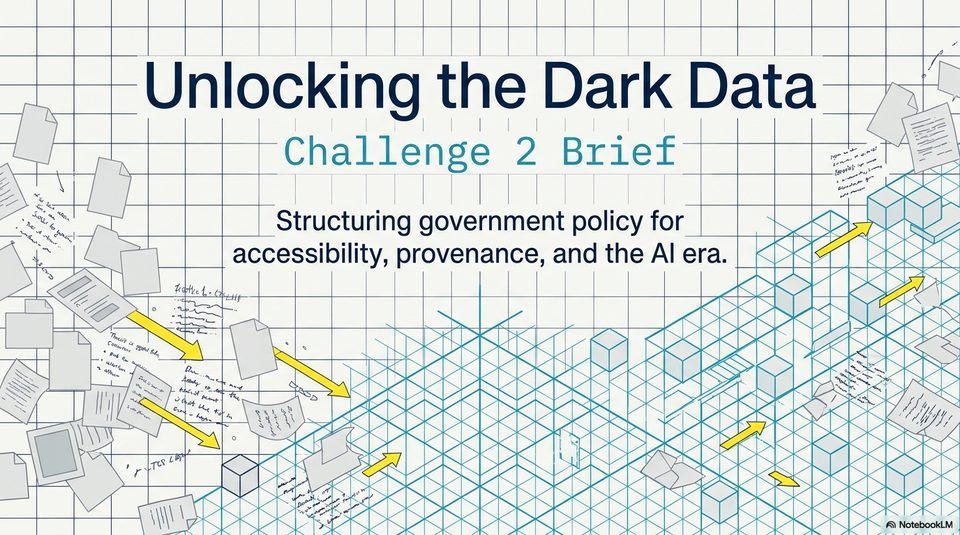

<!-- Generated by research/hmrc-beyond-hype/tools/build_narrative_sidecars.py. -->
---
source_id: challenge-2-unlocking-dark-data
source_file: "research/hmrc-beyond-hype/import/Challenge_2_Unlocking_Dark_Data.pptx"
item_type: pptx-slide
item_number: 1
asset: "assets/visuals/challenge-2-unlocking-dark-data/slide-01.jpg"
publication_status: "publishable derived thumbnail and text sidecar; raw imported PowerPoint remains local"
tags:
  - challenge-2
  - dark-data
  - provenance
  - source-backed-answers
  - talk-demo
---

# Challenge 2 Unlocking Dark Data - Slide 01



## Visual Description

This is slide 01 from `research/hmrc-beyond-hype/import/Challenge_2_Unlocking_Dark_Data.pptx`. It is represented here by a small derived image so the narrative can be browsed on GitHub without publishing the raw import file.

## Claim Or Narrative Function

Frames the public-sector problem: guidance can exist but still be hard to find, structure, trust, and reuse as evidence-backed answers.

## Material Points Illustrated

- tata
- ing the Dark Da ae
- ne locking t
- Unlo Hee co ed BES
- 2 eee | tenes
- a" soe nthe alam RES
- oo Structuring governm d the Al era. SESH BeSaek
- 2) e, an KKH ee
- ae I sibility, provenanc SESS SNES
- Nd sister BEeSePar s RIVES Re
- DS te PERERERKECEY Bee Yes Ty
- oy SS ee "iy,
- as SS PBREREAREREE EB Oe
- Seo ANS xh eB eRPE RES
- os Poa SS ESSE REE
- SS LS Be OK RK ice SS SSK SESE Ke
- HSS Bee ede
- a rye] Zhe BS eSESERENS RSE BRSRERSE ~ A Note
- ee Ko Se Serr <>
- ie Pt a EEESRSRSEERSEER
- NT omiscke

## Related Narrative Links

- [Narrative arc](../../narrative-arc.md)
- [Topic index](../../topics.md)
- [Source material index](../../source-materials.md)
- [06 Repo Case Study Codex Build](../../../06_repo_case_study_codex_build.md)
- [Engineering Accountability In Public Sector Ai.Speakers](../../../transcripts/engineering-accountability-in-public-sector-ai.speakers.md)
- [Workbench](../../../../../challenge-2/wiki/workbench.md)

## Publication Status

publishable derived thumbnail and text sidecar; raw imported PowerPoint remains local.

## Caveats

- Automated OCR from an image-only PowerPoint slide; verify exact wording before quoting.

## Extracted Visual Text

```text
EES
tata
ing the Dark Da ae
ne locking t |
---Unlo Hee co ed BES
2 eee | tenes
a" soe nthe alam RES
: oo Structuring governm d the Al era. SESH BeSaek
2) e, an KKH ee
ae I sibility, provenanc SESS SNES
Nd sister BEeSePar s RIVES Re
DS te PERERERKECEY Bee Yes Ty
oy SS ee "iy,
as SS PBREREAREREE EB Oe
. Seo ANS xh eB eRPE RES
= os Poa SS ESSE REE
SS LS Be OK RK ice SS SSK SESE Ke
HSS Bee ede
a rye] Zhe BS eSESERENS RSE BRSRERSE ~ A Note
ee Ko Se Serr <>
ie Pt a EEESRSRSEERSEER
| NT omiscke
```
