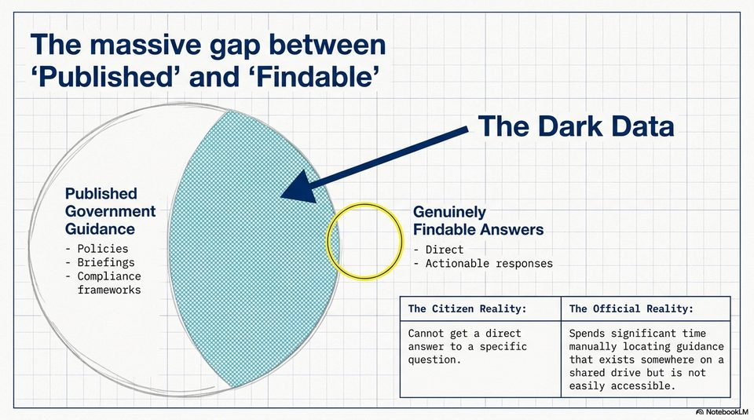

<!-- Generated by research/hmrc-beyond-hype/tools/build_narrative_sidecars.py. -->
---
source_id: challenge-2-unlocking-dark-data
source_file: "research/hmrc-beyond-hype/import/Challenge_2_Unlocking_Dark_Data.pptx"
item_type: pptx-slide
item_number: 2
asset: "assets/visuals/challenge-2-unlocking-dark-data/slide-02.jpg"
publication_status: "publishable derived thumbnail and text sidecar; raw imported PowerPoint remains local"
tags:
  - challenge-2
  - dark-data
  - provenance
  - source-backed-answers
  - talk-demo
---

# Challenge 2 Unlocking Dark Data - Slide 02



## Visual Description

This is slide 02 from `research/hmrc-beyond-hype/import/Challenge_2_Unlocking_Dark_Data.pptx`. It is represented here by a small derived image so the narrative can be browsed on GitHub without publishing the raw import file.

## Claim Or Narrative Function

Frames the public-sector problem: guidance can exist but still be hard to find, structure, trust, and reuse as evidence-backed answers.

## Material Points Illustrated

- The massive gap between
- 6 A 5 'ci J
- Published' and 'Findable
- FN The Dark Data
- Government Genuinely
- Briefings BESS eA - Actionable responses
- Ree answer to a specific manually locating guidance
- Sey question. that exists somewhere on a
- ne shared drive but is not
- _ easily accessible.
- A\ NotebookLV

## Related Narrative Links

- [Narrative arc](../../narrative-arc.md)
- [Topic index](../../topics.md)
- [Source material index](../../source-materials.md)
- [06 Repo Case Study Codex Build](../../../06_repo_case_study_codex_build.md)
- [Engineering Accountability In Public Sector Ai.Speakers](../../../transcripts/engineering-accountability-in-public-sector-ai.speakers.md)
- [Workbench](../../../../../challenge-2/wiki/workbench.md)

## Publication Status

publishable derived thumbnail and text sidecar; raw imported PowerPoint remains local.

## Caveats

- Automated OCR from an image-only PowerPoint slide; verify exact wording before quoting.

## Extracted Visual Text

```text
The massive gap between
6 A 5 'ci J
Published' and 'Findable
| FN The Dark Data
/ Government Genuinely
\ - Briefings BESS eA - Actionable responses
\ Ree answer to a specific manually locating guidance
~ Sey question. that exists somewhere on a
~~ ne shared drive but is not
: _ easily accessible.
'A\ NotebookLV
```
