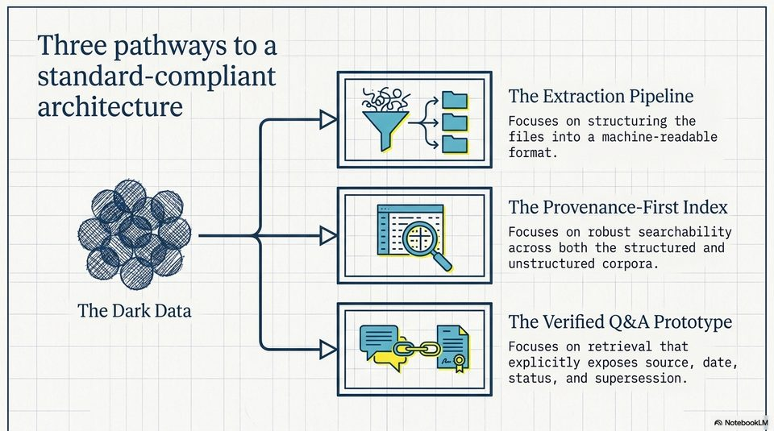

<!-- Generated by research/hmrc-beyond-hype/tools/build_narrative_sidecars.py. -->
---
source_id: challenge-2-unlocking-dark-data
source_file: "research/hmrc-beyond-hype/import/Challenge_2_Unlocking_Dark_Data.pptx"
item_type: pptx-slide
item_number: 7
asset: "assets/visuals/challenge-2-unlocking-dark-data/slide-07.jpg"
publication_status: "publishable derived thumbnail and text sidecar; raw imported PowerPoint remains local"
tags:
  - challenge-2
  - dark-data
  - evaluation
  - provenance
  - review
  - source-backed-answers
  - talk-demo
---

# Challenge 2 Unlocking Dark Data - Slide 07



## Visual Description

This is slide 07 from `research/hmrc-beyond-hype/import/Challenge_2_Unlocking_Dark_Data.pptx`. It is represented here by a small derived image so the narrative can be browsed on GitHub without publishing the raw import file.

## Claim Or Narrative Function

Frames the public-sector problem: guidance can exist but still be hard to find, structure, trust, and reuse as evidence-backed answers.

## Material Points Illustrated

- Three pathways to a
- standard-compliant one belt
- 2 e Extraction Pipeline
- architecture = be
- Focuses on structuring the
- Ea] files into a machine-readable
- format.
- 7 IN The Provenance-First Index
- ERS re ee) > Ea Focuses on robust searchability
- SS Sse 74 \ across both the structured and
- en ee, | unstructured corpora.
- The Dark Data :
- The Verified Q&A Prototype
- Focuses on retrieval that
- explicitly exposes source, date,
- status, and supersession.


## Related Narrative Links

- [Narrative arc](../../narrative-arc.md)
- [Topic index](../../topics.md)
- [Source material index](../../source-materials.md)
- [06 Repo Case Study Codex Build](../../../06_repo_case_study_codex_build.md)
- [Engineering Accountability In Public Sector Ai.Speakers](../../../transcripts/engineering-accountability-in-public-sector-ai.speakers.md)
- [Workbench](../../../../../challenge-2/wiki/workbench.md)
- [Challenge 2 worked example](../../notes/challenge-2-worked-example.md)

## Publication Status

publishable derived thumbnail and text sidecar; raw imported PowerPoint remains local.

## Caveats

- Automated OCR from an image-only PowerPoint slide; verify exact wording before quoting.

## Extracted Visual Text

```text
Three pathways to a
standard-compliant one belt
: 2 e Extraction Pipeline
architecture = be
> = Focuses on structuring the
[Ea] files into a machine-readable
format.
7 IN The Provenance-First Index
ERS re ee) > Ea Focuses on robust searchability
SS Sse 74 \ across both the structured and
en ee, | unstructured corpora.
The Dark Data :
The Verified Q&A Prototype
> Focuses on retrieval that
explicitly exposes source, date,
status, and supersession.
```
