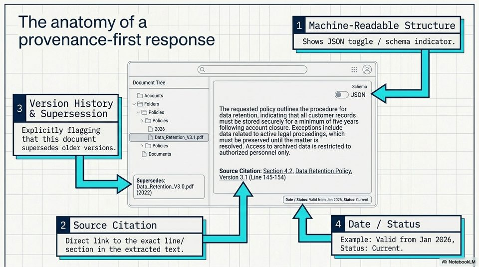

<!-- Generated by research/hmrc-beyond-hype/tools/build_narrative_sidecars.py. -->
---
source_id: challenge-2-unlocking-dark-data
source_file: "research/hmrc-beyond-hype/import/Challenge_2_Unlocking_Dark_Data.pptx"
item_type: pptx-slide
item_number: 8
asset: "assets/visuals/challenge-2-unlocking-dark-data/slide-08.jpg"
publication_status: "publishable derived thumbnail and text sidecar; raw imported PowerPoint remains local"
tags:
  - auditability
  - challenge-2
  - dark-data
  - documentation
  - governance
  - provenance
  - review
  - security
  - source-backed-answers
  - talk-demo
---

# Challenge 2 Unlocking Dark Data - Slide 08



## Visual Description

This is slide 08 from `research/hmrc-beyond-hype/import/Challenge_2_Unlocking_Dark_Data.pptx`. It is represented here by a small derived image so the narrative can be browsed on GitHub without publishing the raw import file.

## Claim Or Narrative Function

Frames the public-sector problem: guidance can exist but still be hard to find, structure, trust, and reuse as evidence-backed answers.

## Material Points Illustrated

- The anatomy ofa ul Machine-Readable Structure
- provenance-first response Shows JSON toggle / schema indicator.
- aS EEE EES
- Cae eee # @
- Schema
- Accounts @) Json
- v BS Fold
- ey version History ae The requested policy outlines the procedure for
- Supersession Sh data retention, indicating that all customer records
- Policies ns be stored Securely ora minimum ot ve years
- Explicitly flagging 1) 2026 Geli account closure. Exceptions include
- lata related to active legal proceedings, which
- that this document [Di datarRetenton-vertpt | | ust be preserved untiline matter is
- supersedes older versions. > C Policies resolved. Access to archived data is restricted to
- 1) Documents authorized personnel only.
- Source Citation: Section 4.2, Data Retention Policy,
- Supersedes: ) Version 3.1 (Line 145-154)
- Data_Retention_V3.0.pdf
- 2022) = Sse Tene eee eer en
- ane ae ES (Date / Status: Valid from Jan 2026, Status: Current.
- ym Source Citation ua Date / Status
- Direct link to the exact line/ Example: Valid from Jan 2026,
- section in the extracted text. Status: Current.
- A) NotebookLM


## Related Narrative Links

- [Narrative arc](../../narrative-arc.md)
- [Topic index](../../topics.md)
- [Source material index](../../source-materials.md)
- [06 Repo Case Study Codex Build](../../../06_repo_case_study_codex_build.md)
- [Engineering Accountability In Public Sector Ai.Speakers](../../../transcripts/engineering-accountability-in-public-sector-ai.speakers.md)
- [Workbench](../../../../../challenge-2/wiki/workbench.md)
- [Challenge 2 worked example](../../notes/challenge-2-worked-example.md)

## Publication Status

publishable derived thumbnail and text sidecar; raw imported PowerPoint remains local.

## Caveats

- Automated OCR from an image-only PowerPoint slide; verify exact wording before quoting.

## Extracted Visual Text

```text
The anatomy ofa ul Machine-Readable Structure
provenance-first response Shows JSON toggle / schema indicator.
aS EEE EES
Cae eee # @
a
'Schema
= = Accounts @) Json
v BS Fold
ey version History ae The requested policy outlines the procedure for
& Supersession Sh data retention, indicating that all customer records
> & Policies ns be stored Securely ora minimum ot ve years
Explicitly flagging 1) 2026 Geli account closure. Exceptions include
. ; lata related to active legal proceedings, which
that this document [Di datarRetenton-vertpt | | ust be preserved untiline matter is
supersedes older versions. > C Policies resolved. Access to archived data is restricted to
1) Documents authorized personnel only.
Source Citation: Section 4.2, Data Retention Policy,
( Supersedes: ) Version 3.1 (Line 145-154)
Data_Retention_V3.0.pdf
(2022) = Sse Tene eee eer en |
ane ae ES (Date / Status: Valid from Jan 2026, Status: Current.
ym Source Citation ua Date / Status
Direct link to the exact line/ Example: Valid from Jan 2026,
section in the extracted text. Status: Current.
A) NotebookLM
```
